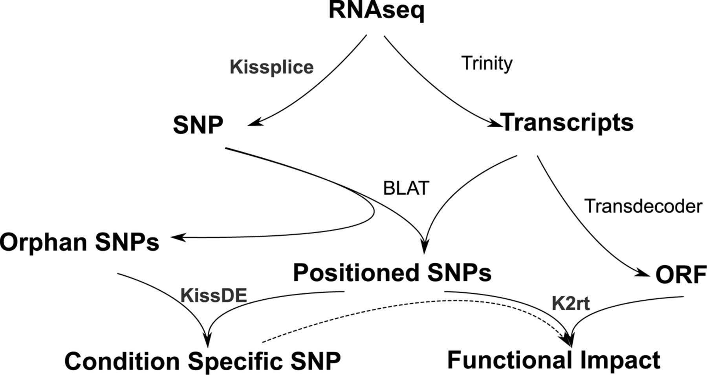

```{r setup_probes, include=FALSE}
rm(list = ls()) ; invisible(gc()) ; set.seed(42)
library(knitr)
library(parallel)
library(Biostrings)
library(tidyverse)
theme_set(bayesplot::theme_default())
opts_chunk$set(
  echo = F, message = F, warning = F, fig.height = 6, fig.width = 8,
  cache = T, cache.lazy = F)
path <- "data/Symphonia_Genomic"
```


# Design of probes set

The genomic and transcriptomic resources used for the design were comprised of a published low-coverage draft genome from Africa [@Olsson2017], an unpublished draft genome from French Guiana [Scotti et al., in prep], an unpublished transcriptome from 20 juveniles from French Guiana [Tysklind et al., in prep], and reduced-representation genomic sequence reads of individuals from French Guiana [Torroba-Balmori et al., unpublished]. 
We aligned genomic reads on the two genome drafts with `bwa` [@Li2009]. 
We kept scaffolds from the two genome drafts with a length of more than 1 kbp and at least one matching alignment with a read with a single match on the genome, and merged the two filtered genome drafts with `quickmerge` [@Chakraborty2016]. 
We aligned transcripts on the new filtered genome draft with `BLAT` [@Kent2002] and selected 533 scaffolds without transcript-match, *i.e.* anonymous scaffolds. 
We masked repetitive regions with `RepeatMasker` [@Smit2015] and selected 533 1-kbp anonymous loci within the 533 previous scaffolds.

Similarly, we filtered transcripts from the 20 juveniles of *Symphonia globulifera* from French Guiana [Tysklind et al., in prep] based on SNP quality, type and frequency. 
We further detected  open reading frames (ORFs) using `transdecoder` [@Haas2013], 
and selected transcripts with non-overlapping  ORFs including a start codon.
We kept ORFs with an alignment on scaffolds from the aforementioned genome draft for *Symphonia* using `BLAT` [@Kent2002],
and masked repetitive regions with `RepeatMasker` [@Smit2015]. 
We selected 1,150 genic loci of 500-bp to 1-kbp, from 100 bp before the start to a maximum of 900 bp after the end of the ORFs, resulting in 1-Mbp genomic loci that included a coding region.

## Scotti *et al. (in prep)* scaffolds preparation

### Filtering scaffolds over $1kbp$

We first filtered scaffolds with a width of more than **1000 bp**.

```{bash filteringScotti, eval=F, echo=T}
cd ~/Documents/BIOGECO/PhD/data/Symphonia_Genomes/Ivan_2018/
mkdir scf_1000
for scf in $( ls raw/ | grep scafSeq$); 
do
  echo item: $scf
  perl ~/Tools/SeqFilter/bin/SeqFilter -l 1000 raw/$scf --out scf_1000/$scf
done
```

### Renaming

For all scaffolds we used the following code : **Ivan_2018_[file name without .scafSeq]_[scaffold name]**.

```{r renamingScotti, eval=F, echo=T}
dir.create(file.path(path, "Ivan_2018", "renamed_scf_1000"))
files <- list.files(file.path(path, "Ivan_2018", "scf_1000"))
sapply(files, function(file){
  scf <- readDNAStringSet(file.path(path, "Ivan_2018", "scf_1000", file))
  names(scf) <- paste0("Ivan_2018_", gsub(".scafSeq", "", file), "_", gsub(" ", "_", names(scf)))
  writeXStringSet(scf, file.path(path, "Ivan_2018", "renamed_scf_1000",
                                 paste0(gsub(".scafSeq", "", file), ".1000.renamed.scafSeq")))
}, simplify = F)
unlink(file.path(path, "Ivan_2018", "scf_1000"), recursive = T)
```

### Libraries merging

We successively merged scaffolds from 6 libraries with `quickmerge`.

```{bash mergingScotti, eval=F, echo=T}
cd ~/Documents/BIOGECO/PhD/data/Symphonia_Genomes/Ivan_2018/renamed_scf_1000
ref=(sympho47_1L1_002.1000.renamed.scafSeq merge1.fasta merge2.fasta merge3.fasta merge4.fasta merge5.fasta merge6.fasta merge7.fasta)
query=(sympho47_1L2_001.1000.renamed.scafSeq sympho47_2L1_008.1000.renamed.scafSeq sympho47_2L1_009.1000.renamed.scafSeq sympho47_2L1_010.1000.renamed.scafSeq sympho47_2L1_011.1000.renamed.scafSeq sympho47_2L1_012.1000.renamed.scafSeq sympho47_3L2_013.1000.renamed.scafSeq sympho47_4L1_014.1000.renamed.scafSeq)
for i in {0..7} 
do
  mkdir merge$i
  cp  "${ref[$i]}" "${query[$i]}" ./merge$i/
  cd merge$i
  nucmer -l 100 -prefix out ${ref[$i]} ${query[$i]}
  delta-filter -i 95 -r -q out.delta > out.rq.delta
  ~/Tools/quickmerge/quickmerge -d out.rq.delta -q ${query[$i]} -r ${ref[$i]} -hco 5.0 -c 1.5 -l n -ml m
  cd ..
  cp merge$i/merged.fasta ./merge$((i+1)).fasta
done
```

```{bash dbScotti, eval=F, echo=T}
cd ~/Documents/BIOGECO/PhD/data/Symphonia_Genomes/Ivan_2018
mkdir merged_1000
cp  renamed_scf_1000/merge5/merged.fasta merged_1000/merged_1000.fa
cd merged_1000
makeblastdb -in merged_1000.fa -parse_seqids -dbtype nucl
```

### Removing scaffolds with multimatch blasted consensus sequence from Torroba-Balmori *et al. (unpublished)*

We used the consensus sequence for French Guianan reads from Torroba-Balmori *et al. (unpublished)* previously assembled with ipyrad. 
We kept the first sequence of the consensus loci file and recoded it to fasta (see loci2fa.py script below). 
We then blasted the consensus sequences on merged scaffolds from Scotti *et al (in prep)* with `blastn` in order to detect scaffolds with repetitive regions (multi-mapped consensus sequences). 
Repetitive sequences have been saved as a list and removed to generate the final list of selected scaffolds.

```{python loci2fa, eval=F, echo=T}
infile = open("symphoGbS2.loci", "r")
outfile = open("symphoGbS2.firstline.fasta", "w")
loci = infile.read().split("|\n")[:-1]
for loc in loci:
    reads = loc.split("\n")
    name, seq = reads[0].split()
    print >>outfile, ">"+name+"\n"+seq
outfile.close()
```

```{bash loci2fa2, eval=F, echo=T}
cd ~/Documents/BIOGECO/PhD/data/Symphonia_Torroba/assembly/symphoGbS2_outfile
python loci2fa.py
cat symphoGbS2.firstline.fasta | tr - N >> symphoGbS2.firstline.fasta
```

```{bash, blastScotti, eval=F, echo=T}
cd ~/Documents/BIOGECO/PhD/data/Symphonia_Genomes/Ivan_2018
query=~/Documents/BIOGECO/PhD/data/Symphonia_Torroba/assembly/symphoGbS2_outfiles/symphoGbS2.firstline.fasta
blastn -db merged_1000/merged_1000.fa -query $query -out blast_consensus_torroba2.txt -evalue 1e-10 -best_hit_score_edge 0.05 -best_hit_overhang 0.25 -outfmt 6 -perc_identity 75 -max_target_seqs 10
```

```{r blastResultScotti, eval=F, echo=T}
blast <- read_tsv(file.path(path, "Ivan_2018", "torroba_blast",
                            "blast_consensus_torroba2.txt"), col_names = F)
names(blast) <- c("Read", "Scaffold", "Perc_Ident", "Alignment_length", "Mismatches",
                  "Gap_openings", "R_start", "R_end", "S_start", "S_end", "E", "Bits")
write_file(paste(unique(blast$Scaffold), collapse = "\n"), 
           file.path(path, "Ivan_2018", "torroba_blast",
                     "selected_scaffolds_blast_consensus2.list"))
```

```{bash blastResultScotti2, eval=F, echo=T}
seqtk subseq merged_1000/merged_1000.fa selected_scaffolds_blast_consensus2.list >> selected_scaffolds_blast_consensus2.fa
```

In total **542 scaffolds** from Scotti *et al (in prep)* matched consensus sequences from Torroba-Balmori et al. (unpublished). 
Several scaffolds obtained multiple matches that we cannot use for probes. 
We thus excluded the whole scaffold if the scaffold is shorter than 2000 bp,
or the scaffold region matching the raw read if the scaffold is longer than 2000 bp.

```{r blastResultScottiFig, fig.cap="Number of match with Torroba consensus reads vs gene width.", fig.height=4}
blast_Ivan <- read_tsv(file.path(path, "Ivan_2018", "torroba_blast", "blast_consensus_torroba2.txt"), col_names = F)
names(blast_Ivan) <- c("Read", "Scaffold", "Perc_Ident", "Alignment_length", "Mismatches",
                  "Gap_openings", "R_start", "R_end", "S_start", "S_end", "E", "Bits")
scf_Ivan <- readDNAStringSet(file.path(path, "Ivan_2018", "torroba_blast", "selected_scaffolds_blast_consensus2.fa"))
blast_Ivan %>%
  dplyr::left_join(data.frame(Scaffold = names(scf_Ivan), width = width(scf_Ivan))) %>% 
  select(Scaffold, Read, width) %>%
  unique() %>%
  group_by(Scaffold, width) %>%
  summarise(n = n()) %>% 
  ggplot(aes(width, n)) +
  geom_point() +
  geom_jitter() +
  ylab("Number of match with consensus sequences from Torroba-Balmori et al (unpublished)") +
  xlab("Width of scaffolds from Scotti et al. (in prep) (in bp)")
```

```{r blastResultScottiFilter}
sel_Ivan <- blast_Ivan %>%
  dplyr::left_join(data.frame(Scaffold = names(scf_Ivan), width = width(scf_Ivan))) %>% 
  select(Scaffold, Read, width, S_start, S_end) %>% 
  group_by(Read) %>%
  filter(n() > 2) %>% 
  ungroup() %>% 
  mutate(remove = ifelse(width < 2000, "X", " ")) %>% 
  mutate(cut = ifelse(width > 2000, paste0(S_start, "-", S_end), " ")) %>% 
  select(Scaffold, width, remove, cut)
sel_Ivan <- list(rm = gsub("Ivan_2018_sympho47_", "", sel_Ivan$Scaffold[sel_Ivan$remove == "X"]),
                 cut = sel_Ivan[sel_Ivan$remove == " ",])
kable(sel_Ivan$cut, caption = "Scaffold to cut due to multiple read match.")
```

The following scaffolds have been removed due to multiple matches and a length $<200bp$: `r paste0(sel_Ivan$rm, collapse = ", ")`. 
The others have been cut (see table \@ref(tab:blastResultScottiFilter)).

### Total filtered scaffolds

```{r scfIvanFilterFig}
scf <- readDNAStringSet(file.path(path, "Ivan_2018", "merged_1000", "merged_1000.fa"))
scf <- scf[-match(paste0("Ivan_2018_sympho47_",sel_Ivan$rm),  names(scf))]
scf <- data.frame(name = names(scf), width = width(scf))
scf %>% 
  ggplot(aes(width)) +
  geom_histogram() +
  ggtitle("190 094 scaffolds", "436.118 Mbp") +
  scale_x_log10() +
  xlab("Width of filtered scaffolds from Scotti et al. (in prep) (bp)")
```

## Olsson *et al. (2017)* scaffolds preparation

**African genome from @Olsson2017.**

### Renaming

We renamed scaffolds from Olsson using the following code : **Olsson_2017_[scaffold name]**.

```{r renamingOlsson, eval=F, echo=T}
scf <- readDNAStringSet(file.path(path, "Olsson_2016", "symph_genome.fa"))
names(scf) <- paste0('Olsson_2017_', names(scf))
dir.create(file.path(path, "Olsson_2016", "db"))
writeXStringSet(scf, file.path(path, "Olsson_2016", "db", "Olsson2017.fa")))
```

### Removing scaffolds with multimatch blasted consensus sequence from Torroba-Balmori *et al. (unpublished)*

We used the consensus sequence for French Guianan reads from Torroba-Balmori *et al. (unpublished)*, by blasting them on scaffolds from @Olsson2017 with `blastn`.

```{bash, blastOlsson, eval=F, echo=T}
cd ~/Documents/BIOGECO/PhD/data/Symphonia_Genomes/Olsson_2016
cd Olsson2017
makeblastdb -in Olsson2017.fa -parse_seqids -dbtype nucl
cd ..
query=~/Documents/BIOGECO/PhD/data/Symphonia_Torroba/assembly/symphoGbS2_outfiles/symphoGbS2.firstline.fasta
blastn -db Olsson2017/Olsson2017.fa -query $query -out blast_consensus_torroba2.txt -evalue 1e-10 -best_hit_score_edge 0.05 -best_hit_overhang 0.25 -outfmt 6 -perc_identity 75 -max_target_seqs 10
```

```{r blastResultOlsson, eval=F, echo=T}
blast <- read_tsv(file.path(path, "Olsson_2016", "torroba_blast",
                            "blast_consensus_torroba2.txt"), col_names = F)
names(blast) <- c("Read", "Scaffold", "Perc_Ident", "Alignment_length", "Mismatches",
                  "Gap_openings", "R_start", "R_end", "S_start", "S_end", "E", "Bits")
write_file(paste(unique(blast$Scaffold), collapse = "\n"), 
           file.path(path, "Olsson_2016", "torroba_blast",
                     "selected_scaffolds_blast_consensus2.list"))
```

```{bash blastResultOlsson2, eval=F, echo=T}
seqtk subseq Olsson2017/Olsson2017.fa selected_scaffolds_blast_consensus2.list >> selected_scaffolds_blast_consensus2.fa
```

We obtained most scaffolds with a single  match including a broad range of sizes (from 100 bp to 33.2 kbp). 
In total **688** scaffolds from @Olsson2017 match consensus sequences from Torroba-Balmori *et al. (unpublished)*. 
Several scaffolds obtained multiple matches that we cannot use for probes.
We thus excluded the whole scaffold if the scaffold is shorter than 2000 bp,
or the scaffold region matching the raw read if the scaffold is longer than 2000 bp.

```{r blastResultOlssonFig, fig.cap="Number of matches with Torroba-Balmori’s consensus reads vs gene width.", fig.height=4}
blast_Olsson <- read_tsv(file.path(path, "Olsson_2016", "torroba_blast", "blast_consensus_torroba2.txt"), col_names = F)
names(blast_Olsson) <- c("Read", "Scaffold", "Perc_Ident", "Alignment_length", "Mismatches",
                  "Gap_openings", "R_start", "R_end", "S_start", "S_end", "E", "Bits")
scf_Olsson <- readDNAStringSet(file.path(path, "Olsson_2016", "torroba_blast", "selected_scaffolds_blast_consensus2.fa"))
blast_Olsson %>%
  dplyr::left_join(data.frame(Scaffold = names(scf_Olsson), width = width(scf_Olsson))) %>% 
  select(Scaffold, Read, width) %>%
  unique() %>%
  group_by(Scaffold, width) %>%
  summarise(n = n()) %>% 
  ggplot(aes(width, n)) +
  geom_point() +
  geom_jitter() +
  ylab("Number of match with consensus sequences from Torroba-Balmori et al (unpublished)") +
  xlab("Width of scaffolds from 0lsson et al. (2017) (in bp)")
```

```{r blastResultOlssonFilter}
sel_Olsson <- blast_Olsson %>%
  dplyr::left_join(data.frame(Scaffold = names(scf_Olsson), width = width(scf_Olsson))) %>% 
  select(Scaffold, Read, width, S_start, S_end) %>% 
  group_by(Read) %>%
  filter(n() > 2) %>% 
  ungroup() %>% 
  mutate(remove = ifelse(width < 2000, "X", " ")) %>% 
  mutate(cut = ifelse(width > 2000, paste0(S_start, "-", S_end), " ")) %>% 
  select(Scaffold, width, remove, cut)
sel_Olsson <- list(rm = gsub("Olsson_2017_", "", sel_Olsson$Scaffold[sel_Olsson$remove == "X"]),
                 cut = sel_Olsson[sel_Olsson$remove == " ",])
kable(sel_Olsson$cut, caption = "Scaffolds to cut due to multiple read matches.") 
```

The following scaffolds have been removed due to multiple matches and a length $<200bp$: `r paste0(sel_Olsson$rm, collapse = ", ")`. 
And other have been cut (see table \@ref(tab:blastResultOlssonFilter)).

### Total filtered scaffolds

```{r scfOlssonFilterFig}
scf <- readDNAStringSet(file.path(path, "Olsson_2016", "Olsson2017", "Olsson2017.fa"))
scf <- scf[-match(paste0("Olsson_2017_",sel_Olsson$rm),  names(scf))]
scf <- data.frame(name = names(scf), width = width(scf))
scf %>% 
  ggplot(aes(width)) +
  geom_histogram() +
  ggtitle("2 653 440 scaffolds", "1 027.332 Mbp") +
  scale_x_log10() +
  xlab("Width of filtered scaffolds from Olsson et al. (2017) (bp)")
```

##  Tysklind *et al (in prep)* transcript preparation

Tysklind *et al (in prep)* used 20 *Symphonia* juveniles from the transplantation garden experiment for transcriptomic analysis.
RNA sequences were captured. 
The analysis followed the scheme suggested by @Lopez-Maestre2016 (see below). 
First, reads were assembled with `Trinity` into transcripts. 
In parallel, SNPs were detected with `Kissplice`. 
Then SNPs were mapped on the transcriptome with `BLAT`.
In parallel SNPs have been tested to be morphotype-specific at the level $\alpha = 0.001$ with `KissDE` and transcriptome Open Reading Frames (ORF) have been identified with `Transdecoder`. 
Finally, SNPs with a functional impact were identified through `k2rt`. 
Consequently, for every SNP we have the following information: 
(i) inside coding DNA sequence (CDS), 
(ii) synonymous or not, 
(iii) morphotype-specificity.



### Filtering SNP on quality

We assessed transcriptomic analysis quality with possible sequencing errors, and SNPs in multiple assembled genes or isoforms (see table \@ref(tab:Qcheck)). 
We found **38 594** SNPs with possible sequencing error, 
and **609 214** SNPs associated to multiple assembled genes that we removed from further analysis.

```{r Qcheck}
data <- read_delim(file.path(path, "Niklas_transcripts", "k2rt", "symphonia_juv_fullsample_trinity500_k2rt_type_0a_mainOutput.tsv"),
           delim = "\t")
data %>% 
  select(Possible_sequencing_error,
         SNP_in_mutliple_assembled_genes,
         SNP_in_mutliple_assembled_isoforms) %>% 
  mutate(Count = 1) %>%
  reshape2::melt(id.vars = "Count") %>% 
  filter(value == "True") %>% 
  mutate(variable = gsub("_", " ", variable)) %>% 
  group_by(variable) %>% 
  summarise(n = n()) %>% 
  mutate(Percentage = round(n/nrow(data)*100,2)) %>% 
  kable(caption = "Quality check with single SNPs.",
        format.args = list(big.mark = " "))
rm(data) ; invisible(gc())
```

### Filtering SNP on type

We also highlighted SNPs which met impossible association of characteristic (table \@ref(tab:countTable)), that we removed from further analysis.

```{r count_SNP}
data <- read_delim(file.path(path, "Niklas_transcripts", "k2rt", "symphonia_juv_fullsample_trinity500_k2rt_type_0a_mainOutput.tsv"),
           delim = "\t") %>% 
  filter(Possible_sequencing_error != "True") %>% 
  filter(SNP_in_mutliple_assembled_genes != "True")
count_SNP <- data %>% 
  select(Is_in_CDS, Is_not_synonymous, Is_condition_specific) %>% 
  group_by(Is_in_CDS, Is_not_synonymous, Is_condition_specific) %>% 
  summarize(n = n()) %>% 
  ungroup() %>%
  mutate(type = ifelse(Is_in_CDS == "False" & Is_not_synonymous == "N/A", 
                       "UTR-UTR-", NA)) %>% 
  mutate(type = ifelse(Is_in_CDS == "True" & Is_not_synonymous == "False", 
                       "CDS-synonymous-", type)) %>% 
  mutate(type = ifelse(Is_in_CDS == "True" & Is_not_synonymous == "True", 
                       "CDS-not synonymous-", type)) %>% 
  mutate(Is_condition_specific = ifelse(Is_condition_specific == "False" & !is.na(type),
                                        "non specific", "morphotype specific")) %>% 
  mutate(type = ifelse(!is.na(type),
                       paste0(type,Is_condition_specific), type)) %>% 
  mutate(type = ifelse(is.na(type), "impossible", type))
rm(data) ; invisible(gc())
```

```{r countTable}
count_SNP %>% 
  filter(type == "unpossible") %>%
  dplyr::rename("Coding sequence" = Is_in_CDS,
         "Not synonymous" = Is_not_synonymous,
         "Morphotype-specific" = Is_condition_specific) %>% 
  kable(caption = "Single SNPs with impossible association of characteristics. First column indicates if the SNP is in a coding sequence, second column indicates if the SNP is non-synonymous, third column indicates if the SNP is morphotype-specific, and fourth column indicates the headcount.", format.args = list(big.mark = " "))
```

### Filtering transcripts on SNP frequency

We found a high frequency of SNPs per candidate gene (the majority between 1 SNP per 10 or 100 bp), 
with some scaffolds having a SNP frequency superior to 0.2 (see figure \@ref(fig:snpGenes2)). We assumed those hyper SNP-rich scaffolds to be errors and decided to remove them from the reference transcriptome. 
In order to do that, we fitted a $\Gamma$ law into the SNP frequency distribution and we kept scaffolds with a SNP frequency under the $99^{th}$ quantile ($q_{99} = 0.07810194$). We thus removed:

* __358 308__ SNPs
* located on __20 521__ transcripts
* representing __1 490__ candidate genes

```{r genes, eval=F}
snp <- read_delim(file.path(path, "Niklas_transcripts", "k2rt", "symphonia_juv_fullsample_trinity500_k2rt_type_0a_mainOutput.tsv"),
           delim = "\t") %>% 
  filter(Possible_sequencing_error != "True") %>% 
  filter(SNP_in_mutliple_assembled_genes != "True") %>% 
  mutate(type = ifelse(Is_in_CDS == "False" & Is_not_synonymous == "N/A", 
                       "UTR-UTR-", NA)) %>% 
  mutate(type = ifelse(Is_in_CDS == "True" & Is_not_synonymous == "False", 
                       "CDS-synonymous-", type)) %>% 
  mutate(type = ifelse(Is_in_CDS == "True" & Is_not_synonymous == "True", 
                       "CDS-not synonymous-", type)) %>% 
  mutate(Is_condition_specific = ifelse(Is_condition_specific == "False" & !is.na(type),
                                        "non specific", "morphotype specific")) %>% 
  mutate(type = ifelse(!is.na(type),
                       paste0(type,Is_condition_specific), type)) %>% 
  filter(!is.na(type)) %>% 
  dplyr::rename(transcript_id = `#Component_ID`, snp_id = SNP_ID)

transcript <- src_sqlite(file.path(path, "Niklas_transcripts", "Trinotate",
                           "symphonia.trinity500.trinotate.sqlite")) %>% 
  tbl("Transcript") %>% 
  collect()

data <- snp %>% 
  left_join(transcript) %>% 
  mutate(width = nchar(sequence))

snp_genes <- data %>% 
  group_by(gene_id) %>% 
  summarize(n_snp = n(), width = mean(width)) %>% 
  mutate(freq = n_snp/width) %>% 
  arrange(desc(freq))

write_tsv(snp_genes, file = "save/snp_genes.tsv")

rm(snp_genes, snp, transcript, data, data2) ; invisible(gc())
```

```{r snpGenes2, fig.cap="Distribution of SNP frequencies in scaffolds. Histogram (grey bars) represents the data, red line represents the Gamma law fit, and blue area represents X*sigma where scaffolds are not excluded.", fig.height=4}
snp_genes <- read_tsv(file = "save/snp_genes.tsv")
fit.params <- MASS::fitdistr(snp_genes$freq, "gamma", lower = c(0, 0))
q99 <- qgamma(0.99,fit.params$estimate["shape"], fit.params$estimate["rate"])
ggplot(snp_genes) +
  geom_rect(aes(xmin=0, xmax=q99, ymin=0, ymax=Inf), fill = "blue", alpha = 0.002) +
  geom_histogram(aes(freq, ..density..), binwidth = 0.001) +
  geom_line(aes(freq, 
                y=dgamma(snp_genes$freq,fit.params$estimate["shape"], fit.params$estimate["rate"])), 
            color="red", size = 1) +
  xlab("SNP frequency (N/bp)")
```

```{r transcriptFiltering, eval=F, echo=T}
filtered_data <- snp_genes %>% 
  filter(freq <= q99) %>% 
  left_join(data, by = "gene_id") %>% 
  select(transcript_id, sequence) %>% 
  unique() %>% 
  mutate(transcript_id = paste0(">", transcript_id))
filtered_data_fasta <- do.call(rbind, lapply(seq(nrow(filtered_data)),
                                             function(i) t(filtered_data[i, ])))
write.table(filtered_data_fasta, row.names = F, col.names = F, quote = F, 
            file = file.path(path, "..", "filtered_transcripts.fasta"))
```

### Total filtered transcript

We have a total of:

* __1 382 525__ filtered SNPs (over 2 398 550)
* located on __177 388__ transcripts (over 257 140, when pseudo-genes and isoforms)
* representing __63 707__ candidate genes (over 76 032, respectively)
* for a total of __283.4__ Mbp

```{r trscFilterFig}
trsc <- readDNAStringSet(file.path(path,  "Niklas_transcripts",
                                   "filtered_transcripts.fasta"))
data.frame(name = names(trsc), width = width(trsc)) %>% 
  ggplot(aes(width)) +
  geom_histogram() +
  ggtitle("177 388 transcripts", "283.4103 Mbp") +
  scale_x_log10() +
  xlab("Width of filtered transcript from Tysklind et al. (in prep) (bp)")
```

## Neutral region selection

### Raw reads from Torroba-Balmori *et al. (unpublished)* alignment on scaffolds from Scotti *et al. (in prep)*

We used the French Guianan raw reads from Torroba-Balmori *et al. (unpublished)*, 
by aligning them on scaffolds from @Olsson2017 with `bwa`.

```{bash alignmentIvan, eval=F, echo=T}
#!/bin/bash
#SBATCH --time=36:00:00
#SBATCH -J alignIvan
#SBATCH -o alignIvan_output.out
#SBATCH -e alignIvan_error.out
#SBATCH --mem=20G
#SBATCH --cpus-per-task=1
#SBATCH --mail-type=BEGIN,END,FAIL

# Environment
module purge
module load bioinfo/bwa-0.7.15
module load bioinfo/picard-2.14.1
module load bioinfo/samtools-1.4
module load bioinfo/bedtools-2.26.0

# read preparation
cd ~/work/Symphonia_Torroba/
tar -xvzf Gbs.tar.gz
cd raw
rm PR_49.fastq RG_1.fastq
for file in ./*.fastq
do
  echo $file
  filename=$(basename "$file")
  filename="${filename%.*}"
  perl -pe 's|[\h]||g' $file > "${filename}".renamed.fastq
  rm $file
done
# variables
cd ~/work/Symphonia_Genomes/Ivan_2018/torroba_alignment
reference=~/work/Symphonia_Genomes/Ivan_2018/merged_1000/merged_1000.fa
query_path=~/work/Symphonia_Torroba/raw
# alignment
bwa index $reference
mkdir bwa
for file in $query_path/*.fastq
do
  filename=$(basename "$file")
  filename="${filename%.*}"
  rg="@RG\tID:${filename}\tSM:${filename}\tPL:IONTORRENT"
  bwa mem -M -R "${rg}" $reference $file > bwa/"${filename}.sam"	
#  rm $file
done
# sam2bam
for file in ./bwa/*.sam
do
  filename=$(basename "$file")
  filename="${filename%.*}"
  java -Xmx4g -jar $PICARD SortSam I=$file O=bwa/"${filename}".bam SORT_ORDER=coordinate
done
# Bam index
for file in bwa/*.bam
do
  filename=$(basename "$file")
  filename="${filename%.*}"
  java -Xmx4g -jar $PICARD BuildBamIndex I=$file O=bwa/"${filename}".bai
done
# sam2bed
mkdir bed
for file in ./bwa/*.bam
do
  filename=$(basename "$file")
  filename="${filename%.*}"
  bedtools bamtobed -i bwa/"${filename}".bam > bed/"${filename}".bed
done
# merge bed
mkdir merged_bed
for file in ./bed/*.bed
do
  filename=$(basename "$file")
  filename="${filename%.*}"
  bedtools merge -i bed/"${filename}".bed > merged_bed/"${filename}".bed
done
cat bed/* | sort -k 1,1 -k2,2n >  all.nonunique.bed
bedtools merge -i all.nonunique.bed -c 1 -o count > all.merged.bed
```

```{r bwatResultScotti, eval=F, echo=T}
bed <- read_tsv(file.path(path, "Ivan_2018", "torroba_alignment", "all.merged.bed"), col_names = F)
names(bed) <- c("scaffold", "start", "end", "coverage")
write_file(paste(unique(bed$scaffold), collapse = "\n"), 
           file.path(path, "Ivan_2018", "torroba_alignment", "scaffolds.list"))
```

```{bash bwaResultScotti2, eval=F, echo=T}
cd ~/Documents/BIOGECO/PhD/data/Symphonia_Genomes/Ivan_2018/torroba_alignment
ref=~/Documents/BIOGECO/PhD/data/Symphonia_Genomes/Ivan_2018/merged_1000/merged_1000.fa
seqtk subseq $ref scaffolds.list >> scaffolds.fa
```

```{r  bwaReadResultIvanCov}
total_length <- sum(width(readDNAStringSet(file.path(path, "Ivan_2018", "merged_1000", "merged_1000.fa"))))
n_total <- length(readDNAStringSet(file.path(path, "Ivan_2018", "merged_1000", "merged_1000.fa")))
bed <- read_tsv(file.path(path, "Olsson_2016", "torroba_alignment", "all.merged.bed"), 
                col_names = F) %>% unique()
names(bed) <- c("scaffold", "start", "end", "coverage")
alignment_coverage <- sum(bed$end-bed$start)
scf <- readDNAStringSet(file.path(path, "Ivan_2018", "torroba_alignment", "scaffolds.fa"))
scf <- data.frame(scaffold = names(scf), width_scf = width(scf))
selection_coverage <- sum(scf$width_scf)
data.frame(name = c("aligned sequence", "selected scaffold", "total"),
           n = c(nrow(bed), nrow(scf), n_total),
           width = c(alignment_coverage, selection_coverage, total_length)) %>% 
  mutate(coverage = width/total_length*100) %>% 
  mutate(width = width / 10^6) %>% 
  kable(caption = "alignment coverage summary",
        col.names = c("", "N", "Width (Mbp)", "Coverage (%)"),
        format.args = list(big.mark = " "))
```

### Masking scaffolds with multimatch from Scotti *et al. (in prep)*

```{r bwaResultScottiFilter, eval=F, echo=T}
bed <- data.table::fread(file.path(path, "Ivan_2018", "torroba_alignment", 
                                   "all.nonunique.bed"), header = F)
names(bed) <- c("scaffold", "start", "end", "read", "quality", "orientation")
multimatch_reads <- bed %>% 
  filter(duplicated(read)) %>% 
  select(read) %>% 
  unique() %>% 
  unlist()
bed %>% 
  filter(read %in% multimatch_reads) %>% 
  write_tsv(file.path(path, "Ivan_2018", "torroba_alignment", 
                       "multimatch.bed"), col_names = F)
rm(bed, multimatch_reads) ; invisible(gc())
```

```{bash bwaResultScottiFilter2, eval=F, echo=T}
cd ~/Documents/BIOGECO/PhD/data/Symphonia_Genomes/Ivan_2018/torroba_alignment
bedtools maskfasta -fi scaffolds.fa -bed multimatch.bed -fo masked.scaffolds.fa
```

```{r bwaResultScottiFilter3, eval=F, echo=T}
scf <- readDNAStringSet(file.path(path, "Ivan_2018", 
                                  "torroba_alignment", "masked.scaffolds.fa"))
scf <- data.frame(scaffold = names(scf), width = width(scf), 
           N = letterFrequency(scf, letters = "N")) %>% 
  mutate(Nperc = N/width*100) %>% 
  filter(Nperc < 25 & width > 1000) %>% 
  select(scaffold)
write_file(paste(scf$scaffold, collapse = "\n"), 
           file.path(path, "Ivan_2018", "torroba_alignment", "final.scaffolds.list"))
```

```{bash bwaResultScottiFilter4, eval=F, echo=T}
cd ~/Documents/BIOGECO/PhD/data/Symphonia_Genomes/Ivan_2018/torroba_alignment
seqtk subseq masked.scaffolds.fa final.scaffolds.list >> final.scaffolds.fa
```

```{r  bwaFilterScottiCov}
total_length <- sum(width(readDNAStringSet(file.path(path, "Ivan_2018", "merged_1000", "merged_1000.fa"))))
n_total <- length(readDNAStringSet(file.path(path, "Ivan_2018", "merged_1000", "merged_1000.fa")))
scf <- readDNAStringSet(file.path(path, "Ivan_2018", "torroba_alignment", "final.scaffolds.fa"))
scf <- data.frame(scaffold = names(scf), width = width(scf),
                  N = letterFrequency(scf, letters = "N"))
data.frame(name = c("selected scaffold", "total"),
           n = c(nrow(scf), n_total),
           width = c(sum(scf$width), total_length),
           N = c(sum(scf$N), NA)) %>% 
  mutate(mask = N/width*100) %>% 
  mutate(coverage = width/total_length*100) %>% 
  mutate(width = width / 10^6) %>% 
  select(-N) %>% 
  kable(caption = "alignment coverage summary",
        col.names = c("", "N", "Width (Mbp)", "Mask (%N)", "Coverage (%)"),
        format.args = list(big.mark = " "))
```

### Raw reads from Torroba-Balmori *et al. (unpublished)* alignment on scaffolds from @Olsson2017 

We used again the French Guianan raw reads from Torroba-Balmori *et al. (unpublished)*, 
to align them on scaffolds from @Olsson2017 with `bwa`.

```{bash alignmentOlsson, eval=F, echo=T}
#!/bin/bash
#SBATCH --time=36:00:00
#SBATCH -J alignOlsson
#SBATCH -o alignOlsson_output.out
#SBATCH -e alignOlsson_error.out
#SBATCH --mem=20G
#SBATCH --cpus-per-task=1
#SBATCH --mail-type=BEGIN,END,FAIL

# Environment
module purge
module load bioinfo/bwa-0.7.15
module load bioinfo/picard-2.14.1
module load bioinfo/samtools-1.4
module load bioinfo/bedtools-2.26.0

# read preparation
cd ~/work/Symphonia_Torroba/
tar -xvzf Gbs.tar.gz
cd raw
rm PR_49.fastq RG_1.fastq
for file in ./*.fastq
do
  echo $file
  filename=$(basename "$file")
  filename="${filename%.*}"
  perl -pe 's|[\h]||g' $file > "${filename}".renamed.fastq
  rm $file
done
# variables
cd ~/work/Symphonia_Genomes/Olsson_2016/torroba_alignment
reference=~/work/Symphonia_Genomes/Olsson_2016/Olsson2017/Olsson2017.fa
query_path=~/work/Symphonia_Torroba/raw
# alignment
bwa index $reference
mkdir bwa
for file in $query_path/*.fastq
do
  filename=$(basename "$file")
  filename="${filename%.*}"
  rg="@RG\tID:${filename}\tSM:${filename}\tPL:IONTORRENT"
  bwa mem -M -R "${rg}" $reference $file > bwa/"${filename}.sam"	
  rm $file
done
# sam2bam
for file in ./bwa/*.sam
do
  filename=$(basename "$file")
  filename="${filename%.*}"
  java -Xmx4g -jar $PICARD SortSam I=$file O=bwa/"${filename}".bam SORT_ORDER=coordinate
done
# Bam index
for file in bwa/*.bam
do
  filename=$(basename "$file")
  filename="${filename%.*}"
  java -Xmx4g -jar $PICARD BuildBamIndex I=$file O=bwa/"${filename}".bai
done
# sam2bed
mkdir bed
for file in ./bwa/*.bam
do
  filename=$(basename "$file")
  filename="${filename%.*}"
  bedtools bamtobed -i bwa/"${filename}".bam > bed/"${filename}".bed
done
# merge bed
mkdir merged_bed
for file in ./bed/*.bed
do
  filename=$(basename "$file")
  filename="${filename%.*}"
  bedtools merge -i bed/"${filename}".bed > merged_bed/"${filename}".bed
done
cat bed/* | sort -k 1,1 -k2,2n >  all.nonunique.bed
bedtools merge -i all.nonunique.bed -c 1 -o count > all.merged.bed
```

```{r bwatResultOlsson, eval=F, echo=T}
bed <- read_tsv(file.path(path, "Olsson_2016", "torroba_alignment", "all.merged.bed"), col_names = F)
names(bed) <- c("scaffold", "start", "end", "coverage")
write_file(paste(unique(bed$scaffold), collapse = "\n"), 
           file.path(path, "Olsson_2016", "torroba_alignment", "scaffolds.list"))
```

```{bash bwaResultOlsson2, eval=F, echo=T}
cd ~/Documents/BIOGECO/PhD/data/Symphonia_Genomes/Olsson_2016/torroba_alignment
ref=~/Documents/BIOGECO/PhD/data/Symphonia_Genomes/Olsson_2016/Olsson2017/Olsson2017.fa
seqtk subseq $ref scaffolds.list >> scaffolds.fa
```

```{r  bwaReadResultOlssonCov}
total_length <- sum(width(readDNAStringSet(file.path(path, "Olsson_2016", "Olsson2017", "Olsson2017.fa"))))
n_total <- length(readDNAStringSet(file.path(path, "Olsson_2016", "Olsson2017", "Olsson2017.fa")))
bed <- read_tsv(file.path(path, "Olsson_2016", "torroba_alignment", "all.merged.bed"), 
                col_names = F) %>% unique()
names(bed) <- c("scaffold", "start", "end", "coverage")
alignment_coverage <- sum(bed$end-bed$start)
scf <- readDNAStringSet(file.path(path, "Olsson_2016", "torroba_alignment", "scaffolds.fa"))
scf <- data.frame(scaffold = names(scf), width_scf = width(scf))
selection_coverage <- sum(scf$width_scf)
data.frame(name = c("aligned sequence", "selected scaffold", "total"),
           n = c(nrow(bed), nrow(scf), n_total),
           width = c(alignment_coverage, selection_coverage, total_length)) %>% 
  mutate(coverage = width/total_length*100) %>% 
  mutate(width = width / 10^6) %>% 
  kable(caption = "alignment coverage summary",
        col.names = c("", "N", "Width (Mbp)", "Coverage (%)"),
        format.args = list(big.mark = " "))
```

### Masking scaffolds with multimatch from @Olsson2017

```{r bwaResultOlssonFilter, eval=F, echo=T}
bed <- data.table::fread(file.path(path, "Olsson_2016", "torroba_alignment", 
                                   "all.nonunique.bed"), header = F)
names(bed) <- c("scaffold", "start", "end", "read", "quality", "orientation")
multimatch_reads <- bed %>% 
  filter(duplicated(read)) %>% 
  select(read) %>% 
  unique() %>% 
  unlist()
bed %>% 
  filter(read %in% multimatch_reads) %>% 
  write_tsv(file.path(path, "Olsson_2016", "torroba_alignment", 
                       "multimatch.bed"), col_names = F)
rm(bed, multimatch_reads) ; invisible(gc())
```

```{bash bwaResultOlssonFilter2, eval=F, echo=T}
cd ~/Documents/BIOGECO/PhD/data/Symphonia_Genomes/Olsson_2016/torroba_alignment
bedtools maskfasta -fi scaffolds.fa -bed multimatch.bed -fo masked.scaffolds.fa
```

```{r bwaResultOlssonFilter3, eval=F, echo=T}
scf <- readDNAStringSet(file.path(path, "Olsson_2016", 
                                  "torroba_alignment", "masked.scaffolds.fa"))
scf <- data.frame(scaffold = names(scf), width = width(scf), 
           N = letterFrequency(scf, letters = "N")) %>% 
  mutate(Nperc = N/width*100) %>% 
  filter(Nperc < 25 & width > 1000) %>% 
  select(scaffold)
write_file(paste(scf$scaffold, collapse = "\n"), 
           file.path(path, "Olsson_2016", "torroba_alignment", "final.scaffolds.list"))
```

```{bash bwaResultOlssonFilter4, eval=F, echo=T}
cd ~/Documents/BIOGECO/PhD/data/Symphonia_Genomes/Olsson_2016/torroba_alignment
ref=~/Documents/BIOGECO/PhD/data/Symphonia_Genomes/Olsson_2016/Olsson2017/Olsson2017.fa
seqtk subseq masked.scaffolds.fa final.scaffolds.list >> final.scaffolds.fa
```

```{r  bwaFilterOlssonCov}
total_length <- sum(width(readDNAStringSet(file.path(path, "Olsson_2016", "Olsson2017", "Olsson2017.fa"))))
n_total <- length(readDNAStringSet(file.path(path, "Olsson_2016", "Olsson2017", "Olsson2017.fa")))
scf <- readDNAStringSet(file.path(path, "Olsson_2016", "torroba_alignment",
                                  "final.scaffolds.fa"))
scf <- data.frame(scaffold = names(scf), width = width(scf),
                  N = letterFrequency(scf, letters = "N"))
data.frame(name = c("selected scaffold", "total"),
           n = c(nrow(scf), n_total),
           width = c(sum(scf$width), total_length),
           N = c(sum(scf$N), NA)) %>% 
  mutate(mask = N/width*100) %>% 
  mutate(coverage = width/total_length*100) %>% 
  mutate(width = width / 10^6) %>% 
  select(-N) %>% 
  kable(caption = "alignment coverage summary",
        col.names = c("", "N", "Width (Mbp)", "Mask (%N)", "Coverage (%)"),
        format.args = list(big.mark = " "))
```

### Removing scaffolds already matching transcripts

```{r trscFilterScotti, eval=F, echo=T}
func <-unlist(read_tsv(file.path(path, "Ivan_2018", 
                          "transcript_alignment", "selected_scaffolds.list"), col_names = F))
neutral <- readDNAStringSet(file.path(path, "Ivan_2018", "torroba_alignment",
                                  "final.scaffolds.fa"))
writeXStringSet(neutral[setdiff(names(neutral), func)], file.path(path, "neutral_selection", "Ivan.selected.scaffolds.fa"))
```

```{r trscFilterOlsson, eval=F, echo=T}
func <-unlist(read_tsv(file.path(path, "Olsson_2016", 
                          "transcript_alignment", "selected_scaffolds.list"), col_names = F))
neutral <- readDNAStringSet(file.path(path, "Olsson_2016", "torroba_alignment",
                                  "final.scaffolds.fa"))
writeXStringSet(neutral[setdiff(names(neutral), func)], file.path(path, "neutral_selection", "Olsson.selected.scaffolds.fa"))
```

### Merge of selected scaffolds

We merged selected scaffolds from Scotti *et al (in prep)* and @Olsson2017 with `quickmerge`.

```{bash mergeNeutralScottiOlsson, eval=F, echo=T}
cd ~/Documents/BIOGECO/PhD/data/Symphonia_Genomes/neutral_selection
ref=Ivan.selected.scaffolds.fa
query=Olsson.selected.scaffolds.fa
nucmer -l 100 -prefix out $ref $query
delta-filter -i 95 -r -q out.delta > out.rq.delta
~/Tools/quickmerge/quickmerge -d out.rq.delta -q $query -r $ref -hco 5.0 -c 1.5 -l n -ml m
```

We merged selected scaffolds from Scotti *et al (in prep)* and @Olsson2017 with `quickmerge`. 
We found **13 343** overlaps resulting a final merged assembly of **82 792** scaffolds for a total length of **146.80 Mb**.

```{r neutralSelectionOverlap, fig.cap="Merging result from quickmerge. Left graph represents the overlap distribution. Right graph represent the merged scaffolds distribution."}
scf <- readDNAStringSet(file.path(path, "neutral_selection", "merged.fasta"))
data <- read_tsv(file.path(path, "neutral_selection", "summaryOut.txt"))
g1 <- data %>%
  select(REF, QUERY, OVERLAP_LEN) %>%
  mutate(QUERY = gsub("Olsson_2017_", "", QUERY)) %>%
  mutate(REF = gsub("Ivan_2018_sympho47_", "", REF)) %>% 
  ggplot(aes(OVERLAP_LEN)) +
  geom_histogram() +
  scale_x_log10() +
  xlab("Overlap length of selected scaffolds\n(from Ivan et al. (in prep) and Olsson et al. (2017)") +
  ggtitle("n = 13 343") +
  coord_flip()
g2 <- data.frame(scf = names(scf), width = width(scf)) %>% 
  ggplot(aes(width)) +
  geom_histogram() +
  scale_x_log10() +
  ggtitle("n = 82 792", "total width = 146.80 Mbp") +
  xlab("Merged scaffolds width (bp)") +
  coord_flip()
cowplot::plot_grid(g1, g2)
```

### Final subset of selected neutral scaffolds

We finally selected 0.533 Mb of sequences by sampling 533 1-kb sequences among 533 scaffolds (1 sequence per scaffold) with a probability $p=\frac{scaffold\_length}{total\_length}$.

```{r neutralSelection, eval=F, echo=T}
scf <- readDNAStringSet(file.path(path, "neutral_selection", "merged.fasta"))
selection <- data.frame(scf = names(scf), width = width(scf), 
                        N = letterFrequency(scf, "N")) %>% 
  sample_n(533, weight = width) %>% 
  select(scf) %>% 
  unlist()
scf_sel <- subseq(scf[selection], end=1000, width=1000)
writeXStringSet(scf_sel, file.path(path, "neutral_selection", "selected.scaffolds.fa"))
```

```{r neutralSelectionTab}
scf <- readDNAStringSet(file.path(path, "neutral_selection", "selected.scaffolds.fa"))
data.frame(n = length(scf),
           width = sum(width(scf))/10^6,
           Nperc = sum(letterFrequency(scf, "N"))/sum(width(scf))) %>% 
    kable(caption = "Selected neutral scaffolds",
        col.names = c("N", "Width (Mbp)", "Mask (%N)"),
        format.args = list(big.mark = " "))
```

### Repetitive regions final check

Last but not least, we do not want to include repetitive regions in our targets for baits design. We consequently aligned raw reads from one library from Scotti *et al. (in prep)* on our targets with `bwa`. 

```{bash neutralBWAcheck, eval=F, echo=T}
cd ~/Documents/BIOGECO/PhD/data/Symphonia_Genomes/neutral_selection
reference=selected.scaffolds.fa
query=~/Documents/BIOGECO/PhD/data/Symphonia_Genomes/Ivan_2018/raw_reads/globu1_symphonia_globulifera_CTTGTA_L001_R1_001.fastq.gz
bwa index $reference
bwa mem -M $reference $query > raw_read_alignment.sam
picard=~/Tools/picard/picard.jar
java -Xmx4g -jar $picard SortSam I=raw_read_alignment.sam O=raw_read_alignment.bam SORT_ORDER=coordinate
bedtools bamtobed -i raw_read_alignment.bam > raw_read_alignment.bed
cat raw_read_alignment.bed | sort -k 1,1 -k2,2n >  raw_read_alignment.sorted.bed
bedtools merge -i raw_read_alignment.sorted.bed -c 1 -o count > raw_read_alignment.merged.bed
```

```{r neutralRepeatFilter1}
bed <- read_tsv(file.path(path, "neutral_selection", "raw_read_alignment.merged.bed"), 
                col_names = c("target", "start", "end", "coverage"))
```

We obtained a continuous decreasing distribution of read coverage across our scaffolds regions (figure \@ref(fig:neutralRepetFilter2)). We fitted a $\Gamma$ distribution with positive parameters for scaffolds regions with a coverage under 5 000 (non continuous distribution with optimization issues). We obtained a distribution with a mean of 324 reads per region and a $99^{th}$ quantile of 4 042. We decided to mask regions with a coverage over the $99^{th}$ quantile and remove scaffolds with a mask superior to 75% of its total length (figure \@ref(fig:neutralRepetFilter2)).

```{r neutralRepetFilter2, fig.cap="Read coverage distribution."}
data <- bed %>%
  filter(coverage < 5000)
fit.params <- fitdistrplus::fitdist(data$coverage, 
                             "gamma", lower = c(0, 0), "mme")
alpha = fit.params$estimate["shape"]
beta = fit.params$estimate["rate"]
ggplot(data) +
  geom_histogram(aes(coverage, ..density..), binwidth = 100) +
  geom_line(aes(coverage, y=dgamma(data$coverage, alpha, beta)),
            color="red", size = 1) +
  geom_vline(xintercept = alpha/beta, lwd = 1.4) +
  geom_vline(xintercept = qgamma(0.99, alpha, beta), 
             lwd = 1.4, linetype = 2) +
  ylim(NA, 0.005) + xlim(1,5000) +
  ggtitle(paste("Y ~ Gamma(", round(alpha,3), ",", round(beta,4), ")"),
          paste("E(Y) = ", round(alpha/(beta)), 
                ", q99(Y) = ", round(qgamma(0.99, alpha, beta))))
```

```{r neutralRepeatFilter3, echo=T}
repetitive_target <- bed %>% 
  filter(coverage > qgamma(0.99, alpha, beta)) %>% 
  mutate(size = end - start) 
repetitive_target %>% 
  select(target, start, end) %>% 
  arrange(target, start, end) %>% 
  mutate_if(is.numeric, as.character) %>% 
  write_tsv(path = file.path(path, "neutral_selection", "repetitive_targets.bed"),
            col_names = F)
```

```{r neutralRepetFilter4, fig.cap="target regions with a coverage over the 99th quantile of the fitted Gamma distribution (4042)."}
ggplot(repetitive_target, aes(size)) + 
  geom_histogram() +
  ggtitle(paste(nrow(repetitive_target), "targets regions to remove (",
                sum(repetitive_target$size)/10^3, "kbp)"),
          paste(length(unique(repetitive_target$target)), "targets over 1165"))
```

```{bash neutralRepeatFilter5, eval=F, echo=T}
cd ~/Documents/BIOGECO/PhD/data/Symphonia_Genomes/neutral_selection
cat repetitive_targets.bed | sort -k 1,1 -k2,2n >  repetitive_targets.sorted.bed
bedtools maskfasta -fi selected.scaffolds.fa -bed repetitive_targets.sorted.bed -fo targets.masked.fasta
```

```{r neutralRepeatFilter6, echo = T}
targets <- readDNAStringSet(file.path(path, "neutral_selection", "targets.masked.fasta"))
writeXStringSet(targets[which(letterFrequency(targets, "N")/width(targets) < 0.65)],
                file.path(path, "neutral_selection", "targets.filtered.masked.fasta"))
```

```{r neutralRepeatFilter7}
targets <- readDNAStringSet(file.path(path, "neutral_selection", 
                                      "targets.filtered.masked.fasta"))
data.frame(n = length(targets),
           width = sum(width(targets))/10^6,
           Nperc = sum(letterFrequency(targets, "N"))/sum(width(targets))) %>% 
    kable(caption = "Selected, masked and filtered funcional targets.",
        col.names = c("N", "Width (Mbp)", "Mask (%N)"),
        format.args = list(big.mark = " "))
```

```{bash neutralRepeatFilter8, eval=F}
cd ~/Documents/BIOGECO/PhD/data/Symphonia_Genomes/neutral_selection
cp targets.filtered.masked.fasta neutral.targets.20180717.fasta
```


## Fuctional region selection

We used open reading frames (ORF) to target genes within scaffolds. 
ORFs have been detected with `transdecoder` on assembled transcripts. 
First, we filtered ORFs including a start codon(figure \@ref(fig:orfFilterGraph)).
Then, we aligned ORFs on pre-selected and merged genomic scaffolds with `blat`. 
We obtained 7 744 aligned scaffolds (table \@ref(tab:blatCovORF) and figure \@ref(fig:blatFigORF)). 
Thanks to alignments, we removed overlapping genes (figure \@ref(fig:orfDist)) and obtained 4 076 pre-selected genes with a total length of 757 kbp (figure \@ref(fig:genesPlot)). 
Finally, we used transcript differential expression to select all genes differentially expressed between *Symphonia globulifera* and *Symphonia sp1* (figure \@ref(fig:diffExprFig)). 
We selected 1150 sequences of 500 to 1-kbp representing 1 063 Mbp (table \@ref(tab:functionalSelectionTab)). 
To validate our final target set, we aligned with `bwa` raw reads from one library from Scotti *et al. (in prep)*.

### Open Reading Frames (ORFs) filtering

173 828 ORFs including a start codon (Methyonin, M) were detected (over 231 883, 75%, see figure \@ref(fig:orfFilterGraph).

```{r orfFilterGraph, fig.cap="Open Reading Frames left and right peptides."}
src_sqlite(file.path(path, "Niklas_transcripts/Trinotate/",
                     "symphonia.trinity500.trinotate.sqlite")) %>% 
  tbl("ORF") %>% 
  dplyr::rename(orf = orf_id, trsc = transcript_id, width = length) %>% 
  collect() %>% 
  mutate(left = substr(peptide, 1, 1)) %>% 
  mutate(right = substr(peptide, nchar(peptide), nchar(peptide))) %>% 
  select(orf, strand, left, right) %>% 
  reshape2::melt(id.vars = c("orf", "strand"),
                 variable.name = "side",
                 value.name = "peptide") %>% 
  ggplot(aes(peptide, fill = (peptide %in% c("M", "*")))) +
  geom_bar() +
  facet_grid(strand~side, labeller = "label_both") +
  scale_fill_discrete(guide = F)
```

```{r orfFilterBed, echo=T}
orf <- src_sqlite(file.path(path, "Niklas_transcripts/Trinotate/",
                           "symphonia.trinity500.trinotate.sqlite")) %>% 
  tbl("ORF") %>% 
  dplyr::rename(orf = orf_id, trsc = transcript_id,
                orfSize = length) %>% 
  filter(substr(peptide, 1, 1) == "M") %>% 
  select(-peptide, -strand) %>%
  collect() %>% 
  rowwise() %>% 
  mutate(orfStart = min(as.numeric(lend), as.numeric(rend)),
         orfEnd = max(as.numeric(lend), as.numeric(rend))) %>% 
  select(-lend, -rend) %>% 
  select(trsc, orfStart, orfEnd, orf) %>% 
  mutate_if(is.numeric, as.character) %>% 
  write_tsv(path = file.path(path, "functional_selection2", "orf.all.bed"),
            col_names = F)
```

### ORF alignment on genomics scaffolds

7 744 scaffolds matched with ORFs (10.5% for 15.4 Mbp, see table \@ref(tab:blatCovORF) and figure \@ref(fig:blatFigORF)).

```{bash orfAlign, eval=F, echo=T}
cd ~/Documents/BIOGECO/PhD/data/Symphonia_Genomes/functional_selection2
cat orf.all.bed | sort -k 1,1 -k2,2n >  orf.all.sorted.bed
trsc=/home/sylvain/Documents/BIOGECO/PhD/data/Symphonia_Niklas/filtered_transcripts.fasta
bedtools getfasta -name -fi $trsc -bed orf.all.sorted.bed -fo orf.fasta
scf=~/Documents/BIOGECO/PhD/data/Symphonia_Genomes/neutral_selection/merged.fasta
orf=./orf.fasta
blat $scf $orf alignment.psl
```

```{r blatResORF}
alignment <- read_tsv(file.path(path, "functional_selection2", "alignment.psl"), skip = 5, 
         col_names = c("matches", "misMatches", "repMatches", "nCount", 
                       "qNumInsert", "qBaseInsert",
                       "tNumInsert", "tBaseInsert", "strand", 
                       "qName", "qSize", "qStart", "qEnd", 
                       "tName", "tSize", "tStart", "tEnd", 
                       "blockCount", "blockSizes", "qStarts", "tStarts")) %>% # psl3 generics
  dplyr::rename(orf = qName, orfSize = qSize, orfStart = qStart, orfEnd = qEnd, 
         scf = tName, scfSize = tSize, scfStart = tStart, scfEnd = tEnd) %>% 
  mutate(alnSize = matches + misMatches + repMatches) %>% 
  select(alnSize,
         orf, orfSize, orfStart, orfEnd,
         scf, scfSize, scfStart, scfEnd)
```

```{r  blatCovORF}
total_length <- sum(width(readDNAStringSet(file.path(path, "neutral_selection", "merged.fasta"))))
n_total <- length(readDNAStringSet(file.path(path, "neutral_selection", "merged.fasta")))
data.frame(name = c("aligned sequence", "selected scaffold", "total"),
           n = c(nrow(alignment), length(unique(alignment$scf)), n_total),
           width = c(sum(alignment$alnSize), 
                     sum(unique(select(alignment, scf, scfSize))$scfSize), 
                     total_length)) %>% 
  mutate(coverage = width/total_length*100) %>% 
  mutate(width = width / 10^6) %>% 
  kable(caption = "Alignment coverage of  Tysklind et al. (in prep) ORFs over genomic scaffolds with blat.",
        col.names = c("", "N", "Width (Mbp)", "Coverage (%)"),
        format.args = list(big.mark = " "))
```

```{r blatFigORF, fig.cap="Alignment result of Tysklind et al. (in prep) ORFs over genomic scaffolds with blat. Left graph represents the overlap distribution. Right graph represent the selected and deduplicated scaffolds distribution."}
g1 <- ggplot(alignment, aes(alnSize)) +
  geom_histogram() +
  scale_x_log10() +
  xlab("Overlap length of selected transcript\n(from Tysklind et al. (in prep) over genomic scaffolds") +
  coord_flip()
scf <- readDNAStringSet(file.path(path, "Ivan_2018", "transcript_alignment", "unique_selected_scaffolds.fa"))
g2 <- alignment %>% 
  select(scf, scfSize) %>% 
  unique() %>% 
  ggplot(aes(scfSize)) +
  geom_histogram() +
  scale_x_log10() +
  xlab("Selected scaffolds width (bp)") +
  coord_flip()
cowplot::plot_grid(g1, g2)
```

### Overlaping genes filtering

995 genes were overlapping and filtered out (figure \@ref(fig:orfDist)).

```{r genesFilter, echo=T}
alignment %>% 
  separate(orf, into = c("gene", "isoform", "geneNumber", "orfNumber"),
           sep = "::", remove = F) %>% 
  select(gene, orf, orfStart, orfEnd, scf, scfStart, scfEnd) %>% 
  unique() %>% 
  select(scf, scfStart, scfEnd, orf, gene) %>% 
  arrange(scf, scfStart, scfEnd) %>% 
  mutate_if(is.numeric, as.character) %>% 
  write_tsv(path = file.path(path, "functional_selection2", "genes.all.bed"),
            col_names = F)
```

```{bash orfBedMerged, eval=F, echo=T}
cd ~/Documents/BIOGECO/PhD/data/Symphonia_Genomes/functional_selection2
cat genes.all.bed | sort -k 1,1 -k2,2n >  genes.all.sorted.bed
bedtools merge -i genes.all.sorted.bed -c 5 -o collapse > genes.merged.bed
```

```{r orfDist, fig.cap="Genes overlap", fig.height=4}
read_tsv(file.path(path, "functional_selection2", "genes.merged.bed"), 
                col_names = c("scf",  "start",  "end",  "gene")) %>% 
  separate_rows(gene, sep = ",") %>% 
  unique() %>% 
  group_by(scf, start, end) %>% 
  summarise(genes = n())  %>% 
  ggplot(aes(genes, fill = (genes == 1))) + 
  geom_histogram(binwidth = 1) +
  xlab("Number of overlapping genes\n(1 = no overlap)") +
  xlim(0, 12) +
  scale_fill_discrete(guide = F)
```

### Pre-selected genes

We obtained 4 076 genes pre-selected for a total length of 757 kbp (figure \@ref(fig:genesPlot)).

```{r genesFilter2}
overlapping_genes <- read_tsv(file.path(path, "functional_selection2", "genes.merged.bed"), 
                col_names = c("scf",  "start",  "end",  "gene")) %>% 
  separate_rows(gene, sep = ",") %>% 
  unique() %>% 
  group_by(scf, start, end) %>% 
  filter(n() > 1) %>% 
  ungroup() %>% 
  select(gene) %>% unique() %>% unlist()
genes <- alignment %>% 
  separate(orf, into = c("gene", "isoform", "geneNumber", "orfNumber"),
           sep = "::", remove = F) %>% 
  select(gene, orf, orfStart, orfEnd, scf, scfSize, scfStart, scfEnd) %>% 
  unique() %>% 
  filter(!(gene %in% overlapping_genes)) %>% 
  group_by(scf, scfSize, gene) %>% 
  summarise(geneStart = min(scfStart), geneEnd = max(scfEnd)) %>% 
  mutate(geneSize = geneEnd - geneStart) %>% 
  ungroup()
```


```{r genesPlot, fig.cap="Available genes for target sequences design."}
genes %>% 
  ggplot(aes(scfSize/1000, geneSize)) + 
  geom_hline(yintercept = 1000, col = "red", lwd = 1) +
  geom_point(alpha = 0.5) +
  xlab("Scaffold width (kbp)") +
  ylab("Gene width (kbp)") +
  scale_y_log10() +
  ggtitle(paste(nrow(genes), "genes"), 
          paste(format(sum(genes$geneSize)/1000, big.mark = " "), "kbp"))
```

### Differential Expression (DE) of genes

Figure \@ref(fig:diffExprFig) shows genes differential expression. First circle represents genes with isoforms not enriched whereas second and third circle represent, respectively, genes with isoforms *S. sp1* and *S. globulifera* enriched. Relatively few genes contained enriched isoforms, and most of them were *S. globulifera* enriched.

```{r diffExprFig, fig.cap="Genes differential expression."}
de <- read_delim(file.path(path, "Niklas_transcripts", "edgeR",
                     "juv_sympho_43k_retained_genes_DecisionTest.txt"), 
           delim = " ") %>% 
  select(-X) %>% 
  dplyr::rename(trsc = genes, deg = X.0.5.glo_HT..0.5.glo_SF.0.5.sp1_HT.0.5.sp1_SF) %>%
  mutate(deg = ifelse(deg == 1, "Eglo", deg)) %>% 
  mutate(deg = ifelse(deg == -1, "Esp", deg)) %>% 
  mutate(deg = ifelse(deg == 0, "NE", deg)) %>% 
  mutate(gene = gsub("_i[0-9]", "", trsc)) %>% 
  filter(gene %in% genes$gene) %>% 
  select(gene, deg) %>% 
  unique()
de %>% 
  dplyr::count(gene, deg) %>% 
  tidyr::spread(deg, n, fill=0) %>% 
  mutate(NE, NE = recode(NE, "1"="Not enriched")) %>% 
  mutate(Eglo, Eglo = recode(Eglo, "1"="Globulifera enriched")) %>% 
  mutate(Esp, Esp = recode(Esp, "1"="Sp1 enriched")) %>% 
  mutate(deg = paste(NE, Esp, Eglo, sep = "-")) %>% 
  dplyr::count(deg) %>% 
  select(deg, n) %>% 
  sunburstR::sunburst(count = T)
```

### Final subset of selected functional scaffolds

We finally selected 1150 sequences of 500 to 1-kbp with 100 bp before geneStart and a maximum of 900 bp after, resulting in 1 063, 544 kbp of targets. All differentially expressed genes between morphotypes were selected (159). And the rest of sequences were randomly selected among non differentially expressed genes (1001).

```{r candidate_functional_target_list}
genes %>% 
  left_join(de) %>% 
  filter(deg %in% c("Eglo", "Esp")) %>% 
  group_by(scf, gene) %>% 
  filter(n() < 2) %>% 
  mutate(targetStart = max(0, geneStart - 100)) %>% 
  mutate(targetEnd = min(targetStart + 1000, scfSize)) %>% 
  mutate(targetSize = targetEnd - targetStart) %>% 
  filter(targetSize > 500) %>% 
  mutate(target = paste0(gene, "_on_", scf)) %>% 
  ungroup() %>% 
  select(target) %>% 
  write_tsv(path = file.path(path, "functional_selection2",
                             "candidate_functional_target.list"),
            col_names = F)
```

```{r finalSubset, echo=T}
targets <- genes %>% 
  left_join(de) %>% 
  filter(deg %in% c("Eglo", "Esp")) %>% 
  rbind(genes %>% 
          left_join(de) %>% 
          filter(deg %in% c("DE", NA)) %>% 
          sample_n(1309)) %>% 
  group_by(scf, gene) %>% 
  filter(n() < 2) %>% 
  mutate(targetStart = max(0, geneStart - 100)) %>% 
  mutate(targetEnd = min(targetStart + 1000, scfSize)) %>% 
  mutate(targetSize = targetEnd - targetStart) %>% 
  filter(targetSize > 500) %>% 
  mutate(target = paste0(gene, "_on_", scf)) %>% 
  ungroup()
targets %>% 
  select(scf, targetStart, targetEnd, target) %>% 
  arrange(scf, targetStart, targetEnd, target) %>% 
  mutate_if(is.numeric, as.character) %>% 
  write_tsv(path = file.path(path, "functional_selection2", "targets.all.bed"),
            col_names = F)
```

```{bash targetFasta, eval=F, echo=T}
cd ~/Documents/BIOGECO/PhD/data/Symphonia_Genomes/functional_selection2
cat targets.all.bed | sort -k 1,1 -k2,2n >  targets.all.sorted.bed
scf=~/Documents/BIOGECO/PhD/data/Symphonia_Genomes/neutral_selection/merged.fasta
bedtools getfasta -name -fi $scf -bed targets.all.sorted.bed -fo targets.fasta
```

```{r functionalSelectionTab}
scf <- readDNAStringSet(file.path(path, "functional_selection2", "targets.fasta"))
data.frame(n = length(scf),
           width = sum(width(scf))/10^6,
           Nperc = sum(letterFrequency(scf, "N"))/sum(width(scf))) %>% 
    kable(caption = "Selected functional targets",
        col.names = c("N", "Width (Mbp)", "Mask (%N)"),
        format.args = list(big.mark = " "))
```

### Repetitive regions final check

Last but not least, we do not want to include repetitive regions in our targets for baits design. We consequently aligned raw reads from one library from Scotti *et al. (in prep)* on our targets with `bwa`. 

```{bash funcBWAcheck, eval=F, echo=T}
cd ~/Documents/BIOGECO/PhD/data/Symphonia_Genomes/functional_selection2
reference=targets.fasta
query=~/Documents/BIOGECO/PhD/data/Symphonia_Genomes/Ivan_2018/raw_reads/globu1_symphonia_globulifera_CTTGTA_L001_R1_001.fastq.gz
bwa index $reference
bwa mem -M $reference $query > raw_read_alignment.sam
picard=~/Tools/picard/picard.jar
java -Xmx4g -jar $picard SortSam I=raw_read_alignment.sam O=raw_read_alignment.bam SORT_ORDER=coordinate
bedtools bamtobed -i raw_read_alignment.bam > raw_read_alignment.bed
cat raw_read_alignment.bed | sort -k 1,1 -k2,2n >  raw_read_alignment.sorted.bed
bedtools merge -i raw_read_alignment.sorted.bed -c 1 -o count > raw_read_alignment.merged.bed
```

```{r funcRepeatFilter1}
bed <- read_tsv(file.path(path, "functional_selection2", "raw_read_alignment.merged.bed"), 
                col_names = c("target", "start", "end", "coverage"))
```

We obtained a continuous decreasing distribution of read coverage across our scaffolds regions (figure \@ref(fig:funcRepeatFilter2)). We fitted a $\Gamma$ distribution with positive parameters for scaffolds regions with a coverage under 5 000 (non continuous distribution with optimization issues). We obtained a distribution with a mean of 309 reads per region and a $99^{th}$ quantile of 2 606. We decided to mask regions with a coverage over the $99^{th}$ quantile and remove scaffolds with a mask superior to 75% of its total length (figure \@ref(fig:funcRepeatFilter2)).

```{r funcRepeatFilter2, fig.cap="Read coverage distribution."}
data <- bed %>%
  filter(coverage < 5000)
fit.params <- MASS::fitdistr(data$coverage, 
                             "gamma", lower = c(0, 0))
alpha = fit.params$estimate["shape"]
beta = fit.params$estimate["rate"]
ggplot(data) +
  geom_histogram(aes(coverage, ..density..), binwidth = 100) +
  geom_line(aes(coverage, y=dgamma(data$coverage, alpha, beta)),
            color="red", size = 1) +
  geom_vline(xintercept = alpha/beta, lwd = 1.4) +
  geom_vline(xintercept = qgamma(0.99, alpha, beta), 
             lwd = 1.4, linetype = 2) +
  ylim(NA, 0.005) + xlim(1,5000) +
  ggtitle(paste("Y ~ Gamma(", round(alpha,3), ",", round(beta,3), ")"),
          paste("E(Y) = ", round(alpha/(beta)), 
                ", q99(Y) = ", round(qgamma(0.99, alpha, beta))))
```

```{r funcRepeatFilter3, echo=T}
repetitive_target <- bed %>% 
  filter(coverage > qgamma(0.99, alpha, beta)) %>% 
  mutate(size = end - start) 
repetitive_target %>% 
  select(target, start, end) %>% 
  arrange(target, start, end) %>% 
  mutate_if(is.numeric, as.character) %>% 
  write_tsv(path = file.path(path, "functional_selection2", "repetitive_targets.bed"),
            col_names = F)
```

```{r funcRepeatFilter4, fig.cap="target regions with a coverage over the 99th quantile of the fitted Gamma distribution (2606)."}
ggplot(repetitive_target, aes(size)) + 
  geom_histogram() +
  ggtitle(paste(nrow(repetitive_target), "targets regions to remove (",
                sum(repetitive_target$size)/10^3, "kbp)"),
          paste(length(unique(repetitive_target$target)), "targets over 1165"))
```

```{bash funcRepeatFilter5, eval=F, echo=T}
cd ~/Documents/BIOGECO/PhD/data/Symphonia_Genomes/functional_selection2
cat repetitive_targets.bed | sort -k 1,1 -k2,2n >  repetitive_targets.sorted.bed
bedtools maskfasta -fi targets.fasta -bed repetitive_targets.sorted.bed -fo targets.masked.fasta
```

```{r funcRepeatFilter6, echo = T}
targets <- readDNAStringSet(file.path(path, "functional_selection2", "targets.masked.fasta"))
writeXStringSet(targets[which(letterFrequency(targets, "N")/width(targets) < 0.65)],
                file.path(path, "functional_selection2", "targets.filtered.masked.fasta"))
```

```{r funcRepeatFilter7}
targets <- readDNAStringSet(file.path(path, "functional_selection2", 
                                      "targets.filtered.masked.fasta"))
data.frame(n = length(targets),
           width = sum(width(targets))/10^6,
           Nperc = sum(letterFrequency(targets, "N"))/sum(width(targets))) %>% 
    kable(caption = "Selected, masked and filtered funcional targets.",
        col.names = c("N", "Width (Mbp)", "Mask (%N)"),
        format.args = list(big.mark = " "))
```

```{bash funcRepeatFilter8, eval=F}
cd ~/Documents/BIOGECO/PhD/data/Symphonia_Genomes/functional_selection2
cp targets.filtered.masked.fasta functional.targets.20180717.fasta
```
