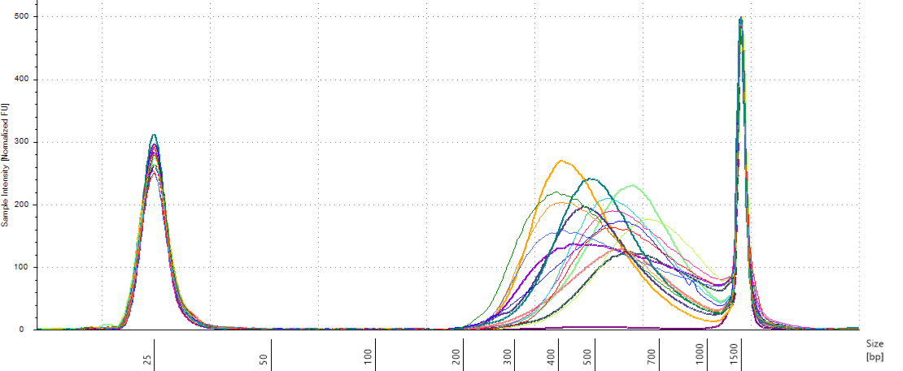
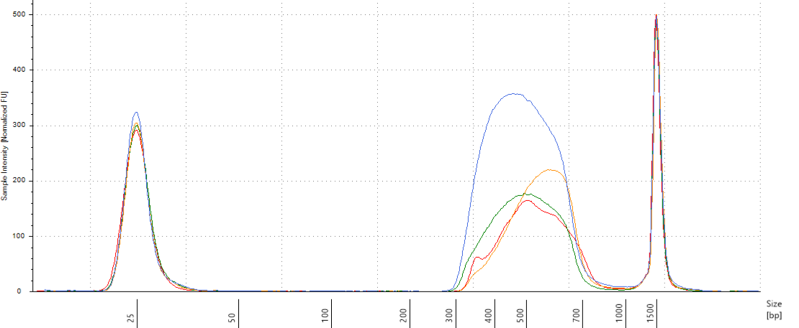

```{r setup_capture, include=FALSE}
rm(list = ls()) ; invisible(gc()) ; set.seed(42)
library(knitr)
library(kableExtra)
if(knitr:::is_html_output()) options(knitr.table.format = "html") 
if(knitr:::is_latex_output()) options(knitr.table.format = "latex") 
library(parallel)
library(tidyverse)
library(rstan)
options(mc.cores = parallel::detectCores())
rstan_options(auto_write = T)
theme_set(bayesplot::theme_default())
opts_chunk$set(
  echo = F, message = F, warning = F, fig.height = 6, fig.width = 8,
  cache = T, cache.lazy = F)
path <- "data/Symphonia_Paracou"
```


# Genomic libraries and sequence capture

Genomic DNA was extracted from 5 mg of dried leaf tissue with a CTAB protocol [@Doyle1987]. 
DNA extracts were digested with 'Ultra II FS Enzyme Mix' (new England Biolabs Inc, MA, USA) for a target size of 150 bp, 
and libraries built with the 'NEBNext Ultra II FS DNA Library Prep kit for Illumina'(New England Biolabs Inc, MA, USA).
We amplified and tagged libraries using 5 $\mu L$ of adaptor-ligated DNA, 8.3 $\mu L$ of 'NEBNext Ultra II Q5 Master Mix' (new England Biolabs Inc, MA, USA), 2x 1.6 $\mu L$ of Index Primer i5 and i7 from 'NEBNext Multiplex Oligos for Illumina (Dual Index Primers Set 1 and Set 2)' (new England Biolabs Inc, MA, USA). 
Initial denaturation (98°C for 30 s) was followed by 8 cycles (98°C for 10 s and 65°C for 1 min 30 s) and a final extension (65°C for 5 min). 
We pooled libraries in four equimolar multiplexes for each genus.
We obtained a custom made set of  20,000 80-mer probes using myBaits Custom 1-20K (Arbor Biosciences, MI, USA)
and conducted the capture experiments using the corresponding myBaits V4 protocol with a hybridization time of 80 hours.
We pooled the four multiplexes and sequenced them in two lanes of an Illumina HiSeq 4000 instrument obtaining 2x150bp pair-end reads.

## Plates

This sub-chapter describes  preparation of plates after the extraction and before library preparation. 
First we looked into plates design after extraction. 
Then we quantified their concentration, volume and DNA quantity, before rearranging them based on their concentration.
Finally plates concentration was adjusted to 20 $ng.\mu L^{-1}$ and sorted by electrophoresis evaluation.

### Extraction

#### Extraction Plates

Plates after extraction were arranged following figure \@ref(fig:plates).

```{r plates, fig.cap="Extraction plates organization"}
extraction <- readxl::read_xlsx(file.path(path, "Symcapture.xlsx"), 
                                sheet = "Extraction")
extraction %>% 
  mutate(row = substr(Position_extraction, 1, 1)) %>% 
  mutate(col = substr(Position_extraction, 2, 3)) %>% 
  group_by(Plate_extraction) %>% 
   ggplot(aes(y = factor(row, levels = rev(LETTERS[1:8])),
             x = factor(col, levels = 1:12))) + 
  geom_text(aes(label = ID_genetic), size = 2.5) +
  facet_wrap(~ Plate_extraction, ncol = 2) +
  theme_bw() +
  labs(x=NULL, y = NULL)
```

All plates were quantified through NanoDrop and some of them with Qubit which is more accurate.
We used Qubit-NanoDrop relation to have an estimation of concentration for all samples. Finally electrophoreses were also used to assess DNA quality and degradation.

#### Extraction NanoDrop

NanoDrop evaluated $1 \mu L$ of samples DNA concentration (figure \@ref(fig:nanodrop)) by absorption in addition to contamination.
But NanoDrop is known to be inaccurate, especially under 25 $ng.\mu L^{-1}$.

```{r nanodrop, fig.cap="Extraction plate NanoDrop concentration (in ng/microL)"}
nanodrop <- do.call("rbind", sapply(list.files(file.path(path, "NanoDrop", "Extraction"), 
                                               full.names = T),
                                  read.delim2, simplify = F)) %>% 
  mutate(row = substr(Well, 1, 1)) %>% 
  mutate(col = substr(Well, 2, 3)) %>% 
  group_by(`Plate.ID`) %>% 
  arrange( Well, -Time) %>% 
  filter(!duplicated(Well)) %>% 
  mutate(Conc. = ifelse(Conc. < 0, NA, Conc.)) %>% 
  mutate(Conc. = ifelse(Conc. > 1000, NA, Conc.)) %>% 
  dplyr::rename(plate = `Plate.ID`, well = Well,
                concentration = Conc., r260.280 = X260.280, 
                r260.230 = X260.230)
nanodrop %>% 
  select(plate, well, row, col, concentration) %>% 
  arrange(plate, row, col) %>% 
  ggplot(aes(y = factor(row,levels = rev(LETTERS[1:8])),
             x = factor(col,levels = 1:12))) + 
  geom_text(aes(label = concentration), size = 2.5) +
  facet_wrap(~ plate, nrow = 3) +
  theme_bw() +
  labs(x=NULL, y = NULL)
```

#### Extraction Qubit

We used Qubit on 12 samples to have a more precise idea of samples concentration. 
Qubit uses fluorescence to measure samples concentration in $ng.\mu L^{-1}$.
We compared Qubit estimation of concentration to NanoDrop estimation. 
We used a bayesian approach to fit the model $Concentration_{Qubit} \sim \mathcal{N}(\beta*Concentration_{NanoDrop},\sigma)$ with a null intercept. 
We found a pretty strong relation with a beta around 0.3. 
We used this relation to better estimate the concentration of all samples.

```{r fit}
Qubit <- readxl::read_xlsx(file.path(path, "Symcapture.xlsx"), 
                                sheet = "QBit_extraction")
data <- filter(Qubit, Concentration_NanoDrop < 250)
fit <- stan(model_code = 
  "
  data {
    int N ;
    vector[N] Y ;
    vector[N] X ;
  }
  parameters {
    real beta ;
    real sigma ;
  }
  model {
      Y ~ normal(beta*X, sigma) ;
  }",
                data = list(N = nrow(data),
                            Y = data$Concentration_Final,
                            X = data$Concentration_NanoDrop))
broom.mixed::tidyMCMC(fit, droppars = NULL, rhat = T) %>%
  kable(caption = "Summary table of the model")
```

```{r pred, fig.cap="Model result of the relation between DNA concentration measured with Qubit and NanoDrop. Color indicates the electrophoresis classification of the samples."}
beta <- broom.mixed::tidyMCMC(fit, droppars = NULL, rhat = T) %>% 
  filter(term == "beta") %>% select(estimate) %>% unlist()
Qubit %>% 
  ggplot(aes(Concentration_NanoDrop, Concentration_Final)) +
  geom_point(aes(color = Quality_Electrophoresis)) +
  geom_abline(intercept = 0, slope = beta) +
  xlab("Concentration NanoDrop (ng/microL)") +
  ylab("Concentration Qubit (ng/microL)") +
  scale_color_discrete("Electrophoresis") +
  ggtitle(paste("Y =", round(beta,2), "* X"))
```

#### Extraction Electrophoresis

We evaluated samples quality and degradation by an electrophoresis of 1 to 1.5 $\mu L$ of sample DNA with 1 to 1.5 $\mu L$ of **weight** migrating 20 minutes with 20 V on an agarose gel with 80 $mL$ of 0.1 X TAE with 1 $\mu L$ of red gel.
Samples were classified as good, medium and bad. 
"Good" samples only included a band at high molecular weight.
"Bad" samples only included a smear at low molecular weight indicating degraded DNA.
"Medium" samples included both.

```{r electrophoresis, fig.cap="Extraction plate Electrophoresis quality"}
electrophoresis <- readxl::read_xlsx(file.path(path, "Symcapture.xlsx"), 
                                sheet = "Electrophoresis_extraction")
electrophoresis %>% 
  arrange(Plate_extraction, Row_extraction, Column_extration) %>% 
  ggplot(aes(y = factor(Row_extraction,levels = rev(LETTERS[1:8])),
             x = factor(Column_extration,levels = 1:12),
             col = Quality_Electrophoresis)) + 
  geom_point(shape = 21) +
  facet_wrap(~ Plate_extraction, nrow = 3) +
  theme_bw() +
  labs(x=NULL, y = NULL)
```

### Library plates design

We first designed new plates based on the samples concentration in order to bring all samples to the same concentration for further easier manipulations in library preparation.

```{r data}
data <- extraction %>% 
  filter(!is.na(ID_genetic)) %>% 
  left_join(nanodrop %>% 
              select(plate, well, concentration) %>% 
              dplyr::rename(Plate_extraction = plate, 
                            Position_extraction = well, 
                            nanodrop = concentration)) %>% 
  mutate(concentration_est = beta*nanodrop) %>%
  mutate(ID_paracou = paste0("P", Plot, "_", SubPlot, "_", TreeFieldNum)) %>% 
  mutate(ID = ifelse(!is.na(Plot), ID_paracou, ID_genetic))
```

#### Pool

We pooled all individuals  with 2 extractions and with a nanodrop concentration inferior to 25 $ng.\mu L^{-1}$. Individuals with only one extraction were further concentrated. **Warning, P7-3-2812 has been pooled from P2.C12 to P7.C12 instead of P7.D12.**

```{r pool}
data %>%
  group_by(ID) %>% 
  filter(nanodrop < 25 | is.na(nanodrop)) %>% 
  filter(n() > 1) %>% 
  arrange(ID) %>% 
  select(ID, Plate_extraction, Position_extraction, nanodrop) %>% 
  head() %>% 
  kable(caption = "Preview of Samples to be pooled. From plates 1, 2 and 3 to plate 5, 6 and 7") %>% 
  kable_styling(full_width = F)
```


#### Pool and new samples nanodrop

Pooled individuals and new individuals from Itubera Brazil (n = 3), La Selva Costa Rica (n = 2) and Barro Colorado Island Panama (n = 2)  have been quantified again with the nanodrop.

```{r nanodrop2}
america <- read.delim2(file.path(path, "NanoDrop", "PullNewSamples",
                                 "sylvain_symphonia_america.txt")) %>% 
  dplyr::select(Sample.ID, Conc.) %>% 
  dplyr::rename(ID = Sample.ID, nanodrop = Conc.) %>% 
  mutate(Plate = "America", Position = NA)
itubera <- read.delim2(file.path(path, "NanoDrop", "PullNewSamples",
                                 "sylvain_symphonia_Itubera.txt")) %>% 
  dplyr::select(Plate.ID, Well, Conc.) %>% 
  dplyr::rename(Plate = Plate.ID, Position = Well, nanodrop = Conc.) %>% 
  mutate(Plate = "Itubera") %>% 
  mutate(ID = paste0("IT_", Position))
pull <- read.delim2(file.path(path, "NanoDrop", "PullNewSamples",
                              "sylvain_symphonia_pull.txt")) %>% 
  dplyr::select(Sample.ID, Conc.) %>% 
  dplyr::rename(ID = Sample.ID, nanodrop = Conc.) %>% 
  mutate(Plate = "Pull", Position = NA)
rbind(america, itubera, pull) %>% 
  sample_n(5) %>% 
  kable(caption = "Preview of New nanodrops.")
```

#### Concentration Plates

We reorganised plates in a new scheme ordered by concentration following figure \@ref(fig:concPlatePosition) design with figure \@ref(fig:concPlateConcentration) concentrations.

```{r newData}
pull <- pull %>% 
  dplyr::rename(nanodrop2 = nanodrop) %>% 
  select(ID, nanodrop2) %>% 
  mutate(ID = gsub("-", "_", ID))
america <- america %>%
  mutate(Origin = substr(ID, 1,2)) %>% 
  mutate(Country = ifelse(Origin == "LS", "Costa Rica", "Panama")) %>% 
  mutate(Origin = ifelse(Origin == "LS", "La Selva", "BCI")) %>% 
  mutate(Species = "S. globulifera",
          ID_genetic = ID, ID_paracou = NA, 
         Plot = NA, Subplot = NA, Number = NA) %>% 
  arrange(ID, Plate, Position, nanodrop,
          Species, Origin, Country,
          ID_genetic, ID_paracou, Plot, Subplot, Number) %>% 
  group_by(Origin) %>% 
  arrange(desc(nanodrop)) %>% 
  dplyr::slice(1:2)
itubera <- itubera %>% 
  mutate(Species = "S. globulifera", Origin = "Itubera", Country = "Brazil",
          ID_genetic = ID, ID_paracou = NA, 
         Plot = NA, Subplot = NA, Number = NA) %>% 
  arrange(ID, Plate, Position, nanodrop,
          Species, Origin, Country,
          ID_genetic, ID_paracou, Plot, Subplot, Number) %>% 
  mutate_if(is.factor, as.character) %>% 
  arrange(desc(nanodrop)) %>% 
  dplyr::slice(1:3)
data <- data %>% 
  filter(!(Plate_extraction %in% 1:2)) %>% 
  group_by(ID) %>% 
  arrange(ID, Plate_extraction) %>% 
  filter(row_number() == n()) %>% 
  left_join(pull, by = "ID") %>% 
  mutate(nanodrop = ifelse(is.na(nanodrop2), nanodrop, nanodrop2)) %>% 
  select(-nanodrop2, -concentration_est, -Comment) %>% 
  arrange(ID, Plate_extraction, Position_extraction, nanodrop,
          Species, Origin, Country,
          ID_genetic, ID_paracou, Plot, SubPlot, TreeFieldNum) %>% 
  mutate(Plate_extraction = as.character(Plate_extraction)) %>%
  bind_rows(america) %>%
  bind_rows(itubera) %>% 
  mutate(concentration = beta*nanodrop)
```

```{r concPlate}
data <- data %>% 
  select(ID, Plate_extraction, Position_extraction, concentration) %>% 
  arrange(concentration)
data$Plate_concentration <- rep(1:5, each = 8*12)[1:432]
data$Position_concentration <- rep(unlist(sapply(1:12, function(x) paste0(LETTERS[1:8], x))), 5)[1:432]
```

```{r concPlatePosition, fig.cap="Previous extraction position in plates arranged by concentration."}
data %>% 
  mutate(row = substr(Position_concentration, 1, 1)) %>% 
  mutate(col = substr(Position_concentration, 2, 3)) %>% 
  group_by(Plate_concentration) %>% 
  mutate(past_Position = ifelse(!is.na(Position_extraction) & Plate_extraction != "Itubera", 
                                paste0("P", Plate_extraction, ".", Position_extraction), ID)) %>% 
  select(Plate_concentration, row, col, past_Position) %>% 
  arrange(Plate_concentration, row, col) %>% 
  ggplot(aes(y = factor(row,levels = rev(LETTERS[1:8])),
             x = factor(col,levels = 1:12))) + 
  geom_text(aes(label = past_Position), size = 2.5) +
  facet_wrap(~ Plate_concentration, nrow = 3) +
  theme_bw() +
  labs(x=NULL, y = NULL)
```

```{r concPlateConcentration, fig.cap="Concentration in plates arranged by concentration."}
data %>% 
   mutate(row = substr(Position_concentration, 1, 1)) %>% 
  mutate(col = substr(Position_concentration, 2, 3)) %>% 
  group_by(Plate_concentration) %>% 
  arrange(Plate_concentration, row, col) %>% 
  ggplot(aes(y = factor(row,levels = rev(LETTERS[1:8])),
             x = factor(col,levels = 1:12),
             col = concentration < 20)) + 
  geom_text(aes(label = round(concentration, 1)), size = 2.5) +
  facet_wrap(~ Plate_concentration, nrow = 3) +
  theme_bw() +
  labs(x=NULL, y = NULL)
```

#### Samples volume

In order to adjust samples concentration we needed first to assess their current volume, see figure \@ref(fig:volumes). 
Volume after extraction was around 45 $\mu L$ (estimated loss). 
Samples have lost volume with NanoDrop, Qubit, electrophoresis, and libraries trial, one or two times. 
Some samples gained volume with pooling. 
We can consider all samples to have lost 1 $\mu L$ with NanoDrop. 
Samples used in Qubit lost an additional 1.5 to 3 $\mu L$. 
Finally samples used in trial libraries lost between 0.5 and 5 $\mu L$ (with library test II repeated). 
Pooled samples from plate 5, 6 an 7 gained 49 $\mu L$ from NanoDrop samples from plate 1, 2, 3 and 4 unused for NanoDrop, Qubit nor libraries trial (original 50 minus 1 due to NanoDrop measurement).
Added samples from Itubera, La Selva and Barro Colorado Island have an estimated volume of 10 $\mu L$ (overestimated).

```{r volumes, fig.cap="Samples estimated volumes."}
tests <- readxl::read_xlsx(file.path(path, "Symcapture.xlsx"), 
                                sheet = "Tests") %>% 
  mutate(Volume_Test = ifelse(Date == "23/07/2018", 
                              Volume_Test*2, Volume_Test)) # repeated library test II
data <- data %>% 
  mutate(volume_init = 45) %>% # lost volume
  mutate(volume_nanodrop = -1) %>% 
  left_join(mutate(Qubit, volume_Qubit = -Volume_Sample) %>% 
              mutate(Plate_extraction = as.character(Plate_extraction)) %>% 
              select(Plate_extraction, Position_extraction, volume_Qubit)) %>% 
  mutate(volume_Qubit = ifelse(is.na(volume_Qubit), 0, volume_Qubit)) %>% 
  mutate(volume_pool = ifelse(ID %in% pull$ID, 49, 0)) %>% 
  left_join(mutate(tests, volume_libraries_test = -Volume_Test) %>% 
              mutate(Plate_extraction = as.character(Plate_extraction)) %>% 
              select(Plate_extraction, Position_extraction, volume_libraries_test)) %>% 
  mutate(volume_libraries_test = ifelse(is.na(volume_libraries_test), 
                                        0, volume_libraries_test)) %>% 
  mutate(volume = sum(volume_init, volume_nanodrop, volume_Qubit, 
                      volume_pool, volume_libraries_test)) %>% 
  mutate(volume = ifelse(Plate_extraction %in% c("America", "Itubera"), 10, volume)) %>% 
  select(-volume_init, -volume_nanodrop, -volume_Qubit, -volume_pool, -volume_libraries_test)
data  %>% 
  mutate(row = substr(Position_concentration, 1, 1)) %>% 
  mutate(col = substr(Position_concentration, 2, 3)) %>% 
  ggplot(aes(y = factor(row,levels = rev(LETTERS[1:8])),
             x = factor(col,levels = 1:12),
             col = volume)) + 
  geom_text(aes(label = round(volume, 1)), size = 2.5) +
  facet_wrap(~ Plate_concentration, nrow = 3) +
  theme_bw() +
  labs(x=NULL, y = NULL)
```

#### DNA quality

We assessed DNA fragment quality and size through electrophoresis and reorganized columns inside plates by quality.

```{r dnaQuality}
electrophoresis <- readxl::read_xlsx(file.path(path, "Symcapture.xlsx"), 
                                sheet = "Electrophoresis_extraction") %>% 
  select(Plate_extraction, Position_extraction, Quality_Electrophoresis) %>% 
  mutate(Plate_extraction = as.character(Plate_extraction))
data <- data %>%
  left_join(electrophoresis) %>% 
  mutate(Quality_Electrophoresis = ifelse(is.na(Quality_Electrophoresis), 
                                          "Medium", Quality_Electrophoresis))
data <- data %>%  
  mutate(numeric_status = ifelse(Quality_Electrophoresis == "Good", 1, NA)) %>% 
  mutate(numeric_status = ifelse(Quality_Electrophoresis == "Medium", 2, numeric_status)) %>% 
   mutate(numeric_status = ifelse(Quality_Electrophoresis == "Bad", 3, numeric_status)) %>% 
  arrange(Plate_concentration, desc(numeric_status))
data$Plate_library <- rep(1:5, each = 8*12)[1:432]
data$Position_library <- rep(unlist(sapply(1:12, function(x) paste0(LETTERS[1:8], x))), 5)[1:432]
# data %>%
#   select(ID,	Plate_concentration,	Position_concentration,	volume, concentration,
#          Plate_library,	Position_library, Quality_Electrophoresis) %>%
#   write_csv(path = file.path(path, "Final plate.csv"))
```

```{r robotQuality}
data %>%
  mutate(volumeplus5 = volume + 5) %>% 
  mutate(volumeplus5 = ifelse(volume+5 > 50, 50, volumeplus5)) %>% 
  filter(Plate_concentration %in% 1:2) %>% 
  mutate(source_Plate = ifelse(Plate_concentration == 1, "PCR1", "PCR3")) %>% 
  mutate(dest_Plate = ifelse(Plate_concentration == 1, "PCR2", "PCR4")) %>% 
  mutate(source_Position = Position_concentration) %>% 
  mutate(dest_Position = Position_library) %>% 
  select(ID,	source_Plate,	source_Position,	volumeplus5, concentration,
         dest_Plate,	dest_Position)
  # write_csv(path = file.path(path, "Robot", "arrangement_quality",
  #                            "Robot1.csv"))
data %>%
  mutate(volumeplus5 = volume + 5) %>% 
  mutate(volumeplus5 = ifelse(volume+5 > 50, 50, volumeplus5)) %>% 
  filter(Plate_concentration %in% 3:4) %>% 
  mutate(source_Plate = ifelse(Plate_concentration == 3, "PCR1", "PCR3")) %>% 
  mutate(dest_Plate = ifelse(Plate_concentration == 3, "PCR2", "PCR4")) %>% 
  mutate(source_Position = Position_concentration) %>% 
  mutate(dest_Position = Position_library) %>% 
  select(ID,	source_Plate,	source_Position,	volumeplus5, concentration,
         dest_Plate,	dest_Position)
  # write_csv(path = file.path(path, "Robot", "arrangement_quality",
  #                            "Robot2.csv"))
data %>%
  mutate(volumeplus5 = volume + 5) %>% 
  mutate(volumeplus5 = ifelse(volume+5 > 50, 50, volumeplus5)) %>% 
  filter(Plate_concentration %in% 5:6) %>%   
  mutate(source_Plate = ifelse(Plate_concentration == 5, "PCR1", "PCR3")) %>% 
  mutate(dest_Plate = ifelse(Plate_concentration == 5, "PCR2", "PCR4")) %>% 
  mutate(source_Position = Position_concentration) %>% 
  mutate(dest_Position = Position_library) %>% 
  select(ID,	source_Plate,	source_Position,	volumeplus5, concentration,
         dest_Plate,	dest_Position)
  # write_csv(path = file.path(path, "Robot", "arrangement_quality",
  #                            "Robot3.csv"))
data %>%
  mutate(volumeplus5 = volume + 5) %>% 
  filter(volumeplus5 > 50) %>% 
  select(ID,	Plate_concentration,	Position_concentration,	volumeplus5, concentration,
         Plate_library,	Position_library) %>% 
  kable()
```

```{r dnaQualityPlot1, fig.cap="Plates electrophoresis status before rearrangement."}
data %>% 
  mutate(row = substr(Position_concentration, 1, 1)) %>% 
  mutate(col = substr(Position_concentration, 2, 3)) %>% 
  ggplot(aes(y = factor(row,levels = rev(LETTERS[1:8])),
             x = factor(col,levels = 1:12),
             col = Quality_Electrophoresis)) + 
  geom_point(size = 4)  +
  facet_wrap(~ Plate_concentration, nrow = 3) +
  theme_bw() +
  labs(x=NULL, y = NULL)
```

```{r dnaQualityPlot2, fig.cap="Plates electrophoresis status after rearrangement."}
data %>% 
  mutate(row = substr(Position_library, 1, 1)) %>% 
  mutate(col = substr(Position_library, 2, 3)) %>% 
  ggplot(aes(y = factor(row,levels = rev(LETTERS[1:8])),
             x = factor(col,levels = 1:12),
             col = Quality_Electrophoresis)) + 
  geom_point(size = 4)  +
  facet_wrap(~ Plate_library, nrow = 3) +
  theme_bw() +
  labs(x=NULL, y = NULL)
```

#### Concentration

All individuals with an estimated concentration inferior to 19 $ng.\mu L^{-1}$ (Plates 1 and 2) have been dried in the speed vacuum centrifuge.
And corresponding volume of milliQ water will be added to reach a concentration of 20 $ng.\mu L^{-1}$ (or at least 6.5 $\mu L$ to reach sample volume). 
Their DNA content in $ng$ has been computed multiplying concentration with volume. 
The volume of water to add is thus the DNA content divided by the objective concentration of 20 $ng.\mu L^{-1}$: $V = \frac{C_0*V_0}{20}$. 
Corresponding volumes are shown in figure \@ref(fig:concentrationVolume).

```{r concentration, fig.cap="Samples to be concentrated. Estimated concentration in ng/microL"}
data %>% 
  filter(Plate_library %in% 1:2) %>% 
  mutate(row = substr(Position_library, 1, 1)) %>% 
  mutate(col = substr(Position_library, 2, 3)) %>% 
  ggplot(aes(y = factor(row,levels = rev(LETTERS[1:8])),
             x = factor(col,levels = 1:12))) + 
  geom_text(aes(label = round(concentration, 2)), size = 2.5) +
  facet_wrap(~ Plate_library, nrow = 3) +
  theme_bw() +
  labs(x=NULL, y = NULL)
```

```{r concentrationVolume, fig.cap="Volume to resuspend dry samples."}
data %>% 
  filter(Plate_library %in% 1:2) %>% 
  mutate(new_volume = (volume*concentration)/20) %>% 
  mutate(new_volume = ifelse(new_volume < 10, 10, new_volume)) %>% 
  mutate(row = substr(Position_library, 1, 1)) %>% 
  mutate(col = substr(Position_library, 2, 3)) %>% 
  ggplot(aes(y = factor(row,levels = rev(LETTERS[1:8])),
             x = factor(col,levels = 1:12))) + 
  geom_text(aes(label = round(new_volume, 2)), size = 2.5) +
  facet_wrap(~ Plate_library, nrow = 3) +
  theme_bw() +
  labs(x=NULL, y = NULL)
```

```{r robotResuspension}
data %>%
  ungroup() %>% 
  filter(Plate_library %in% 1:2) %>% 
  mutate(new_volume = (volume*concentration)/20) %>% 
  mutate(new_volume = ifelse(new_volume < 10, 10, new_volume)) %>% 
  mutate(new_volume = round(new_volume, 1)) %>% 
  mutate(sample_volume = 0) %>% 
  mutate(source_Plate = ifelse(Plate_library == 1, "PCR1", "PCR3")) %>% 
  mutate(dest_Plate = ifelse(Plate_library == 1, "PCR2", "PCR4")) %>% 
  mutate(source_Position = Position_library) %>% 
  mutate(dest_Position = Position_library) %>% 
  select(source_Plate,	source_Position,	sample_volume, new_volume,
         dest_Plate,	dest_Position)
  # write_csv(path = file.path(path, "Robot", "resuspension",
  #                            "Plate1Plate2.csv"))
```

#### Samples volume

The objective was to get 100 $ng$ of DNA in 6.5 $\mu L$ of sample for the library preparation. 
Consequently we needed to extract with the robot $V = \frac{n}{C} = \frac{100}{C}$ with $C$ the sample concentration in $ng.\mu L^{-1}$.

```{r sampleVolume, fig.cap="Sample volume (microL)"}
data <- data %>% 
  mutate(new_concentration = ifelse(Plate_library %in% 1:2, 20, concentration)) %>% 
  mutate(sample_volume = 100/new_concentration) %>% 
  mutate(sample_volume = ifelse(sample_volume < 1, 1, sample_volume)) %>% 
  mutate(sample_volume = ifelse(is.na(sample_volume), 1.5, sample_volume))
data %>% 
  mutate(row = substr(Position_library, 1, 1)) %>% 
  mutate(col = substr(Position_library, 2, 3)) %>% 
  ggplot(aes(y = factor(row,levels = rev(LETTERS[1:8])),
             x = factor(col,levels = 1:12))) + 
  geom_text(aes(label = round(sample_volume, 2)), size = 2.5) +
  facet_wrap(~ Plate_library, nrow = 3) +
  theme_bw() +
  labs(x=NULL, y = NULL)
```

```{r robotSamples}
data %>% 
  filter(Plate_library %in% 3:4) %>% 
  mutate(source_Plate = ifelse(Plate_library == 3, "PCR1", "PCR3")) %>% 
  mutate(dest_Plate = ifelse(Plate_library == 3, "PCR2", "PCR4")) %>% 
  mutate(source_Position = Position_library) %>% 
  mutate(dest_Position = Position_library) %>% 
  mutate(water_volume = 6.5 - sample_volume) %>% 
  mutate(water_volume = ifelse(water_volume < 2, 0, water_volume)) %>% 
  mutate(water_volume = round(water_volume, 1)) %>% 
  mutate(sample_volume = round(sample_volume, 1)) %>% 
  select(source_Plate,	source_Position,	sample_volume, water_volume,
         dest_Plate,	dest_Position) 
    # write_csv(path = file.path(path, "Robot", "library_samples",
    #                          "Plate3Plate4.csv"))
data %>% 
  filter(Plate_library == 5) %>% 
  mutate(source_Plate = "PCR1") %>% 
  mutate(dest_Plate = "PCR2") %>% 
  mutate(source_Position = Position_library) %>% 
  mutate(dest_Position = Position_library) %>% 
  mutate(sample_volume = 2*sample_volume) %>% 
  mutate(water_volume = 13 - sample_volume) %>% 
  mutate(water_volume = round(water_volume, 1)) %>% 
  mutate(sample_volume = round(sample_volume, 1)) %>% 
  select(source_Plate,	source_Position,	sample_volume, water_volume,
         dest_Plate,	dest_Position) 
    # write_csv(path = file.path(path, "Robot", "library_samples",
    #                          "Plate5.csv"))
data %>% 
  ungroup() %>% 
  filter(Plate_library %in% 3:4) %>% 
  mutate(source_Plate = ifelse(Plate_library == 3, "PCR1", "PCR3")) %>% 
  mutate(dest_Plate = ifelse(Plate_library == 3, "PCR2", "PCR4")) %>% 
  mutate(source_Position = Position_library) %>% 
  mutate(dest_Position = Position_library) %>% 
  mutate(water_volume = 6.5 - sample_volume) %>% 
  select(Plate_library, Position_library, sample_volume, water_volume) %>% 
  filter(water_volume < 2) %>% kable()
```

## Libraries preparation protocol

The protocol is given per sample with the corresponding volume for a plate of 96 samples in bracket.

### Material preparation

* **0.5 $\mu L$ of 10mM TrisHCL + 10 mM NaCl** (48 $\mu L$ per plate)
* **46.875 $\mu L$ of 0.1X TE buffer** (2 136.875 $\mu L$ per plate) = 4.7 $\mu L$ of TE buffer (213.7 $\mu L$ per plate) + 42.3  $\mu L$ of water (1 923.3 $\mu L$ per plate)
* **400 $\mu L$ of fresh 80% Ethanol** (38 400  $\mu L$ per plate)

### Fragmentation

1. Prepare **6.5 $\mu L$ of samples** with *ca* **100 $ng$ of DNA** (see previous chapter)
2. **On ice**, pipette up and down **ULTRA II FS Reaction Buffer** 10X, vortex 5" and spin
3. **On ice**, vortex 5" **Ultra II FS Enzyme Mix** and spin
4. **On ice**, premix **0.5  $\mu L$ of Ultra II FS Enzyme Mix** (48 $\mu L$ per plate) with **1.75 $\mu L$ of Ultra II FS Reaction Buffer** (168 $\mu L$ per plate), vortex and spin
5. **On ice**, add **2.25  $\mu L$ of premix** to each sample, vortex 5" and spin:

```{r}
data.frame(
  Component = c("DNA", "Ultra II FS Enzyme Mix", "Ultra II FS Reaction Buffer", "Total"),
  V = c("6.5 $\\mu L$", "0.5 $\\mu L$", "1.75 $\\mu L$", "8.75 $\\mu L$"),
  Vplate = c("", "48 $\\mu L$", "168 $\\mu L$", "")
) %>% 
kable(col.names = c("Component", "Volume per library", "Volume per plate"))
```

6. Thermocycle with following programs depending on electrophoresis quality:
    * Good: 13'@37°C, 30'@65°C, Hold@-4°C
    * Medium: 9'@37°C, 30'@65°C, Hold@-4°C
    * Bad: 1'@37°C, 30'@65°C, Hold@-4°C
7. *Optionally, put the **NEBNext adaptor for Illumina** out of the freezer (long to melt)*
8. *Optionally, samples can be stored overnight at $-20^\circ$*

### Adaptor ligation

1. **On ice**, prepare diluted adaptor (1:5) with **0.125 $\mu L$ of NEBNext adaptor for Illumina** (12 $\mu L$ per plate) diluted into **0.5 $\mu L$ of 10mM TrisHCL + 10 mM NaCl** (48 $\mu L$ per plate)
2. **On ice**, premix **7.5  $\mu L$ of NEBNext Ultra II Ligation Master Mix** (720 $\mu L$ per plate) with **0.25 $\mu L$ of NEBNext ligation enhancer** (24 $\mu L$ per plate), vortex and spin
3. **On ice**, add **0.625 $\mu L$ of diluted adaptor** and **7.75 $\mu L$ of premix** to samples, mix and spin:

```{r}
data.frame(
  Component = c("DNA", "NEBNext Ultra II Ligation Master Mix", 
                "NEBNext ligation enhancer", "diluted NEBNext adaptor (1:5)", "Total"),
  V = c("8.75 $\\mu L$", "7.5 $\\mu L$", "0.25 $\\mu L$", "0.625 $\\mu L$", "17.25 $\\mu L$"),
  Vplate = c("", "720 $\\mu L$", "24 $\\mu L$", "50 $\\mu L$", "")
) %>% 
kable(col.names = c("Component", "Volume per library", "Volume per plate"))
```

4. Incubate 15'@20°C with **lid open**
5. **On ice**, add **0.75 $\mu L$ of USER Enzyme** (72 $\mu L$ per plate) to samples, mix and spin
6. Incubate 15'@37°C with lid hot (>47°C)
7. *Optionally, samples can be stored overnight at $-20^\circ$*

### Size selection

1. Bring the sample volume from **17.125 $\mu L$** to **27.125 $\mu L$** adding **10 $\mu L$ of 0.1X TE buffer** (1 716 $\mu L$ per plate)
1. Vortex **PGTB beads from batch E** at room temperature
1. Add **7 $\mu L$ (~0.28X) of beads** (672 $\mu L$ per plate) to each sample, mix, vortex 5" keeping beads, incubet 5', spin, place on magnet, wait 5', and transfer ~32 $\mu L$ of sample to a new plate
1. Add **3.5 $\mu L$ (~0.14X) of beads** (336 $\mu L$ per plate) to each sample, mix, wait 5' without the magnet
1. Place on magnet, wait 5" and discard ~35.5 $\mu L$ of supernatant
1. Add **100 $\mu L$ of fresh 80% Ethanol** (9 600 $\mu L$ per plate) to the beads on the magnet, wait 30' remove supernatant
1. Repeat, add **100 $\mu L$ of fresh 80% Ethanol** (9 600 $\mu L$ per plate) to the beads on the magnet, wait 30" remove supernatant
1. Air dry beads 3' on magnet
1. Remove magnet, elute into **12 $\mu L$ of hot 0.1X TE** (1 152 $\mu L$ per plate) (~40°C), mix, incubate 2', spin, put on magnet, wait 5'
1. Transfer 2 x **5 $\mu L$ of supernatant** to 2 new plates
1. *Optionally, samples can be stored overnight at $-20^\circ$*

### Enrichment and purification

*protocol given for delivered oligos at $100mM$, not NEBNext tag at $10mM$*

1. Prepare diluted index (1:10) with **0.16 $\mu L$ of Index Primer i5 and i7** diluted in **1.44 $\mu L$ of mQ $H_2O$** (1.92 $\mu L$ of i5 per row and 1.28 $\mu L$ of i7 per column)
2. Mix in each plate (2 for the 2 PCR), mix and spin :

```{r}
data.frame(
  Component = c("sample", "NEBNext Ultra II Q5 Master Mix", 
                "diluted Index Primer i5 (1:10)", "diluted Index Primer i7 (1:10)", "Total"),
  V = c("5 $\\mu L$", "8.3 $\\mu L$", "1.6 $\\mu L$", "1.6 $\\mu L$", "16.5 $\\mu L$"),
  Vplate = c("", "796.8 $\\mu L$", "19.2 $\\mu L$", "12.8 $\\mu L$", "")
) %>% 
kable(col.names = c("Component", "Volume per library", "Volume per plate/row/column"))
```

3. Thermocycle with following program
    * 30"@98°C
    * 8 cycles of 10"@98°C and 75"@65°C
    * 5'@65°C
    * Hold@4°C
4. *Optionally, amplify only the first plate, assess it with electrophoresis, and adjust cycles number for the second amplification depending on gel migration*
5. Pool PCR results (~16.5 $\mu L$ per sample) from the 2 plates into one (~33.3K $\mu L$ per sample)
6. Vortex **PGTB beads from batch E** at room temperature
7. Add **30 $\mu L$ (~0.9X) of beads** (2 880 $\mu L$ per plate), mix, vortex 5" keeping beads, spin, place on magnet, wait 5', and remove supernatant (~ 63 $\mu L$ per sample)
8. Add **100 $\mu L$ of fresh 80% Ethanol** (9 600 $\mu L$ per plate), wait 30' remove supernatant
9. Repeat, add **100 $\mu L$ of fresh 80% Ethanol** (9 600 $\mu L$ per plate), wait 30" remove supernatant
10. Air dry beads 3' on magnet
11. Remove magnet, elute into **22 $\mu L$ of hot 0.1X TE** (2 112 $\mu L$ per plate) (~40°C), mix, incubate 2', and spin
12. Place on magnet, wait 5', transfer **22 $\mu L$ of supernatant** to a new plate and store at $-20^\circ$

## Library preparation results

### Post-enrichment PCR1 quantification

After the enrichment and the purification of the first PCR (PCR1), we quantified double strand DNA in every plate in order to adjust the second PCR (PCR2), and more specifically in order to increase the number of cycles in PCR2. We used both Quant-It and a few samples on Qubit and transformed raw absorbance results into concentration with regressions.

```{r quantit}
quantit <- read_csv(file.path(path, "QuantIt", 
                   "SYMCAPTURE_Library_enriched_PCR1_Plate1_Plate2_QuantIt.csv"), skip = 53)[2:4] %>% mutate(QuantIt = 1) %>% 
  bind_rows(read_csv(file.path(path, "QuantIt", 
                   "SYMCAPTURE_Library_enriched_PCR1_Plate3_Plate4_Plate5_QuantIt.csv"), skip = 53)[2:4] %>% mutate(QuantIt = 2)) %>% 
  select(-`Well ID`) %>% 
  dplyr::rename(position = Well, fluorescence = `dosage_fluo_384_CB:501,527`) %>% 
  filter(!is.na(fluorescence)) %>%
  mutate(row = substr(position, 1, 1)) %>% 
  mutate(col = substr(position, 2, 3)) %>% 
  arrange(QuantIt, row, as.numeric(col)) %>%
  mutate(plate = NA) %>%
  mutate(plate = ifelse(QuantIt == 1 & row != "I" & (as.numeric(col) %% 2 != 0), 
                         1, plate)) %>% 
  mutate(plate = ifelse(QuantIt == 1 & row != "I" & (as.numeric(col) %% 2 == 0), 
                         2, plate)) %>% 
  mutate(plate = ifelse(QuantIt == 1 & row == "I", "ladder", plate)) %>% 
  filter(!(QuantIt == 1 & plate == "ladder" & as.numeric(col) > 12)) %>% 
  mutate(plate = ifelse(QuantIt == 2 & row %in% LETTERS[1:8] & (as.numeric(col) %% 2 != 0), 
                         3, plate)) %>% 
  mutate(plate = ifelse(QuantIt == 2 & row %in% LETTERS[1:8] & (as.numeric(col) %% 2 == 0), 
                         4, plate)) %>% 
  mutate(plate = ifelse(QuantIt == 2 & row %in% LETTERS[9:11], 5, plate)) %>% 
  mutate(plate = ifelse(QuantIt == 2 & row == "L", "ladder", plate)) %>% 
  filter(!(QuantIt == 2 & plate == "ladder" & as.numeric(col) > 12)) %>% 
  mutate(row_plate = NA) %>% 
  mutate(row_plate = ifelse(plate %in% as.character(1:4), row, row_plate)) %>% 
  mutate(col_plate = NA) %>% 
  mutate(col_plate = ifelse(plate %in% c(1,3), (as.numeric(col) + 1)/2, col_plate)) %>% 
  mutate(col_plate = ifelse(plate %in% c(2,4), as.numeric(col)/2, col_plate)) %>% 
  mutate(concentration = NA) %>% 
  mutate(concentration = ifelse(QuantIt == 1 & plate == "ladder", 
                                rep(c(0, 5, 10, 20, 40, 60), each = 2), concentration)) %>% 
  mutate(concentration = ifelse(QuantIt == 2 & plate == "ladder", 
                                rep(c(0, 5, 10, 20, 40, 60)*19/20, each = 2), concentration))
```

```{stan quantitModel, output.var="quantitModel", echo=F, eval=F, cache=F}
  data {
    int N ;
    real fluorescence[N] ;
    real concentration[N] ;
  }
  parameters {
    real beta ;
    real sigma ;
  }
  model {
    for(n in 1:N)
      concentration[n] ~ normal(beta*fluorescence[n], sigma) ;
  }
```

```{r fitQuantit}
data1 <- quantit %>% filter(QuantIt == 1, plate == "ladder")
data2 <- quantit %>% filter(QuantIt == 2, plate == "ladder")
# fit1 <- sampling(quantitModel,
#                 data = list(N = nrow(data1),
#                             fluorescence = data1$fluorescence,
#                             concentration = data1$concentration))
# fit2 <- sampling(quantitModel,
#                 data = list(N = nrow(data2),
#                             fluorescence = data2$fluorescence,
#                             concentration = data2$concentration))
# save(fit1, fit2, file = "./probes_save/MQantIt.Rdata")
load("save/MQantIt.Rdata")
```

```{r quantitConcentration}
beta1 <- broom.mixed::tidyMCMC(fit1, droppars = NULL, rhat = T) %>% 
  filter(term == "beta") %>% select(estimate) %>% unlist()
beta2 <- broom.mixed::tidyMCMC(fit2, droppars = NULL, rhat = T) %>% 
  filter(term == "beta") %>% select(estimate) %>% unlist()
quantit <- quantit %>% 
  mutate(concentration = ifelse(QuantIt == 1 & plate != "ladder", 
                                fluorescence*beta1, concentration)) %>% 
  mutate(concentration = ifelse(QuantIt == 2 & plate != "ladder", 
                                fluorescence*beta2, concentration))
```

```{r Qubit}
Qubit <- data.frame(
  plate = as.character(1),
  row = "A",
  col = as.character(1:12),
  Qubit = c(0, 0.186, 2.02, 0.26, 5.6, 0.258, 23.8, 8.12, 0.238, 15.4, 12.8, 4.2) 
) %>% 
  left_join(quantit %>% 
              mutate(col_plate = as.character(col_plate)),
            by = c("plate" = "plate", "row" = "row_plate", "col" = "col_plate"))
```

```{stan QubitModelRes, output.var="QubitModel", echo=F, eval=F, cache=F}
  data {
    int N ;
    real quantit[N] ;
    real Qubit[N] ;
  }
  parameters {
    real beta ;
    real sigma ;
  }
  model {
    for(n in 1:N)
      Qubit[n] ~ normal(beta*quantit[n], sigma) ;
  }
```

```{r fitQubit}
# fit <- sampling(QubitModel,
#                 data = list(N = nrow(Qubit),
#                             quantit = Qubit$concentration,
#                             Qubit = Qubit$Qubit))
# save(fit, file = "./probes_save/MQubit.Rdata")
load("save/MQbit.Rdata")
```

```{r quantitQubit}
beta <- broom.mixed::tidyMCMC(fit, droppars = NULL, rhat = T) %>% 
  filter(term == "beta") %>% select(estimate) %>% unlist()
quantit <- quantit %>% 
  mutate(Qubit_est = beta*concentration)
```

```{r quantitConcentrationQubit1}
quantit %>% 
  filter(plate %in% 1:4) %>% 
  ggplot(aes(y = factor(row_plate,levels = rev(LETTERS[1:8])),
             x = factor(col_plate,levels = 1:12))) + 
  geom_point(aes(col = concentration), size =6)  +
  geom_text(aes(label = round(Qubit_est)), size = 2.5, col = "white") +
  facet_wrap(~ plate, nrow = 2, labeller = "label_both") +
  theme_bw() +
  labs(x=NULL, y = NULL)
```

### Post-enrichment (PCR1 & PCR2) and amplification quantification

Libraries showing no band or light smear in the electrophoresis have been amplified,
resulting in amplified plates A1 and A2.
We used the Quant-It to dose all samples (original libraries and amplified libraries).

```{r quantit2}
quantit <- read_csv(file.path(path, "QuantIt", 
                   "SYMCAPTURE_P1_P2_P3.csv"), skip = 53)[2:4] %>% 
  mutate(QuantIt = 1) %>% 
  bind_rows(read_csv(file.path(path, "QuantIt", 
                   "SYMCAPTURE_A1_A2_P4_P5.csv"), skip = 53)[2:4] %>% 
              mutate(QuantIt = 2)) %>% 
  select(-`Well ID`) %>% 
  dplyr::rename(position = Well, fluorescence = `dosage_fluo_384_CB:501,527`) %>% 
  filter(!is.na(fluorescence)) %>%
  mutate(row = substr(position, 1, 1)) %>% 
  mutate(col = substr(position, 2, 3)) %>% 
  arrange(QuantIt, row, as.numeric(col)) %>%
  mutate(plate = NA) %>% 
  mutate(plate = ifelse(QuantIt == 1 & row %in% LETTERS[1:4], "P1", plate)) %>% 
  mutate(plate = ifelse(QuantIt == 1 & row %in% LETTERS[5:8], "P2", plate)) %>% 
  mutate(plate = ifelse(QuantIt == 1 & row %in% LETTERS[9:12], "P3", plate)) %>% 
  mutate(plate = ifelse(QuantIt == 1 & row == "M", "ladder", plate)) %>% 
  mutate(plate = ifelse(QuantIt == 2 & row %in% LETTERS[1:4], "A1", plate)) %>% 
  mutate(plate = ifelse(QuantIt == 2 & row %in% LETTERS[5:8], "A2", plate)) %>% 
  mutate(plate = ifelse(QuantIt == 2 & row %in% LETTERS[9:12], "P4", plate)) %>% 
  mutate(plate = ifelse(QuantIt == 2 & row %in% LETTERS[13:14], "P5", plate)) %>% 
  mutate(plate = ifelse(QuantIt == 2 & row == "O", "ladder", plate)) %>% 
  filter(!(plate == "ladder" & as.numeric(col) > 12)) %>% 
  mutate(row_plate = NA) %>% 
  group_by(plate, row, col) %>% 
  mutate(row_plate = ifelse(plate %in% c("P1", "A1") & (as.numeric(col) %% 2 != 0), 
                            LETTERS[which(LETTERS == row)*2-1], row_plate)) %>% 
  mutate(row_plate = ifelse(plate %in% c("P1", "A1") & (as.numeric(col) %% 2 == 0), 
                            LETTERS[which(LETTERS == row)*2], row_plate)) %>%
  mutate(row_plate = ifelse(plate %in% c("P2", "A2") & (as.numeric(col) %% 2 != 0), 
                            LETTERS[(which(LETTERS == row)-4)*2-1], row_plate)) %>% 
  mutate(row_plate = ifelse(plate %in% c("P2", "A2") & (as.numeric(col) %% 2 == 0), 
                            LETTERS[(which(LETTERS == row)-4)*2], row_plate)) %>% 
  mutate(row_plate = ifelse(plate %in% c("P3", "P4") & (as.numeric(col) %% 2 != 0), 
                            LETTERS[(which(LETTERS == row)-8)*2-1], row_plate)) %>% 
  mutate(row_plate = ifelse(plate %in% c("P3", "P4") & (as.numeric(col) %% 2 == 0), 
                            LETTERS[(which(LETTERS == row)-8)*2], row_plate)) %>%
  mutate(row_plate = ifelse(plate == "P5" & row == "M" & col %in% seq(1, 11, length.out = 6), "A", row_plate)) %>% 
  mutate(row_plate = ifelse(plate == "P5" & row == "M" & col %in% seq(2, 12, length.out = 6), "B", row_plate)) %>% 
  mutate(row_plate = ifelse(plate == "P5" & row == "M" & col %in% seq(13, 23, length.out = 6), "C", row_plate)) %>% 
  mutate(row_plate = ifelse(plate == "P5" & row == "M" & col %in% seq(14, 24, length.out = 6), "D", row_plate)) %>% 
    mutate(row_plate = ifelse(plate == "P5" & row == "N" & col %in% seq(1, 11, length.out = 6), "E", row_plate)) %>% 
  mutate(row_plate = ifelse(plate == "P5" & row == "N" & col %in% seq(2, 12, length.out = 6), "F", row_plate)) %>% 
  mutate(row_plate = ifelse(plate == "P5" & row == "N" & col %in% seq(13, 23, length.out = 6), "G", row_plate)) %>% 
  mutate(row_plate = ifelse(plate == "P5" & row == "N" & col %in% seq(14, 24, length.out = 6), "H", row_plate)) %>% 
  mutate(col_plate = NA) %>% 
  mutate(col_plate = ifelse(!(plate %in% c("P5", "ladder")) & (as.numeric(col) %% 2 != 0), 
                            (as.numeric(col)+1)/2, col_plate)) %>% 
  mutate(col_plate = ifelse(!(plate %in% c("P5", "ladder")) & (as.numeric(col) %% 2 == 0), 
                            as.numeric(col)/2, col_plate)) %>% 
  mutate(col_plate = ifelse(plate == "P5" & (as.numeric(col) %% 2 != 0) & as.numeric(col) < 13, (as.numeric(col)+1)/2, col_plate)) %>% 
  mutate(col_plate = ifelse(plate == "P5" & (as.numeric(col) %% 2 == 0) & as.numeric(col) < 13, as.numeric(col)/2, col_plate)) %>% 
  mutate(col_plate = ifelse(plate == "P5" & (as.numeric(col) %% 2 != 0) & as.numeric(col) > 12, (as.numeric(col)-11)/2, col_plate)) %>% 
  mutate(col_plate = ifelse(plate == "P5" & (as.numeric(col) %% 2 == 0) & as.numeric(col) > 12, (as.numeric(col)-12)/2, col_plate)) %>% 
  group_by(plate) %>% 
  mutate(concentration = NA) %>% 
  mutate(concentration = ifelse(plate == "ladder", 
                                rep(c(0, 5, 10, 20, 40, 60)*19/20, each = 2),
                                concentration)) %>% 
  ungroup()
```

```{r fitQuantit2}
data1 <- quantit %>% filter(QuantIt == 1, plate == "ladder")
data2 <- quantit %>% filter(QuantIt == 2, plate == "ladder")
# fit1 <- sampling(quantitModel,
#                 data = list(N = nrow(data1),
#                             fluorescence = data1$fluorescence,
#                             concentration = data1$concentration))
# fit2 <- sampling(quantitModel,
#                 data = list(N = nrow(data2),
#                             fluorescence = data2$fluorescence,
#                             concentration = data2$concentration))
# save(fit1, fit2, file = "./probes_save/MQantIt2.Rdata")
load("save/MQantIt2.Rdata")
```

```{r quantitConcentration2}
beta1 <- broom.mixed::tidyMCMC(fit1, droppars = NULL, rhat = T) %>% 
  filter(term == "beta") %>% select(estimate) %>% unlist()
beta2 <- broom.mixed::tidyMCMC(fit2, droppars = NULL, rhat = T) %>% 
  filter(term == "beta") %>% select(estimate) %>% unlist()
quantit <- quantit %>% 
  mutate(concentration = ifelse(QuantIt == 1 & plate != "ladder", 
                                fluorescence*beta1, concentration)) %>% 
  mutate(concentration = ifelse(QuantIt == 2 & plate != "ladder", 
                                fluorescence*beta2, concentration))
```

```{r quantitConcentrationPlot4}
quantit %>% 
  filter(plate != "ladder") %>% 
  ggplot(aes(y = factor(row_plate,levels = rev(LETTERS[1:8])),
             x = factor(col_plate,levels = 1:12))) + 
  geom_point(aes(col = concentration), size =6)  +
  geom_text(aes(label = round(concentration)), size = 2.5, col = "white") +
  facet_wrap(~ plate, ncol = 2, labeller = "label_both") +
  theme_bw() +
  labs(x=NULL, y = NULL) +
  scale_color_continuous(guide = F)
```

```{r, eval=F}
readxl::read_xlsx(file.path(path, "Symcapture.xlsx"), 
                                sheet = "Amplification") %>% 
  left_join(quantit %>% 
              filter(grepl("A", plate)) %>% 
              mutate(Plate_amplification = as.numeric(sub("A", "", plate))) %>% 
              mutate(Position_amplification = paste0(row_plate, col_plate)) %>% 
              mutate(Concentration_QuantIt = concentration) %>% 
              select(Plate_amplification, Position_amplification, 
                     Concentration_QuantIt)) %>% 
  write_csv(path = file.path(path, "Amplification.csv"))
```

### Amplification result

We used electrophoresis and noticed if re-amplified samples had a band (B), a light smear (L) or nothing (A). Samples without anything (A) had their library repeated.

```{r elecrtophoresisAmplified, fig.cap="Electrophoresis Amplified"}
readxl::read_xlsx(file.path(path, "Symcapture.xlsx"), 
                                sheet = "Amplification") %>% 
  mutate(row = substr(Position_amplification, 1, 1)) %>% 
  mutate(col = substr(Position_amplification, 2, 3)) %>% 
  ggplot(aes(y = factor(row,levels = rev(LETTERS[1:8])),
             x = factor(col,levels = 1:12))) + 
  geom_point(aes(col = Quality_Electrophoresis), size =6)  +
  geom_text(aes(label = Quality_Electrophoresis), size = 2.5, col = "white") +
  facet_wrap(~ Plate_amplification, ncol = 2, labeller = "label_both") +
  theme_bw() +
  labs(x=NULL, y = NULL)
```

### Library & extraction repetition result

69 libraries were still not satisfying after amplification. Those libraries have been rebuilt from source DNA. Among them, 43 were still not good at the electrophoresis and DNA has been re-extracted. Electrophoresis of re-extracted samples show a high heterogeneity of size, and around 8 of them seem to have not worked. All new samples have been quantified and libraries re-prepared according to the previously detailed protocol.

```{r capture}
library <- readxl::read_xlsx(file.path(path, "Symcapture.xlsx"), 
                                sheet = "Library")
amplification <- readxl::read_xlsx(file.path(path, "Symcapture.xlsx"), 
                                sheet = "Amplification")
repetitions <- readxl::read_xlsx(file.path(path, "Symcapture.xlsx"), 
                                sheet = "Repetitions")
capture <- bind_rows(library %>% 
                       select(ID, Plate_library, Position_library, 
                              i5, i7, Concentration_QuantIt) %>% 
                       left_join(amplification %>% 
                                   select(Plate_library, 
                                          Position_library, Concentration_Amplified)),
                     repetitions %>% 
                       select(ID, Plate_library...2, 
                              Position_library...3, i5, i7, Repeated_Extraction) %>% 
                       dplyr::rename(Plate_library = Plate_library...2, 
                                     Position_library = Position_library...3))
```

## Capture

We did 16 reactions of gene capture by hybridization.
Each reaction had up to 32 samples. 
We proceeded as follows:

1. __Amplifcation 1 Plate reorganization__: plates state and volume have been assessed and 6 new plates (P1 to P6) have been built from (i) original libraries (P1-P5), (ii) reamplified libraries (A1-A2), and (iii) extraction and library repeat (P6). In order to do so, P6 stayed unchanged, and new plates 1 to 5 were either reamplified libraries or original libraries if not reamplified. *Tip: remove unwanted cone from boxes when transferring original P1 to P5 to new ones to work with multi-channel pipette and prepare correspondence table to transfer reamplified plates A1 and A2 to new P1 to P5 plates crossing each line one-by-one.*
1. __DNA dosage 1__: with [PicoGreen](https://www.thermofisher.com/document-connect/document-connect.html?url=https%3A%2F%2Fassets.thermofisher.com%2FTFS-Assets%2FLSG%2Fmanuals%2Fmp07581.pdf&title=UXVhbnQtaVQgUGljb0dyZWVuIGRzRE5BIFJlYWdlbnQgYW5kIEtpdHM), we will assess DNA concentration of each sample with a ladder from 5 to 30 $ng.\mu L^{-1}$ in order to correctly dose low concentration samples.
1. __Amplification 2__: Samples that have never been reamplified with a concentration below 1 $ng.\mu L^{-1}$ have been reorganized on a new plate (A3) and reamplified with 8 cycles.
1. __DNA dosage 2__: Re-amplified samples (A3) have been dosed through NanoDrop and other more accurate technology depending on the availability.
1. __Amplifcation 2 and Library Repeat Plates reorganization__: Re-amplified samples (A3) have been redistributed in their original position within library plates, and plates  and 6.2 reorganized in a unique plate 6.3 for pools building.
1. __Pool building__:  Pool building followed plate organization, with re-extracted samples (P6.2) pooled together due to high fragment size heterogeneity. Pool building must be equimolar and thus depended on DNA dosage. Because we won't pipette less than 0.5 $\mu L$ of the most concentrated sample of one pool, depending on the concentration of the less concentrated sample, we needed to do dilution.
1. __Purification & Concentration__: AMPure beads have been used to clean pools. We also used this step to concentrate samples in a smaller volume for the reaction (targeted volume of reaction is [7 $\mu L$ with 100 to 500 $ng$ of DNA](https://arborbiosci.com/wp-content/uploads/2018/04/myBaits-Manual-v4.pdf)).
1. __Size assessment__: Pools fragments size have been assessed with  [TapeStation](https://www.agilent.com/en/promotions/agilent-4200-tapestation-system?gclid=Cj0KCQjwj9LkBRDnARIsAGQ-hUcY74n88A8zk5NB8XdzdlXYtE0IiZF7aUzKr9-RG1duhTQ7_5PoMykaAgByEALw_wcB&gclsrc=aw.ds), in order to check for correct fragment size distribution, and, if needed, further clean library pools.
1. __Size selection__:  if size distribution result was not good enough, we further cleaned library pools through size selection with a [Pippin](http://www.sagescience.com/products/bluepippin/). *Info: we thus avoid failure of capture with too small fragments but we risk losing libraries.*
1. __Capture__: Finally we realized capture by hybridization following [ArborScience protocol](https://arborbiosci.com/wp-content/uploads/2018/04/myBaits-Manual-v4.pdf)

### Amplifcation 1 Plate reorganization

First amplification plates (A1 and A2) have been redistributed within their original library plates, removing previous libraries.

```{r originToKeep, fig.cap="Original libraries to be kept (P1-P5)."}
capture %>% 
  filter(Plate_library != 6) %>% 
  mutate(origin = ifelse(is.na(Concentration_Amplified), "first", "amplified")) %>% 
  mutate(row = substr(Position_library, 1, 1)) %>% 
  mutate(col = substr(Position_library, 2, 3)) %>% 
  ggplot(aes(y = factor(row,levels = rev(LETTERS[1:8])),
             x = factor(col,levels = 1:12))) + 
  geom_point(aes(col = origin), size =6)  +
  geom_text(aes(label = Position_library), size = 2.5, col = "white") +
  facet_wrap(~ Plate_library, ncol = 2, labeller = "label_both") +
  theme_bw() +
  theme(legend.position = c(0.9, 0.1)) +
  labs(x=NULL, y = NULL)
```

```{r amplifiedReorganizationFig, fig.cap="Original position of amplified samples."}
amplification %>% 
  mutate(Plate_library = as.factor(Plate_library)) %>% 
  mutate(row = substr(Position_amplification, 1, 1)) %>% 
  mutate(col = substr(Position_amplification, 2, 3)) %>% 
  ggplot(aes(y = factor(row,levels = rev(LETTERS[1:8])),
             x = factor(col,levels = 1:12))) + 
  geom_point(aes(col = Plate_library), size =6)  +
  geom_text(aes(label = Position_library), size = 2.5, col = "white") +
  facet_wrap(~ Plate_amplification, ncol = 2, labeller = "label_both") +
  theme_bw() +
  labs(x=NULL, y = NULL)
```

```{r amplifiedReorganizationTab, eval=F}
amplification %>% 
  select(Plate_amplification, Position_amplification, Plate_library, Position_library) %>% 
  kable(caption = "Original position of amplified samples.",
        col.names = c("Plate amplification", "Position amplification",
                      "Plate library", "Position library"),
        format = "pandoc", escape = F) %>% 
  kable_styling(full_width = F)
```

### DNA dosage 1

Samples concentration has been assessed by PicoGreen with ca 60 samples having a concentration below $1 ng.\mu L^{-1}$ among which 50 have not been reamplified (34 among original libraries, and the rest among repeated libraries or extractions). Those samples have been reamplified.

```{r PicoGreen, fig.cap="Sampled dosage by PicoGreen (concentration in ng.uL)."}
picogreen1 <- read_csv(file.path(path, "QuantIt", 
                   "SYMCAPTURE_25032019_PicoGreen_fluo.csv"), skip = 52)[2:4] %>% 
  dplyr::rename(position = Well, fluo = `dosage_fluo_384_CB:485,520`) %>% 
  dplyr::select(position, fluo) %>% 
  filter(!is.na(fluo)) %>% 
  left_join(read_csv(file.path(path, "QuantIt", 
                               "SYMCAPTURE_25032019_PicoGreen_plates.csv"),  skip = 36) %>% 
              dplyr::rename(row = X1) %>% 
              reshape2::melt(id.vars = "row", variable.name = "col", value.name = "library") %>% 
              mutate(position = paste0(row, col)) %>% 
              select(position, library)) %>% 
  separate(library, c("Plate_library", "Position_library"), "_") %>% 
  mutate(Plate_library = as.numeric(gsub("P", "", Plate_library))) %>% 
  select(Plate_library, Position_library, fluo) %>% 
  arrange(Plate_library, Position_library) %>% 
  left_join(data.frame(Plate_library = 0,
                       Position_library = as.vector(sapply(1:6, function(x) paste0(LETTERS[1:4], x))),
                       concentration = rep(c(0, 5, 10, 20, 25, 40), each = 4)))
data1 <- filter(picogreen1, Plate_library == 0)
picogreen1 <- picogreen1 %>% 
  mutate(concentration_est = lm(concentration ~ fluo, data = data1)$coefficients[2]*fluo)
picogreen2 <- read_csv(file.path(path, "QuantIt", 
                   "SYMCAPTURE_26032019_PicoGreen_fluo.csv"), skip = 52)[2:4] %>% 
  dplyr::rename(position = Well, fluo = `dosage_fluo_384_CB:485,520`) %>% 
  dplyr::select(position, fluo) %>% 
  filter(!is.na(fluo)) %>% 
  left_join(read_csv(file.path(path, "QuantIt", 
                               "SYMCAPTURE_26032019_PicoGreen_plates.csv"),  skip = 36) %>% 
              dplyr::rename(row = X1) %>% 
              reshape2::melt(id.vars = "row", variable.name = "col", value.name = "library") %>% 
              mutate(position = paste0(row, col)) %>% 
              select(position, library)) %>% 
  separate(library, c("Plate_library", "Position_library"), "_") %>% 
  mutate(Plate_library = as.numeric(gsub("P", "", Plate_library))) %>% 
  select(Plate_library, Position_library, fluo) %>% 
  arrange(Plate_library, Position_library) %>% 
  left_join(data.frame(Plate_library = 0,
                       Position_library = as.vector(sapply(1:6, function(x) paste0(LETTERS[1:4], x))),
                       concentration = rep(c(0, 5, 10, 20, 25, 40), each = 4))) %>% 
  filter(!is.na(Plate_library))
data2 <- filter(picogreen2, Plate_library == 0)
picogreen2 <- picogreen2 %>% 
  mutate(concentration_est = lm(concentration ~ fluo, data = data2)$coefficients[2]*fluo)
picogreen <- picogreen1 %>% 
  bind_rows(picogreen2) %>% 
  filter(Plate_library != 0) %>% 
  select(-concentration) %>% 
  dplyr::rename(concentration = concentration_est)
rm(picogreen1, picogreen2)
picogreen %>% 
  filter(Plate_library != 0) %>% 
  mutate(row = substr(Position_library, 1, 1)) %>% 
  mutate(col = substr(Position_library, 2, 3)) %>% 
  ggplot(aes(y = factor(row,levels = rev(LETTERS[1:8])),
             x = factor(col,levels = 1:12))) + 
  geom_point(aes(col = round(concentration)), size =6)  +
  geom_text(aes(label = round(concentration)), size = 2.5, col = "white") +
  facet_wrap(~ Plate_library, ncol = 2, labeller = "label_both") +
  theme_bw() +
  labs(x=NULL, y = NULL) +
  theme(legend.position = c(0.9, 0.1))
```

```{r secondAmplification, fig.cap="Samples to be re-amplified."}
picogreen %>% 
  mutate(Plate_library0 =  Plate_library) %>% 
  mutate(Repetition = (Plate_library - round(Plate_library))*10) %>% 
  mutate(Plate_library = round(Plate_library)) %>% 
  left_join(capture) %>% 
  group_by(ID) %>% 
  filter(max(concentration) < 1) %>% 
  filter(is.na(Concentration_Amplified)) %>% 
  mutate(row = substr(Position_library, 1, 1)) %>% 
  mutate(col = substr(Position_library, 2, 3)) %>% 
  ggplot(aes(y = factor(row,levels = rev(LETTERS[1:8])),
             x = factor(col,levels = 1:12))) + 
  geom_point(aes(col = round(concentration, 1)), size =8)  +
  geom_text(aes(label = round(concentration, 1)), size = 2.5, col = "white") +
  facet_wrap(~ Plate_library0, ncol = 2, labeller = "label_both") +
  theme_bw() +
  labs(x=NULL, y = NULL) +
  theme(legend.position = c(0.9, 0.1)) +
  ggtitle("Individual with a maximum concentration < 1 ng.uL which have never been reamplified.", 
          "N = 50 (75% of individual maximum concentration < 1 ng.uL)")
```

### Amplification 2

```{r picogreen2}
picogreen2 <- picogreen %>% 
  mutate(Plate_library0 =  Plate_library) %>% 
  mutate(Repetition = (Plate_library - round(Plate_library))*10) %>% 
  mutate(Plate_library = round(Plate_library)) %>% 
  left_join(capture) %>% 
  group_by(ID) %>% 
  filter(max(concentration) < 1) %>% 
  filter(is.na(Concentration_Amplified)) %>% 
  ungroup() %>% 
  dplyr::select(Plate_library0, Position_library) %>% 
  mutate(Plate_amplification = 3,
         Position_amplification = as.vector(sapply(1:12, function(x) paste0(LETTERS[1:8], x)))[1:nrow(.)]) 
picogreen <- left_join(picogreen, dplyr::rename(picogreen2, Plate_library = Plate_library0))
```

```{r secondAmplificationtTab, eval=F}
kable(picogreen2, caption = "Samples to amplify.",
      col.names = c("Plate library", "Position library",
                    "Plate amplification", "Position amplification"),
      format = "pandoc", escape = F) %>% 
  kable_styling(full_width = F)
```

```{r secondAmplificationtFig, fig.cap="Original position of amplified samples in A3."}
picogreen2 %>% 
  mutate(row = substr(Position_amplification, 1, 1)) %>% 
  mutate(col = substr(Position_amplification, 2, 3)) %>% 
  ggplot(aes(y = factor(row,levels = rev(LETTERS[1:8])),
             x = factor(col,levels = 1:12))) + 
  geom_point(aes(col = as.factor(Plate_library0)), size =6)  +
  geom_text(aes(label = Position_library), size = 2.5, col = "white") +
  facet_wrap(~ Plate_amplification, ncol = 2, labeller = "label_both") +
  theme_bw() +
  labs(x=NULL, y = NULL) +
  theme(legend.position = c(0.9, 0.1))
```

### DNA dosage 2

```{r PicoGreen2, fig.cap="Reampified sampled dosage by PicoGreen (concentration in ng.uL)."}
picogreen2 <- read_csv(file.path(path, "QuantIt", 
                   "SYMCAPTURE_PicoGreen_A3_fluo.csv"), skip = 52)[2:4] %>% 
  dplyr::rename(position = Well, fluo = `dosage_fluo_384_CB:485,520`) %>% 
  dplyr::select(position, fluo) %>% 
  filter(!is.na(fluo)) %>% 
  left_join(read_csv(file.path(path, "QuantIt", 
                               "SYMCAPTURE_PicoGreen_A3_plates.csv"),  skip = 37) %>% 
              dplyr::rename(row = X1) %>% 
              reshape2::melt(id.vars = "row", variable.name = "col", value.name = "library") %>% 
              mutate(position = paste0(row, col)) %>% 
              select(position, library) %>% 
              na.omit()) %>% 
  separate(library, c("Plate_library", "Position_library"), "_") %>% 
  select(Plate_library, Position_library, fluo) %>% 
  arrange(Plate_library, Position_library) %>% 
  left_join(data.frame(Plate_library = "A0",
                       Position_library = as.vector(sapply(1:6, function(x) paste0(LETTERS[1:4], x))),
                       concentration = rep(c(0, 5, 10, 20, 25, 40), each = 4))) %>% 
  filter(!is.na(Plate_library))
data <- filter(picogreen2, Plate_library == "A0")
picogreen2 <- mutate(picogreen2,
                    concentration_est = lm(concentration ~ fluo, data = data1)$coefficients[2]*fluo)
picogreen <- left_join(picogreen,
          picogreen2 %>% 
            filter(Plate_library != "A0") %>% 
            mutate(Plate_amplification = 3, 
                   Position_amplification = Position_library,
                   Concentration_amplification = concentration_est) %>% 
            dplyr::select(Plate_amplification, Position_amplification, Concentration_amplification))
picogreen2 %>% 
  filter(Plate_library != "A0") %>% 
  mutate(row = substr(Position_library, 1, 1)) %>% 
  mutate(col = substr(Position_library, 2, 3)) %>% 
  ggplot(aes(y = factor(row,levels = rev(LETTERS[1:8])),
             x = factor(col,levels = 1:12))) + 
  geom_point(aes(col = round(concentration_est)), size =6)  +
  geom_text(aes(label = round(concentration_est)), size = 2.5, col = "white") +
  facet_wrap(~ Plate_library, ncol = 2, labeller = "label_both") +
  theme_bw() +
  labs(x=NULL, y = NULL) +
  theme(legend.position = c(0.9, 0.1))
```

### Amplification 2 and Library Repeat Plates reorganization

```{r secondAmplificationtTab2, eval=F}
picogreen %>% 
  mutate(Plate_library0 =  Plate_library) %>% 
  mutate(Repetition = (Plate_library - round(Plate_library))*10) %>% 
  mutate(Plate_library = round(Plate_library)) %>% 
  left_join(capture) %>% 
  group_by(ID) %>% 
  filter(max(concentration) < 1) %>% 
  filter(is.na(Concentration_Amplified)) %>% 
  ungroup() %>% 
  dplyr::select(Plate_library0, Position_library) %>% 
  mutate(Plate_amplification = 3,
         Position_amplification = as.vector(sapply(1:12, function(x) paste0(LETTERS[1:8], x)))[1:nrow(.)]) %>% 
  select(Plate_amplification, Position_amplification, Plate_library0, Position_library) %>% 
  kable(caption = "Amplified samples to redistribute.",
        col.names = c("Plate amplification", "Position amplification",
                      "Plate library", "Position library"),
        format = "pandoc", escape = F) %>% 
  kable_styling(full_width = F)
```

```{r P6reorganizationTab, eval=F}
repetitions %>% 
  dplyr::select(LibraryRep_Position, ExtractionRep_Position, Final_Position) %>% 
  dplyr::rename(P6.1 = LibraryRep_Position, P6.2 = ExtractionRep_Position, P6.3 = Final_Position) %>% 
  mutate(P6.1 = ifelse(!is.na(P6.2), NA, P6.1)) %>% 
  reshape2::melt(id.vars = "P6.3", variable.name = "Plate", value.name = "Position") %>% 
  filter(!is.na(Position)) %>% 
  select(Plate, Position, P6.3) %>% 
  kable(caption = "P6 reorganization.",
        col.names = c("Plate 6 origin", "Position origin",
                      "Position destination"),
        format = "pandoc", escape = F) %>% 
  kable_styling(full_width = F)
```

```{r P6reorganizationFig, fig.cap="Original position of plate 6.1 and 6.2 reorganization in 6.3."}
repetitions %>% 
  select(LibraryRep_Position, ExtractionRep_Position, Final_Position) %>% 
  dplyr::rename(P6.1 = LibraryRep_Position, P6.2 = ExtractionRep_Position, P6.3 = Final_Position) %>% 
  mutate(P6.1 = ifelse(!is.na(P6.2), NA, P6.1)) %>% 
  reshape2::melt(id.vars = "P6.3", variable.name = "Plate", value.name = "Position") %>% 
  filter(!is.na(Position)) %>% 
  select(Plate, Position, P6.3) %>% 
  mutate(row = substr(P6.3, 1, 1)) %>% 
  mutate(col = substr(P6.3, 2, 3)) %>% 
  ggplot(aes(y = factor(row,levels = rev(LETTERS[1:8])),
             x = factor(col,levels = 1:12))) + 
  geom_point(aes(col = as.factor(Plate)), size =6)  +
  geom_text(aes(label = Position), size = 2.5, col = "white") +
  theme_bw() +
  labs(x=NULL, y = NULL)
```

### Pool building

Due to non uniformity of fragment size, 
re-extracted samples from P6 (P6.2) have been treated in a single separated reaction (so 15 remaining). 
All other samples have been pulled by batches of 32 following plate order.
We wanted 100 to 500 ng of DNA per reaction, and the reaction with the least samples had 16 samples. 
Consequently we used 15 ng of each sample, resulting in 240 to 645 ng of DNA per sample (but we may lose material in purification, so we aimed for extra). 
Samples reaching to high concentration, 
for which we should sample less than 0.5 $\mu L$ have been diluted 2 to 4 times.

```{r FinalConcentration}
concentration <- picogreen %>% 
  dplyr::rename(Plate_library0 = Plate_library, Position_library0 = Position_library) %>% 
  left_join(repetitions %>% 
              select(LibraryRep_Position, ExtractionRep_Position, Final_Position) %>% 
              dplyr::rename(`6.1` = LibraryRep_Position, `6.2` = ExtractionRep_Position,
                            Position_library = Final_Position) %>% 
              mutate(`6.1` = ifelse(!is.na(`6.2`), NA, `6.1`)) %>% 
              reshape2::melt(id.vars = "Position_library", variable.name = "Plate_library0", 
                             value.name = "Position_library0") %>% 
              mutate(Plate_library0 = as.numeric(as.character(Plate_library0))) %>% 
              filter(!is.na(Position_library0)) %>% 
              mutate(Plate_library = 6) %>% 
              dplyr::select(Plate_library0, Position_library0, Plate_library, Position_library)) %>% 
  mutate(Plate_library = round(ifelse(Plate_library0 %in% c(6.1,6.2), Plate_library, Plate_library0)),
         Position_library = ifelse(is.na(Position_library), Position_library0, Position_library),
         Concentration_PicoGreen = ifelse(is.na(Concentration_amplification), 
                                          concentration, Concentration_amplification)) %>% 
  filter(!is.na(Plate_library)) %>% 
  select(Plate_library, Position_library, Concentration_PicoGreen)
```

```{r captureData}
capture <- capture %>% 
  mutate(row = substr(Position_library, 1, 1)) %>% 
  mutate(col = as.numeric(substr(Position_library, 2, 3))) %>% 
  arrange(Plate_library, col, row) %>% 
  mutate(Reaction = as.factor(c(rep(1:14, each = 32)[1:432], 
                                rep(15,26),rep(16, 43)))) %>% 
  left_join(concentration) %>% 
  select(Reaction, ID, Plate_library, Position_library, Concentration_PicoGreen, i5, i7) %>% 
  mutate(dilution = 1) %>% 
  mutate(volume = round(ifelse(round(Concentration_PicoGreen) < 1, 15,
                         15/round(Concentration_PicoGreen)),1)) %>% 
  mutate(dilution = ifelse(volume < 0.5, dilution/2, dilution)) %>% 
  mutate(volume = ifelse(volume < 0.5, volume*2, volume)) %>% 
  mutate(dilution = ifelse(volume < 0.5, dilution/2, dilution)) %>% 
  mutate(volume = ifelse(volume < 0.5, volume*2, volume))
# write_csv(capture, file.path(path, "capture.csv"))
```

```{r captureTab, eval=F}
capture %>% 
  select(Reaction, Plate_library, Position_library,
         dilution, volume) %>% 
  kable(caption = "Capture reactions.",
        col.names = c("Reaction", "Plate", "Position", "Dilution", "Volume"),
        format = "pandoc", escape = F) %>% 
  kable_styling(full_width = F)
```

```{r captureReactions, fig.cap="Sample reaction tube per plate."}
capture %>%
  mutate(row = substr(Position_library, 1, 1)) %>% 
  mutate(col = substr(Position_library, 2, 3)) %>% 
  ggplot(aes(y = factor(row,levels = rev(LETTERS[1:8])),
             x = factor(col,levels = 1:12))) + 
  geom_point(aes(col = Reaction), size =6)  +
  geom_text(aes(label = Reaction), size = 2.5, col = "white") +
  facet_wrap(~ Plate_library, ncol = 2, labeller = "label_both") +
  theme_bw() +
  labs(x=NULL, y = NULL)
```

```{r captureVolume, fig.cap="Sample reaction volume per plate."}
capture %>%
  mutate(row = substr(Position_library, 1, 1)) %>% 
  mutate(col = substr(Position_library, 2, 3)) %>% 
  ggplot(aes(y = factor(row,levels = rev(LETTERS[1:8])),
             x = factor(col,levels = 1:12))) + 
  geom_point(aes(col = as.factor(dilution)), size =6)  +
  geom_text(aes(label = volume), size = 2.5, col = "white") +
  facet_wrap(~ Plate_library, ncol = 2, labeller = "label_both") +
  theme_bw() +
  labs(x=NULL, y = NULL) +
  theme(legend.position = c(0.4, 0.1))
```

```{r captureTotalVolume, eval=F}
capture %>% 
  group_by(Reaction) %>% 
  summarise(volume = sum(volume),
            concentration = n()*10) %>% 
  mutate(concentration = round(concentration/volume)) %>% 
  kable(caption = "Reaction volume total volume per tube.",
        col.names = c("Reaction", "Total volume", "Concentration"),
        format = "pandoc", escape = F) %>% 
  kable_styling(full_width = F)
```

### Purification & Concentration

```{r NanoDropC1}
nanodrop <- read.delim2(file.path(path, "NanoDrop", "Capture", "SYMCAPTURE_NanoDrop_C1.txt")) %>% 
  mutate(Plate = "C1") %>% 
  mutate(Reaction = 1:16) %>% 
  mutate(Volume = 25-1-1) %>% # Minus NanoDrop & TapeStation
  dplyr::rename(Position = Well, Concentration = Conc.) %>% 
  mutate(DNA = Concentration*Volume) %>% 
  dplyr::select(Reaction, Plate, Position, Concentration, Volume, DNA)
```

```{r NanoDropC1Fig, fig.cap="Reactions DNA content assessed by NanoDrop."}
nanodrop %>% 
  mutate(row = substr(Position, 1, 1)) %>% 
  mutate(col = substr(Position, 2, 3)) %>% 
  ggplot(aes(y = factor(row,levels = rev(LETTERS[1:8])),
             x = factor(col,levels = 1:12))) + 
  geom_point(aes(col = Concentration), size =6)  +
  geom_text(aes(label = round(DNA)), size = 2.5, col = "white") +
  theme_bw() +
  labs(x=NULL, y = NULL)
```

```{r NanoDropC1Tab, eval=F}
nanodrop %>% 
  mutate(VolumeTapeStation = 1) %>% 
  mutate(DilutionTapeStation = round(Concentration/2)) %>% 
  mutate(ConcentrationTapeStation = Concentration/DilutionTapeStation) %>% 
  mutate(VolumeWater = DilutionTapeStation-1) %>% 
  select(Reaction, Position, DilutionTapeStation, VolumeTapeStation,
         VolumeWater, ConcentrationTapeStation) %>% 
  kable(caption = "Capture pools preparation for TapeStation (1-2ng.uL).",
        col.names = c("Reaction", "Position", "Dilution", "Pool", "Water", "Concentration"),
        format = "pandoc", escape = F) %>% 
  kable_styling(full_width = F)
```

### Size assessment

We had an heterogeneity of fragments size distribution among pools with a large spectrum (Fig. \@ref(fig:TapeStation)). 
We used TapeStation to select fragments between 330 and 700 bp.

```{r TapeStation, fig.cap="Pools size assessment."}

```

### Size selection

We did pools of pools for the size selection with Pippin (Fig. \@ref(fig:PoolGraph)),
resulting in $22*4=88 \mu L$ per pool. 
But the Pippin used 30 $\mu L$ and we wanted to do two reactions of Pippin per pool.
So we reduced pool volume to 60 $\mu L$ per pool with the speed vac. 
Then we used Pippin with a repeat of the 4 pools with 30 $\mu L$ per pool.
We used Pippin to filter fragments between 330 and 750 bp. 
After the Pippin, we cleaned the samples with 1.8X PGTB Beads from Batch J,
and assessed their concentration with QuBIT and their fragment size distribution with TapeStation. 
We obtained between 180 and 280 ng of DNA (Table \@ref(tab:PoolsConcentration)),
with fragments distributed between 300 and 700 bp (Fig. \@ref(fig:TapeStationPoolOfPools)).

```{r PoolData}
capture <- capture %>% 
  mutate(Pool = as.factor(rep(1:4, each = 4)[Reaction]))
# write_csv(capture, file.path(path, "capture.csv"))
```

```{r PoolGraph, fig.cap="Pool of reactions."}
capture %>% 
  mutate(row = substr(Position_library, 1, 1)) %>% 
  mutate(col = substr(Position_library, 2, 3)) %>% 
  ggplot(aes(y = factor(row,levels = rev(LETTERS[1:8])),
             x = factor(col,levels = 1:12))) + 
  geom_point(aes(col = Pool), size =6)  +
  geom_text(aes(label = Pool), size = 2.5, col = "white") +
  facet_wrap(~ Plate_library) +
  theme_bw() +
  labs(x=NULL, y = NULL)
```

```{r PoolsConcentration}
data.frame(
  Pool = rep(1:4, 2),
  Repetition = rep(1:2, each = 4),
  Volume = 40 - 2 - 1, # QuBIT and TapeStation
  Concentration = c(4.94, 5.33, 7.38, 3.98, rep(NA, 4))
) %>% 
  mutate(DNA = Concentration*Volume) %>% 
  mutate(DNA0 = rep(c(1748, 978, 1177, 1028)/2,2)) %>% 
  mutate(Drop = round(DNA0/DNA)) %>% 
  filter(!is.na(DNA)) %>% 
  kable(caption = "Pool of pools result.",
        col.names = c("Pool", "Repetition", "Volume ($\\mu L$)", 
                      "Concentration ($ng. \\mu L^{-1}$)", "DNA ($ng$)", 
                      "DNA origin ($ng$)", "Loss factor"),
        format = "pandoc", escape = F) %>% 
  kable_styling(full_width = F)
```

```{r TapeStationPoolOfPools, fig.cap="Size selected pools assessment."}

```

### Capture

We split the 4 pools in 16 reactions (4 replicates for each) and realized the capture following [ArborScience protocol](https://arborbiosci.com/wp-content/uploads/2018/04/myBaits-Manual-v4.pdf). After amplification we obtained between 227 and 987 ng of DNA per pool assessed by Qubit (with the four replicates summed, Table \@ref(tab:QubitCapture)). 
We then pooled back the reaction, assessed their concentration by qPCR and adjust final samples for sequencing by an equimolar pooling Pool 1 and 2 and 3 and 4 together. 
We thus obtained 22 $\mu L$ of Lane 1 at $7.19~nM$ and 19 $\mu L$ of Lane 2 at $10.18~nM$ ([see google sheets for more details](https://docs.google.com/spreadsheets/d/1gdmz0qpck8b5sfThmtcSo_sRkU8Vu_2ifrm8B3b_YYk/edit?usp=sharing)). 
The material has been sent to the Genotoul Get team for sequencing on Illumina HiSeq 4000 on two lanes of pair-ends 150 bp sequences.

```{r QubitCapture}
data.frame(
  Reaction = 1:16,
  Pool = rep(1:4, each = 4),
  Concentration = c(22.6, 11.7, 11, 3.8, 2.5, 2.15, 4.7, 3.1,
                    14.7, 11.3, 11.6, 13, 2.76, 2.19, 3.87, 2.87)/2
) %>% 
  mutate(DNA = Concentration*39) %>% 
  group_by(Pool) %>% 
  mutate(PoolDNA = sum(DNA)) %>% 
    kable(caption = "Capture result (Qubit).",
        col.names = c("Reaction", "Pool",
                      "Concentration ($ng. \\mu L^{-1}$)", 
                      "DNA ($ng$)", 
                      "DNA pool ($ng$)"),
        format = "pandoc", escape = F) %>% 
  kable_styling(full_width = F)
```

$$ C~in~nM = \frac{C~in~ng/\mu L}{660 .average~fragment~size}.10^6$$

> __Dilution for qPCR (1 pM)__
> Dilute in cascade your samples from 20.4 - 4.9 nM to almost 1 pM. So we need a 10 000 times dilution. We will do 4 1:10 dilutions with $1 \mu L$ of sample in $9 \mu L$ of $H_2O~milliQ$. Change of tips for every step and better use pipette in the middle of their range than in their extreme (*e.g.* for $100 \mu L$ better use a $200 \mu L$ than a $100 \mu L$ pipette).
