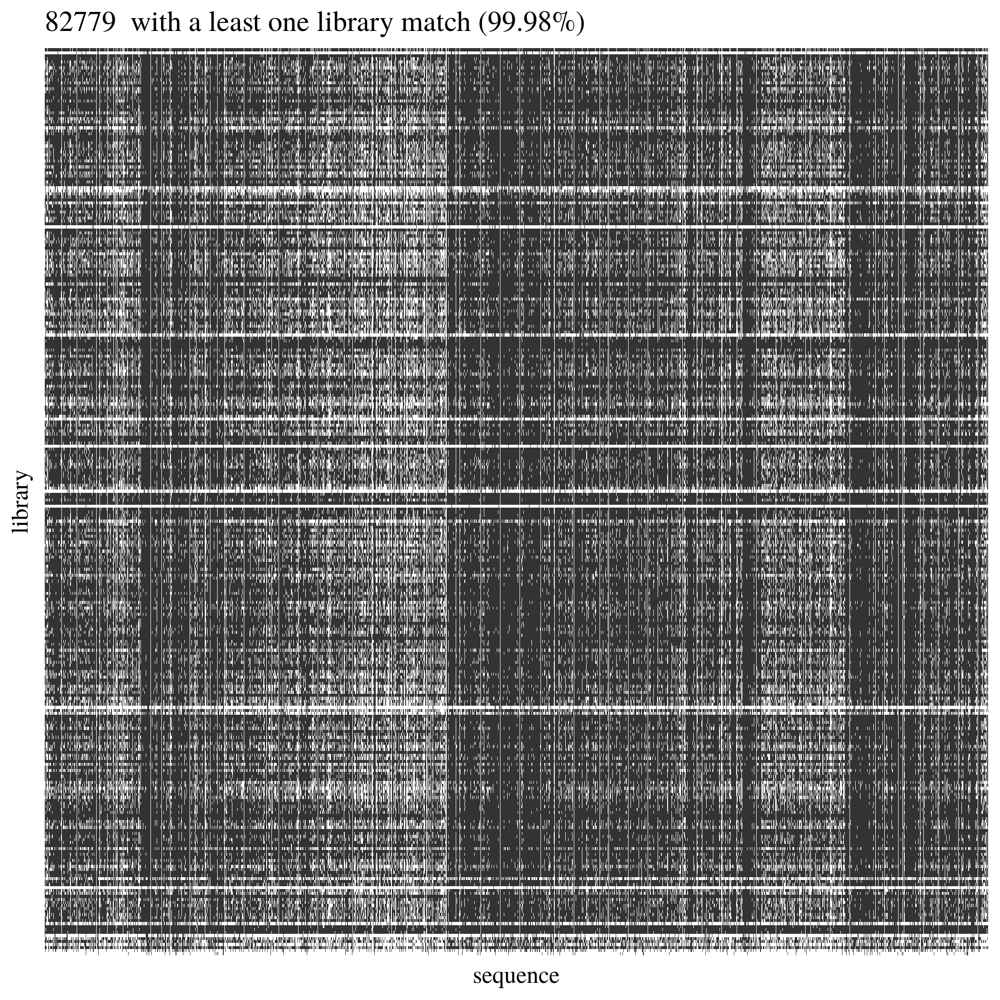

```{r setup_snp, include=FALSE}
rm(list = ls()) ; invisible(gc()) ; set.seed(42)
library(knitr)
library(kableExtra)
if(knitr:::is_html_output()) options(knitr.table.format = "html") 
if(knitr:::is_latex_output()) options(knitr.table.format = "latex") 
library(tidyverse)
library(Biostrings)
theme_set(bayesplot::theme_default())
opts_chunk$set(
  echo = F, message = F, warning = F, fig.height = 6, fig.width = 8,
  cache = T, cache.lazy = F)
path <- "data/Symphonia_Paracou/"
```


# SNP calling and filtering

We assessed the quality of raw reads using `multiqc` [@Ewels2016] and trimmed them with `trimmomatic` [@Andrews2010]. 
We kept only pair-end reads without adaptors and a phred score above 15 in a sliding window of 4.
Seventy percent of trimmed reads mapped off-targets using `bwa` [@Li2009]. 
We thus mapped trimmed reads on the hybrid reference built for the sequence capture experiment using `bwa` [@Li2009], `picard` [@BroadInstitute2018], `samtools` [@Li2009a] and `bedtools` [@Quinlan2010].
We called variants for each individual using `HaplotypeCaller`, aggregated variants using `GenomicsDBImport` and jointly-genotyped individuals using `GenotypeGVCFs` all in `GATK4` software [@Freksa1993]. 
We filtered biallelic SNPs with a quality above 30, a quality by depth above 2, a Fisher strand bias below 60 and a strand odds ratio above 3 using `GATK4` [@Freksa1993]. 
Finally, we filtered individuals and SNPs for missing data with a maximum of 95% and 15% of missing data per individual and SNP, respectively, using `plink2` [@Chen2019].
We obtained 454,262 biallelic SNPs over 385 individuals without outgroups, that we used for population genetic analyses.
Since low-frequency alleles and linkage disequilibrium will bias the number of fixed loci and increase the number of false-positives in genomic scans for outliers [@Foll2008],
we built a second dataset for quantitative genomics and genomic scans, filtering variants with a minor allele frequency above 5% (18 individuals) and with linkage disequilibrium $r^2<0.99$. 
We further removed admixed individuals (see population genetic analyses for criteria) and retained 70,737 biallelic SNPs over 372 individuals.

```{r QC}
quality <- read_tsv(file.path(path, "Sequences", "quality", "multiqc", "general_stats_table.tsv")) %>% 
  mutate(Library = gsub("_001", "", Sample)) %>% 
  mutate(SequencesRaw = `Total Sequences (millions)`*10^6)
unpaired <- read_delim(file.path(path, "Sequences", "trimming", "unpaired_stat.txt"),
           delim = " ", col_names = c("Library", "SequencesUnpaired")) %>% 
  mutate(Library = gsub("_unpaired.fq.gz", "", Library)) %>% 
  mutate(SequencesUnpaired = as.numeric(SequencesUnpaired))
paired <- read_delim(file.path(path, "Sequences", "trimming", "paired_stat.txt"),
           delim = " ", col_names = c("Library", "SequencesPaired")) %>%
    mutate(Library = gsub("_paired.fq.gz", "", Library)) %>% 
  mutate(SequencesPaired = as.numeric(SequencesPaired))
```

## Quality Check

We received demultiplexed libraries from sequencing. 
We  checked sequences quality combining already produced fastqc and compared them with originally furnished (i) baits, (ii) targets, and (iii) references:

1. __Multi Quality Check__: we used `multiqc` to combined `fastqc` inputs for every library (1002 for forward and reverse individuals) and check sequences, counts, quality and GC content
1. __Trimming__: we trimmed sequences removing bad quality and adaptors sequences
1. __Targets mapping__: we mapped 10 libraries on targets to check proportion of off-targets sequences
1. __Reference mapping__: we mapped 10 libraries on hybrid reference to check proportion of off-reference sequences, and assess the need for *de novo* assembly of captured sequences (in case of a high proportion of off-reference sequences)

### Multi Quality Check

We used `multiqc` to combine `fastqc` inputs for every library (1002 for forward and reverse individuals) and checked sequences, counts, quality and GC content.

```{bash multiqc, eval=F, echo=T}
cd ~/Documents/BIOGECO/PhD/data/Eschweilera_Paracou/Sequences/quality
multiqc fastqc
mkdir multiqc
mv multiqc_data/ multiqc_report.html L1.fastqc.tar.gz L2.fastqc.tar.gz multiqc
```

#### Counts

We had a big heterogeneity of sample representativity (215 000 fold), 
but 85% of samples had more than 66 6667 sequences (ca 1M targets / 150 bp * 10X). Moreover, duplicated sequences were obviously more present in over-represented individuals, 
probably more linked to PCR biases than ro sequencing issues.

```{r seqcounts, fig.cap="Sequence counts."}
quality %>% 
  ggplot(aes(reorder(Sample, `Total Sequences (millions)`), `Total Sequences (millions)`, fill = `% Duplicate Reads`)) + 
  geom_bar(stat = "identity") +
  coord_flip() +
  scale_y_sqrt() +
  theme(axis.text.y = element_blank(), 
        axis.title.y = element_blank(), 
        axis.line.y =element_blank(), 
        axis.ticks.y = element_blank()) +
  ylab("Total sequences (millions)") + scale_fill_continuous("Duplicated\nreads\npercentage")
```

#### Quality

Sequence quality was very good as the Phred score is above 25 for every base on all positions across all sequences.

```{r phred, fig.cap="Phred score."}
knitr::include_graphics("data/Symphonia_Paracou/Sequences/quality/multiqc/plots/phred.png")
```

#### GC content

The mean GC content was 41.5 and only a few sequences had non expected global GC content or GC content across the sequence.

```{r gc, fig.cap="GC content across sequences."}
quality %>% 
  ggplot(aes(`Average % GC Content`)) + 
  geom_histogram() +
  geom_vline(xintercept = 41.56587, col = "red", linetype = "dashed") +
  xlab("Average GC content percentage")
```

```{r gcwithin, fig.cap="GC content within sequences."}
knitr::include_graphics("data/Symphonia_Paracou/Sequences/quality/multiqc/plots/GC.png")
```

### Trimming

We listed all libraries in text files and trimmed all libraries with `trimmomatic` in pair end (`PE`) into paired and unpaired compressed fastq files (`fq.gz`). 
We trimmed the adaptor (`ILLUMINACLIP`) of our protocol (`TruSeq3-PE`) with a seed mismatch of 2 (mismatched count allowed),
a threshold for clipping palindrome of 30 (authorized match for ligated adapters), 
a threshold for simple clip of 10 (match between adapter and sequence), 
a minimum adaptor length of 2, 
and keeping both reads each time (`keepBothReads`).
We trimmed sequences on phred score with a minimum of 15 in a sliding window of 4 (`SLIDINGWINDOW:4:15`) 
without trimming the beginning (`LEADING:X`) or the end (`TRAILING:X`). 
Without surprise due to the high quality check of sequencing, 
trimming resulted in 99.91% of paired trimmed reads compared to raw reads (\@ref(fig:trimmingStat)). 
Thus the main issue of our dataset was more the representativity of sequences more than their quality.

```{r librariesList, eval=F, echo=T}
data.frame(libraries = list.files(file.path(path, "Sequences", "raw"))) %>% 
  mutate(libraries = gsub("_R[12].fastq.gz", "", libraries)) %>% 
  unique() %>% 
  write_tsv(path = file.path(path, "Sequences", "libraries.txt"), col_names = F)
```

```{r librariesMappingList, eval=F, echo=T}
read_tsv(file.path(path, "Sequences", "libraries.txt"), col_names = "Library") %>% 
  sample_n(10) %>% 
  write_tsv(path = file.path(path, "Sequences", "libraries_mapping.txt"), col_names = F)
```

```{bash trimming, eval=F, echo=T}
#!/bin/bash
#SBATCH --time=36:00:00
#SBATCH -J trimming
#SBATCH -o trimming_output.out
#SBATCH -e trimming_error.out
#SBATCH --mem=20G
#SBATCH --cpus-per-task=1
#SBATCH --mail-type=BEGIN,END,FAIL
module load bioinfo/Trimmomatic-0.36
for library in $(cat libraries.txt)
do
  java -jar $TRIM_HOME/trimmomatic.jar PE \
    raw/"$library"_R1.fastq.gz raw/"$library"_R2.fastq.gz \
    trimmed/paired/"$library"_R1_paired.fq.gz trimmed/unpaired/"$library"_R1_unpaired.fq.gz \
    trimmed/paired/"$library"_R2_paired.fq.gz trimmed/unpaired/"$library"_R2_unpaired.fq.gz \
    ILLUMINACLIP:TruSeq3-PE.fa:2:30:10:2:keepBothReads \
    SLIDINGWINDOW:4:15
done
cat trimmed/paired_stat.txt
for file in $(ls trimmed/paired)
do
  zcat trimmed/paired/$file | echo $file"   "$((`wc -l`/4)) >> trimmed/paired_stat.txt
done
cat trimmed/unpaired_stat.txt
for file in $(ls trimmed/unpaired)
do
  zcat trimmed/unpaired/$file | echo $file"   "$((`wc -l`/4)) >> trimmed/unpaired_stat.txt
done
```

```{r trimmingStat, fig.cap="Trimming results."}
quality %>% 
  left_join(paired) %>% 
  left_join(unpaired) %>% 
  mutate(R = str_sub(Library,-2,-1)) %>% 
  mutate(Unpaired = (SequencesUnpaired/SequencesRaw)*100) %>% 
  mutate(Removed = (1-SequencesPaired/SequencesRaw)*100) %>% 
  select(Library, R, Removed, Unpaired) %>% 
  reshape2::melt(id.vars = c("Library", "R")) %>% 
  ggplot(aes(Library, value, fill = R)) + 
  geom_bar(stat = "identity") +
  coord_flip() +
  scale_y_sqrt() +
  theme(axis.text.y = element_blank(), 
        axis.title.y = element_blank(), 
        axis.line.y =element_blank(), 
        axis.ticks.y = element_blank()) +
  facet_wrap(~ variable, scale = "free") +
  ylab("In percentage of reads after trimming") +
  scale_fill_discrete("", labels = c("forward", "reverse")) +
  ggtitle("1 458 137 818 raw sequences", "1 456 900 940 (99.91%) trimmed and paired & 618 291 (0.04%) trimmed unpaired")
```

### Targets mapping

We mapped every library on the hybrid reference to check off-reference sequences, and assess the need for de novo assembly, in case many sequences would not map on the reference. Globally we had a low coverage of the reference (median of 19%, Fig. \@ref(fig:targetsAlignmentCoverage)) but reads were 79% to 88% on-reference (Fig. \@ref(tab:targetsAlignmentReadsMapped)) ! Finally, we had a median of 4Mb covered with 10X on reference, which is 4 times what we designed in probes. Consequently, we won’t need *de novo* assembly and will proceed to read mapping for every library on the built reference, already partly annotated.

```{bash targetsMapping, eval=F, echo=T}
#!/bin/bash
#SBATCH --time=36:00:00
#SBATCH -J targetsMapping
#SBATCH -o targetsMapping_output.out
#SBATCH -e targetsMapping_error.out
#SBATCH --mem=20G
#SBATCH --cpus-per-task=1
#SBATCH --mail-type=BEGIN,END,FAIL

module purge
module load bioinfo/bwa-0.7.15
module load bioinfo/picard-2.14.1
module load bioinfo/samtools-1.4
module load bioinfo/bedtools-2.26.0

targets=../Baits/files-Symphonia/target-sequences.fas
bwa index $targets
for library in $(cat libraries_mapping.txt)
do
  rg="@RG\tID:${library}\tSM:${library}\tPL:HiSeq4K"
  bwa mem -M -R "${rg}" -t 16 $targets trimmed/paired/"$library"_R1_paired.fq.gz trimmed/paired/"$library"_R2_paired.fq.gz > targetsMapping/sam/"${library}.sam"
  java -Xmx4g -jar $PICARD SortSam I=targetsMapping/sam/"${library}.sam" O=targetsMapping/bam/"${library}".bam SORT_ORDER=coordinate
  java -Xmx4g -jar $PICARD BuildBamIndex I=targetsMapping/bam/"${library}".bam O=targetsMapping/bam/"${filename}".bai
  samtools index targetsMapping/bam/"${library}".bam
  bedtools bamtobed -i =targetsMapping/bam/"${library}".bam > targetsMapping/bed/"${library}".bed
  bedtools merge -i targetsMapping/bed/"${library}".bed > targetsMapping/merged_bed/"${library}".bed
done
touch readsMappingStat.txt
for file in $(ls bam/*.bam)
do
  samtools flagstat $file | echo $file"   "$(grep "mapped (") >> readsMappingStat.txt
done
```

```{r targetsAlignmentCoverage, fig.cap="Reads alignment coverage on targets. Distribution has been cut at 2000X."}
# alns <- lapply(list.files(file.path(path, "Sequences", "mapping.test", "targets", "bam"), pattern = ".bam$", full.names = T),
#               function(file) readGAlignments(file, use.names = T))
# names(alns) <- list.files(file.path(path, "Sequences", "targetsMapping", "bam"), pattern = ".bam$", full.names = F)
# alns.cov <- lapply(alns,  function(aln)
#   lapply(coverage(aln)@listData, function(x) data.frame(length = x@lengths, coverage = x@values)) %>%
#     bind_rows(.id = "seq") %>%
#     mutate(type = ifelse(grepl("DN", seq), "Functional", "Neutral")) %>%
#     group_by(type, coverage) %>%
#     summarise(N = sum(length)) %>%
#     ungroup()) %>%
#   bind_rows(.id = "library") %>%
#   mutate(library = gsub("_[[:alpha:]]*-[[:alpha:]]*-[[:alnum:]]*_L00[56].bam$", "", library))
# save(alns.cov, file = "./symcapture_save/targetsAlignmet.Rdata")
load("save/targetsAlignmet.Rdata")
ggplot(alns.cov, aes(coverage, N, fill = library)) +
  geom_bar(stat = "identity") +
  scale_y_log10() +
  scale_x_sqrt() +
  facet_wrap(~ type, scales = "free", nrow = 2) +
  xlim(0, 2000) +
  ggtitle(alns.cov %>% 
            mutate(match = as.numeric(coverage > 0)) %>%
            filter(type == "Functional") %>% 
            group_by(library, match) %>% 
            summarise(N = sum(N)) %>% 
            group_by(library) %>% 
            mutate(Pct = round(N/sum(N)*100, 2)) %>% 
            filter(match == 1) %>% 
            ungroup() %>% 
            summarise(min = min(Pct), mean = median(Pct), max = max(Pct)) %>% 
            transmute(paste0(min, "% to ", max, "% (median of ", mean, "% , ", round(mean*897/100) ,
                             " kb) of functional coverage > 0")) %>% 
            unlist(),
          alns.cov %>% 
            mutate(match = as.numeric(coverage > 0)) %>%
            filter(type == "Neutral") %>% 
            group_by(library, match) %>% 
            summarise(N = sum(N)) %>% 
            group_by(library) %>% 
            mutate(Pct = round(N/sum(N)*100, 2)) %>% 
            filter(match == 1) %>% 
            ungroup() %>% 
            summarise(min = min(Pct), mean = median(Pct), max = max(Pct)) %>% 
            transmute(paste0(min, "% to ", max, "% (median of ", mean, "% , ", round(mean*415/100) ,
                             " kb) of neutral coverage > 0")) %>% 
            unlist()) 
```

```{r targetsAlignmentReadsMapped}
read_delim(file.path(path, "Sequences",  "mapping.test", "targets", "readsMappingStat.txt"),
           delim = " ", col_names = c("Library", "readsMapped", "+", "0", "mapped", "percentage", ":", "N/A")) %>% 
  select(Library, readsMapped, percentage) %>% 
  mutate(Library = gsub("bam/", "", Library)) %>% 
  mutate(Library = gsub("_[[:alpha:]]*-[[:alpha:]]*-[[:alnum:]]*_L00[56].bam$", "", Library)) %>% 
  mutate(percentage = gsub("(", "", percentage, fixed = T)) %>% 
  mutate(percentage = gsub("%", "", percentage, fixed = T)) %>% 
  kable(col.names = c("Library", "Reads mapped", "Percentage of reads mapped"),
        caption = "Reads mapped on targets statistics.",
    format = "pandoc", escape = F) %>% 
  kable_styling(full_width = F)
```

### Reference mapping

We mapped every library on hybrid reference to check off-reference sequences, and assess *de novo* usefulness. Globally we had a low coverage of the reference (median of 19%, \@ref(fig:referenceAlignmentCoverage)) but reads were 79% to 88% on-reference (\@ref(tab:referenceAlignmentReadsMapped)) ! Finally, we had a median of 4Mb covered with 10X on reference, which is 4 times what we designed in probes. Consequently, we won't need *de novo* assembly and will proceed to read mapping for every library on the built reference, already partly annotated.

```{bash referenceMapping, eval=F, echo=T}
#!/bin/bash
#SBATCH --time=36:00:00
#SBATCH -J referenceMapping
#SBATCH -o treferenceMapping_output.out
#SBATCH -e referenceMapping_error.out
#SBATCH --mem=20G
#SBATCH --cpus-per-task=1
#SBATCH --mail-type=BEGIN,END,FAIL

module purge
module load bioinfo/bwa-0.7.15
module load bioinfo/picard-2.14.1
module load bioinfo/samtools-1.4
module load bioinfo/bedtools-2.26.0

cat ../../Symphonia_Genomic/neutral_selection/merged.fasta > referenceMapping/reference.fasta
reference=referenceMapping/reference.fasta 
bwa index $reference
for library in $(cat libraries_mapping.txt)
do
  rg="@RG\tID:${library}\tSM:${library}\tPL:HiSeq4K"
  bwa mem -M -R "${rg}" -t 16 $reference trimmed/paired/"$library"_R1_paired.fq.gz trimmed/paired/"$library"_R2_paired.fq.gz > referenceMapping/sam/"${library}.sam"
  java -Xmx4g -jar $PICARD SortSam I=referenceMapping/sam/"${library}.sam" O=referenceMapping/bam/"${library}".bam SORT_ORDER=coordinate
  java -Xmx4g -jar $PICARD BuildBamIndex I=referenceMapping/bam/"${library}".bam O=referenceMapping/bam/"${filename}".bai
  samtools index targetsMapping/bam/"${library}".bam
  bedtools bamtobed -i =referenceMapping/bam/"${library}".bam > referenceMapping/bed/"${library}".bed
  bedtools merge -i referenceMapping/bed/"${library}".bed > referenceMapping/merged_bed/"${library}".bed
done
touch readsMappingStat.txt
for file in $(ls bam/*.bam)
do
  samtools flagstat $file | echo $file"   "$(grep "mapped (") >> readsMappingStat.txt
done
```

```{r referenceAlignmentCoverage, fig.cap="Reads alignment coverage on reference. Distribution has been cut at 2000X."}
# alns <- lapply(list.files(file.path(path, "Sequences",  "mapping.test", "reference", "bam"), pattern = ".bam$", full.names = T),
#               function(file) readGAlignments(file, use.names = T))
# names(alns) <- list.files(file.path(path, "Sequences", "referenceMapping", "bam"), pattern = ".bam$", full.names = F)
# alns.cov <- lapply(alns,  function(aln)
#   lapply(coverage(aln)@listData, function(x) data.frame(length = x@lengths, coverage = x@values)) %>%
#     bind_rows(.id = "seq") %>%
#     group_by(coverage) %>%
#     summarise(N = sum(length)) %>%
#     ungroup()) %>%
#   bind_rows(.id = "library") %>%
#   mutate(library = gsub("_[[:alpha:]]*-[[:alpha:]]*-[[:alnum:]]*_L00[56].bam$", "", library))
# save(alns.cov, file = "./symcapture_save/referenceAlignmet.Rdata")
load("save/referenceAlignmet.Rdata")
ggplot(alns.cov, aes(coverage, N, fill = library)) +
  geom_bar(stat = "identity") +
  scale_y_log10() +
  scale_x_sqrt() +
  xlim(0, 2000) +
  ggtitle(
    alns.cov %>% 
      mutate(match = as.numeric(coverage > 0)) %>%
      group_by(library, match) %>% 
      summarise(N = sum(N)) %>% 
      group_by(library) %>% 
      mutate(Pct = round(N/sum(N)*100, 2)) %>% 
      filter(match == 1) %>% 
      ungroup() %>% 
      summarise(min = min(Pct), mean = median(Pct), max = max(Pct)) %>% 
      transmute(paste0(min, "% to ", max, "% (median of ", mean, "% , ", round(mean*146.80/100) ," Mb) of coverage > 0")) %>% 
      unlist(),
    alns.cov %>% 
      mutate(match = as.numeric(coverage > 9)) %>%
      group_by(library, match) %>% 
      summarise(N = sum(N)) %>% 
      group_by(library) %>% 
      mutate(Pct = round(N/sum(N)*100, 2)) %>% 
      filter(match == 1) %>% 
      ungroup() %>% 
      summarise(min = min(Pct), mean = median(Pct), max = max(Pct)) %>% 
      transmute(paste0(min, "% to ", max, "% (median of ", mean, "% , ", round(mean*146.80/100) ," Mb) of coverage > 9")) %>% 
      unlist()) 
```

```{r referenceAlignmentReadsMapped}
read_delim(file.path(path, "Sequences",  "mapping.test", "reference", "readsMappingStat.txt"),
           delim = " ", col_names = c("Library", "readsMapped", "+", "0", "mapped", "percentage", ":", "N/A")) %>% 
  select(Library, readsMapped, percentage) %>% 
  mutate(Library = gsub("bam/", "", Library)) %>% 
  mutate(Library = gsub("_[[:alpha:]]*-[[:alpha:]]*-[[:alnum:]]*_L00[56].bam$", "", Library)) %>% 
  mutate(percentage = gsub("(", "", percentage, fixed = T)) %>% 
  mutate(percentage = gsub("%", "", percentage, fixed = T)) %>% 
  kable(col.names = c("Library", "Reads mapped", "Percentage of reads mapped"),
        caption = "Reads mapped on reference statistics.",
    format = "pandoc", escape = F) %>% 
  kable_styling(full_width = F)
```

## Mapping

We proceeded to read mapping for every library on the built reference,
already partly annotated:

1. __Repeats merging__: 41 libraries were repeated, we merged their fastq files before mapping to increase their information before variant calling
1. __Reads mapping__: we mapped every library in pair end with `bwa mem` on the hybrid reference from Ivan Scotti and Sanna Olsson used to build the targets
1. __Reference sequences__: we built bedtools for every alignment in order to list sequences with matches in the reference to be used to reduce the explored reference area in variant calling

### Repeats merging

41 libraries were repeated, we merged their FASTQ to increase their information before variant calling. 
Merging repeats confirmed the presence of all 430 individuals at the end of the alignment (402 from Paracou, 20 from herbariums, and 8 from BCI, Itubera and La Selva).

```{bash compression, eval=F, echo=T}
#!/bin/bash
#SBATCH --time=36:00:00
#SBATCH -J compression
#SBATCH -o compression_output.out
#SBATCH -e compression_error.out
#SBATCH --mem=4G
#SBATCH --cpus-per-task=1
#SBATCH --mail-type=BEGIN,END,FAIL

folder=trimmed.paired.joined/
name=symcapture.trimmed.paired.joined

module purge
mkdir trimmed.paired
for file in $(ls paired/*)
do
  mv $file trimmed.paired/$(basename $(echo $file | sed -e 's/_[[:alpha:]]*-[[:alpha:]]*-[[:alnum:]]*//'))
done
rm -r paired
cp ../libraries.txt ./
cat libraries.txt | sed -e 's/_[[:alpha:]]*-[[:alpha:]]*-[[:alnum:]]*_L00[56]//' | sort | uniq | sed -e 's/-b//' | sort | uniq > libraries.uniq.txt
mkdir trimmed.paired.joined
for ind in $(cat libraries.uniq.txt)
do
  echo $ind
  cat trimmed.paired/$ind*_R1_paired.fq.gz > trimmed.paired.joined/"$ind"_R1_paired.fq.gz
  cat trimmed.paired/$ind*_R2_paired.fq.gz > trimmed.paired.joined/"$ind"_R2_paired.fq.gz
done
rm -r trimmed.paired
tar -zcvf $name.tar.gz $folder
```

### Reads mapping

We mapped every library in pair end with `bwa mem` on the hybrid reference from Ivan Scotti and Sanna Olsson used to build the targets (32 alignments with 2 processes on 64 cores of 1 node of the genologin computer cluster at Genotoul, Toulouse). We had globally a good mapping with more than 80% of the reads mapped for 98% of the libraries (Figure \@ref(fig:mappingStat)).

```{bash mappingSH, eval=F, echo=T}
#!/bin/bash
#SBATCH --time=48:00:00
#SBATCH -J mapping
#SBATCH -o mapping_output.out
#SBATCH -e mapping_error.out
#SBATCH --mem=160G
#SBATCH --cpus-per-task=64
#SBATCH --mail-type=BEGIN,END,FAIL

module purge
module load bioinfo/bwa-0.7.15
module load bioinfo/picard-2.14.1
module load bioinfo/samtools-1.4
module load bioinfo/bedtools-2.26.0

task(){
	echo MAPPING "$1"
	bwa mem -M -R "@RG\tID:$1\tSM:$1\tPL:HiSeq4K" \
   		-t 2 \
   		reference/reference.fasta \
   		trimming/trimmed.paired.joined/"$1"_R1_paired.fq.gz \
   		trimming/trimmed.paired.joined/"$1"_R2_paired.fq.gz \
   		> mapping/sam/"$1".sam
   	rm trimming/trimmed.paired.joined/"$1"_R1_paired.fq.gz
   	rm trimming/trimmed.paired.joined/"$1"_R2_paired.fq.gz
	java -Xmx4g -jar $PICARD SortSam \
   		I=mapping/sam/"$1".sam \
   		O=mapping/bam2/"$1".bam
   		SORT_ORDER=coordinate
	rm mapping/sam/"$1".sam
	samtools index mapping/bam2/"$1".bam
}

mkdir mapping/sam
mkdir mapping/bam2
N=32
(
for library in $(cat unmapped.txt)
do 
   ((i=i%N)); ((i++==0)) && wait
   task "$library" &
done
)
rm -r mapping/sam
```

```{bash mappingStatSH, eval=F, echo=T}
# folders
mkdir mappingStat
touch readsMappingStat.txt

# test
file=$(ls bam*/*.bam | head -n 1)
module load bioinfo/samtools-1.4 ; samtools flagstat $file | echo $file"   "$(grep "mapped (") >> readsMappingStat.txt
cat readsMappingStat.txt
rm readsMappingStat.txt
touch readsMappingStat.txt

# sarray
for file in $(ls bam*/*.bam); do echo 'module load bioinfo/samtools-1.4 ; samtools flagstat '$file' | echo '$file'"   "$(grep "mapped (") >> readsMappingStat.txt'; done > mappingStat.sh
sarray -J mappingStat -o mappingStat/%j.out -e mappingStat/%j.err -t 1:00:00 --mail-type=BEGIN,END,FAIL  mappingStat.sh

# clean
rm -r mappingStat
```

```{r mappingStat, fig.cap="Mapping result"}
read_delim(file.path(path, "Sequences", "mapping", "readsMappingStat.txt"),
           delim = " ", col_names = c("Library", "readsMapped", "+", "0", "mapped", "percentage", ":", "N/A")) %>% 
  select(Library, readsMapped, percentage) %>% 
  mutate(Library = gsub("bam/", "", Library)) %>% 
  mutate(Library = gsub("_[[:alpha:]]*-[[:alpha:]]*-[[:alnum:]]*_L00[56].bam$", "", Library)) %>% 
  mutate(percentage = gsub("(", "", percentage, fixed = T)) %>% 
  mutate(percentage = gsub("%", "", percentage, fixed = T)) %>% 
  mutate(percentage = as.numeric(percentage)) %>% 
  mutate(type = ifelse(grepl("P", Library), "Paracou", "Outgroup")) %>% 
  ggplot(aes(percentage, fill = type)) +
  geom_histogram() +
  ggtitle("4 Paracou libraries < 75% coverage (99.2% above)", "10 Paracou libraries < 80% coverage (98% above)")
```

### Reference sequences

We built bedtools for every alignment in order to list sequences with matches in the reference to be used to reduce the explored reference areas in variant calling.
99.98% of reference sequences had at least one library matching (Fig. \@ref(fig:referenceSequences)). 
Consequently we used all sequences from the reference in the variant calling. Some reference sections were underrepresented in our libraries but they have been removed at the SNP filtering stage..

```{bash bed, eval=F, echo=T}
# folders
mkdir bed
mkdir bed.out

# test
file=$(ls bam*/*.bam | head -n 1)
module load bioinfo/bedtools-2.26.0 ; bedtools bamtobed -i $file > bed/$(basename "${file%.*}").bed
rm bed/*

# sarray
for file in $(ls bam*/*.bam); do echo 'module load bioinfo/bedtools-2.26.0 ; file='$file' ; bedtools bamtobed -i $file > bed/$(basename "${file%.*}").bed'; done > bed.sh
sarray -J bed -o bed.out/%j.out -e bed.out/%j.err -t 1:00:00 --mail-type=BEGIN,END,FAIL  bed.sh

# clean
rm -r bed.out
  
# statistics
mkdir bed.out
touch referenceMappedStats.txt
for file in $(ls bed/*.bed); do echo "cut $file -f1 | sort | uniq | awk -v file="$(basename "${file%.*}")" '{print \$1, file}' >> referenceMappedStats.txt" ; done > bed.sh
sarray -J bed -o bed.out/%j.out -e bed.out/%j.err -t 1:00:00 --mail-type=BEGIN,END,FAIL  bed.sh
rm -r bed.out
```

```{r referenceSequences, fig.cap="Sequences from reference alignment with reads from all libraries."}
# # On genologin
# bed <- read_delim("referenceMappedStats.txt", delim = " ", col_names = c("sequence", "library"))
# ggplot(bed, aes(library, sequence)) +
#   geom_tile() +
#   coord_flip() +
#   theme(axis.text.x = element_blank(),
#         axis.line.x =element_blank(),
#         axis.ticks.x = element_blank(),
#         axis.text.y = element_blank(),
#         axis.line.y =element_blank(),
#         axis.ticks.y = element_blank()) +
#   ggsave("./seqAligned.png")

```

## Variant call

We used `GATK` as it has apparently similar performance to other variant callers [@Supernat2018] and was more known by Myriam. 
For that we used the following pipeline:

1. __Variant calling__ Run the `HaplotypeCaller` on each sample's BAM files to create single-sample gVCFs using the `.g.vcf` extension for the output file.
1. __Data aggregation__ Aggregate the GVCF files and feed in one GVCF with `GenomicsDBImport` to be genotyped
1. __Joint genotyping__ Run `GenotypeGVCFs` on all of them together to create the raw SNP and indel VCFs that are usually emitted by the callers.

### Variant calling

Run the `HaplotypeCaller` on each sample's BAM files to create single-sample gVCFs using the `.g.vcf` extension for the output file.  
We used `sarray` which is much more powerful than `sbatch` in parallel computing.

```{bash HaplotypeCaller, eval=F, echo=T}
# folders
mkdir variantCalling/gvcf5

# test
file=$(ls mapping/bam5/*.bam | head -n 1)
srun --mem=20G --pty bash
module load bioinfo/gatk-4.1.2.0 ; gatk --java-options "-Xmx20G" HaplotypeCaller -R reference/reference.fasta -I $file -O variantCalling/gvcf4/$(basename "${file%.*}").g.vcf.gz  -ERC GVCF
exit
rm variantCalling/gvcf4/*

# sarray
for file in $(ls mapping/bam5/*.bam); do echo "module load bioinfo/gatk-4.1.2.0 ; gatk --java-options \"-Xmx20G\" HaplotypeCaller -R reference/reference.fasta -I $file -O variantCalling/gvcf5/$(basename "${file%.*}").g.vcf.gz  -ERC GVCF"; done > haplo5.sh
mkdir haplo5
sarray -J haplo5 -o haplo5/%j.out -e haplo5/%j.err -t 48:00:00 --mem=20G --mail-type=BEGIN,END,FAIL  haplo5.sh

# clean
rm -r haplo5
rm -r tmp
```

### Data aggregation

We aggregated the GVCF files and fed them into one GVCF database with `GenomicsDBImport` to be genotyped. 
**Beware**, `GATK 4.0.0.0` does not deal with multiple intervals when using `GenomicsDBImport`, so we used `GATK 4.1.2.0`.
We divided the step into several interval files of a maximum of 1000 sequences computed in parallel to speed up the operation. 
**NB**, we tested the pipeline with 3 individual haplotypes and 10 intervals of 100 sequences run in parallel; and it took 24 minutes. 
Consequently with 10 fold more sequences per interval we may increase to 4H, and the effect of 10 fold more individual haplotypes is hard to assess.

Due to a memory overload on the cluster I boosted the `sarray` to 24G per node beside limiting `gatk` java session to 20G, still the overload is strange as if `gatk` was opening a parallel session of 20G java. 
We should not decrease batch size as a batch of 50 individuals means that we will use 9 batches ! 
If memory issues persist we may decrease the interval length (currently 1000 sequences) and increase the number of jobs in `sarray`. 
We may even decrease intervals to 100 sequences resulting in more than 800 jobs and run them by batch of 100 if they are really more efficient.

Running a first batch of 10 samples on 100 sequences took 35 minutes. 
Thus 432 samples should take ca 1 day and 40 minutes. 
This is the first run of DB among 8, so in total DB build should take 8 days ! 
But on the other hand joint genotyping might be launched on each run as soon as they finish. So we might clean the first vcf and obtain a preview of population genetics structure with the first 100 sequences.

```{bash combine, eval=F, echo=T}
# Sample map
touch sample_map.txt
for file in $(ls gvcf*/*.g.vcf.gz)
do 
   echo -e $(basename "${file%.*}")"\t"$file >> sample_map.txt
done

# seq lists
mkdir reference.sequences.lists
cut ../reference/reference.fasta.fai -f1 > reference.sequences.lists/reference.sequences.list
cd reference.sequences.lists
split -l 100 -d reference.sequences.list reference.sequences_ --additional-suffix=.list
rm reference.sequences.list
ls | wc -l
cd ..

# folders
mkdir tmp
mkdir symcaptureDB

# test
srun --mem=24G --pty bash
file=$(ls reference.sequences.lists/ | head -n 1)
module load bioinfo/gatk-4.1.2.0 ; gatk --java-options "-Xmx20g -Xms20g" GenomicsDBImport --genomicsdb-workspace-path symcaptureDB/"${file%.*}".DB -L reference.sequences.lists/$file --sample-name-map sample_map.txt --batch-size 50 --tmp-dir=tmp
exit
rm -r symcaptureDB/*
rm tmp/*

# sarray

for file in $(ls reference.sequences.lists/); do echo "module load bioinfo/gatk-4.1.2.0 ; gatk --java-options \"-Xmx20g -Xms20g\" GenomicsDBImport --genomicsdb-workspace-path symcaptureDB/\"${file%.*}\".DB -L reference.sequences.lists/$file --sample-name-map sample_map.txt --batch-size 10 --consolidate"; done > combine.sh
split -l 207 -d combine.sh combine_ --additional-suffix=.sh
rm combine.sh
mkdir combine
sarray -J combine -o combine/%j.out -e combine/%j.err -t 48:00:00 --mem=40G --mail-type=BEGIN,END,FAIL combine.sh
rm combine_00.sh
rm -r combine
rm -r tmp

# clean
rm -r combine
rm -r tmp
```

### Joint genotyping

We joint-genotyped individuals with GenotypeGVCFs on all of them together to create the raw SNP and indel VCFs that are usually emitted by the callers. 
We divided the step into several intervals with a maximum of 1000 sequences computed in parallel to speed up the operation (similarly to the previous step). 
**NB**, we tested the pipeline with 3 individual haplotypes and 10 intervals of 100 sequences run in parallel; and it took 6 minutes. 
Consequently with 10 fold more sequences per interval we may increase to 1H, 
and the effect of 10 fold more individual haplotypes is hard to assess. 
Then we merged genotypes of all intervals with `GatherVcfs` from `Picard` in one raw VCF to be filtered.

```{bash genotype, eval=F, echo=T}
# folders
mkdir tmp
mkdir symcapture.vcf.gz

# test
file=$(ls reference.sequences.lists/ | head -n 1)
srun --mem=20G --pty bash
module load bioinfo/gatk-4.1.2.0 ; gatk --java-options "-Xmx20g" GenotypeGVCFs -R ../reference/reference.fasta -L reference.sequences.lists/$file -V gendb://symcaptureDB/$file -O symcapture.vcf.gz/"${file%.*}".vcf.gz
exit
rm tmp/*
rm symcapture.vcf.gz/*

# sarray

for file in $(ls reference.sequences.lists); do echo "module load bioinfo/gatk-4.1.2.0 ; gatk --java-options \"-Xmx20g\" GenotypeGVCFs -R ../reference/reference.fasta -L reference.sequences.lists/$file -V gendb://symcaptureDB/${file%.*}.DB -O symcapture.vcf.gz/${file%.*}.vcf.gz"; done > genotype.sh
mkdir genotype
sarray -J genotype -o genotype.array/%j.out -e genotype.array/%j.err -t 48:00:00 --mem=20G --mail-type=BEGIN,END,FAIL genotype.array.sh

# clean
rm -r genotype.array
rm -r tmp

# merge
echo -e '#!/bin/bash\n#SBATCH --time=48:00:00\n#SBATCH -J gather\n#SBATCH -o gather.out\n#SBATCH -e gather.err\n#SBATCH --mem=20G\n#SBATCH --cpus-per-task=1\n#SBATCH --mail-type=BEGIN,END,FAIL\nmodule load bioinfo/picard-2.14.1\njava -Xmx20g -jar $PICARD GatherVcfs \' > gather.sh
for file in $(ls symcapture.vcf.gz/*.gz)
do
	echo -e '\tI='$file' \' >> gather.sh
done
echo -e '\tO=symcapture.all.raw.vcf.gz\n' >> gather.sh
```

## Variant filtering

We filtered the previously produced raw vcf with several steps:

* __Gather__ raw vcf files which resulted in **26 813 513** variants over **432** individuals
* __Biallelic__ raw vcf filtering which resulted in **19 242 294** variants over **432** individuals
* __SNP__ biallelic vcf filtering which resulted in **17 521 879** variants over **432** individuals
* __Filters__ biallelic snps which resulted in **15 531 866** variants over **432** individuals
* __Missing__ filtered biallelic snp vcf filtering which resulted in **454 262** variants over **406** individuals
* __Paracou__ filtered & non missing biallelic snp vcf filtering which resulted in **454 262** variants over **385** individuals

### Gather

We first gathered all raw vcf files. Individuals genotyping lost 42 reference scaffolds (over 878, 4%) in few batches of individuals, which blocked the functioning of `gatk CombineVariants`. We thus removed the variants associated with these 42 reference scaffolds. We obtained 26 813 513 variants.

```{bash missingidv, eval=F, echo=T}
mkdir out
mkdir missing_ind
for file in $(ls symcapture.filtered.vcf/*.vcf.gz) ; do file=$(basename $file) ; file=${file%.*} ; echo "module load bioinfo/tabix-0.2.5 ; module load bioinfo/vcftools-0.1.15 ; vcftools --gzvcf symcapture.filtered.vcf/$file.gz --missing-indv -c > missing_ind/$file.missing.txt"; done > missingInd.sh
sarray -J missingInd -o out/%j.missingInd.out -e out/%j.missingInd.err -t 1:00:00 --mail-type=BEGIN,END,FAIL missingInd.sh
for file in $(ls missing_ind/*.missing.txt) ; do awk '{{if (NR!=1) print FILENAME"\t"$0}}' $file ; done > missingInd.txt
rm - r out
rm -r missing_ind
```

```{r missingindR, eval=F}
missing <- read_tsv(file.path(path, "Sequences", "variantCalling", "missingInd.txt"), 
         col_names = c("ref", "sample", "ndata", "ngenotypes", "nmiss", "freq")) %>% 
  mutate(ref = gsub("missing_ind/reference.sequences_", "", ref)) %>% 
  mutate(ref = gsub(".vcf.missing.txt", "", ref)) %>% 
  mutate(sample = gsub(".g.vcf", "", sample)) %>% 
  reshape2::dcast(ref ~ sample, value.var = "freq") %>% 
  reshape2::melt(id.vars = "ref", variable.name = "sample", value.name = "missing") %>% 
  mutate(missing = ifelse(is.na(missing) | is.nan(missing), 1, missing))
read_tsv(file.path(path, "Sequences", "variantCalling", "missingInd.txt"), 
         col_names = c("ref", "sample", "ndata", "ngenotypes", "nmiss", "freq")) %>% 
  mutate(ref = gsub("missing_ind/reference.sequences_", "", ref)) %>% 
  mutate(ref = gsub(".vcf.missing.txt", "", ref)) %>% 
  mutate(sample = gsub(".g.vcf", "", sample)) %>% 
  group_by(ref) %>% 
  summarise(N = n()) %>% 
  filter(N == 432) %>% 
  dplyr::select(ref) %>% 
  mutate(ref = paste0("symcapture.filtered.vcf/reference.sequences_", ref, ".vcf.gz")) %>% 
  write_tsv(file.path(path, "Sequences", "variantCalling", "nonmissing.list"), col_names = F)
googlesheets::gs_title("Symcapture") %>% 
              googlesheets::gs_read("Pop") %>% 
  mutate(Ind = paste0(Ind, ".g.vcf", "")) %>% 
  filter(Pop2 != "O") %>% 
  dplyr::select(Ind) %>% 
  write_tsv(file.path(path, "Sequences", "variantCalling", "Paracou.ind"), col_names = F)
```

```{bash gather, eval=F, echo=T}
echo -e '#!/bin/bash\n#SBATCH --time=48:00:00\n#SBATCH -J gather\n#SBATCH -o gather.out\n#SBATCH -e gather.err\n#SBATCH --mem=20G\n#SBATCH --cpus-per-task=1\n#SBATCH --mail-type=BEGIN,END,FAIL\nmodule load bioinfo/picard-2.14.1\njava -Xmx20g -jar $PICARD GatherVcfs \' > gather.sh
for file in $(cat nonmissing.list)
do
	echo -e '\tI=symcapture.raw.vcf/'$(basename $file)' \' >> gather.sh
done
echo -e '\tO=symcapture.all.raw.vcf.gz\n' >> gather.sh
zcat symcapture.all.raw.vcf.gz | grep "#contig" | wc -l
```

### Biallelic

We then used `bcftools` to limit data to biallelic variants (`--max-alleles 2`), resulting in 19 242 294 biallelic variants.

```{bash biallelic, eval=F, echo=T}
srun --mem=80G --cpus-per-task=8 --pty bash
module load bioinfo/bcftools-1.8
bcftools view --max-alleles 2 --threads 8 symcapture.all.raw.vcf.gz | bgzip -c --threads 8 > symcapture.all.biallelic.vcf.gz
bcftools stats  --threads 8 symcapture.all.biallelic.vcf.gz
```

### SNP

We then used `gatk` to limit data to biallelic snps, 
resulting in 17 521 879 biallelic snps.

```{bash snp, eval=F, echo=T}
module load bioinfo/gatk-4.1.2.0
gatk IndexFeatureFile \
  -F symcapture.all.biallelic.vcf.gz
gatk SelectVariants \
  -V symcapture.all.biallelic.vcf.gz \
  -select-type SNP \
  -O symcapture.all.biallelic.snp.vcf.gz
gatk IndexFeatureFile \
  -F symcapture.all.biallelic.snp.vcf.gz
module load bioinfo/bcftools-1.8
bcftools stats  --threads 8 symcapture.all.biallelic.snp.vcf.gz
```

### Filters

We filtered the biallelic snp vcf with following filters (name, filter, description), resulting in 15 531 866 filtered biallelic snps,  
using next histograms to set and test parameters values :

* __Quality ([QUAL](https://software.broadinstitute.org/gatk/documentation/article?id=7258))__ `QUAL < 30`: represents the likelihood of the site to be homozygous across all samples, we filter out variants having a low quality score (\@ref(fig:filtersR))
* __Quality depth ([QD](https://software.broadinstitute.org/gatk/documentation/tooldocs/3.8-0/org_broadinstitute_gatk_tools_walkers_annotator_QualByDepth.php))__ `QD < 2`: filter out variants with low variant confidence (\@ref(fig:filtersR))
* __Fisher strand bias ([FS](https://software.broadinstitute.org/gatk/documentation/tooldocs/3.8-0/org_broadinstitute_gatk_tools_walkers_annotator_FisherStrand.php))__ `FS > 60`: filter out variants based on Phred-scaled p-value using Fisher's exact test to detect strand bias (\@ref(fig:filtersR))
* __Strand odd ratio ([SOR](https://software.broadinstitute.org/gatk/documentation/tooldocs/3.8-0/org_broadinstitute_gatk_tools_walkers_annotator_StrandOddsRatio.php))__ `SOR < 3`: filter out variants based on Phred-scaled p-value used to detect strand bias (\@ref(fig:filtersR))

```{bash filters, eval=F, echo=T}
vcftools --gzvcf reference.sequences_00.vcf.gz --missing-indv -c
vcftools --gzvcf reference.sequences_00.vcf.gz --missing-site -c > missing.txt
vcftools --gzvcf reference.sequences_00.vcf.gz --site-quality -c > QUAL.txt
vcftools --gzvcf reference.sequences_00.vcf.gz \
  --get-INFO AC \
  --get-INFO AF \
  --get-INFO QD \
  --get-INFO FS \
  --get-INFO SOR \
  -c > INFO.txt
```

```{r filtersR, fig.cap="Quality, quality by depth, Fisher strand and strand odds ratios for biallelic SNPs."}
filtering <- left_join(read_tsv(file.path(path, "Sequences", "variantCalling", "symcapture.vcf.stats", "missing.txt")),
          read_tsv(file.path(path, "Sequences", "variantCalling", "symcapture.vcf.stats", "QUAL.txt"))) %>% 
  left_join(read_tsv(file.path(path, "Sequences", "variantCalling", "symcapture.vcf.stats", "INFO.txt"))) %>% 
  mutate(QD = as.numeric(QD)) %>% 
  mutate(AF = as.numeric(AF)) %>% 
  sample_n(1000) # for tests
QUALthresh <- 30
g.qual <- ggplot(filtering, aes(QUAL)) + 
  geom_rect(xmin = 0, xmax = log10(QUALthresh), ymin = 0, ymax = 100, col = "grey", alpha = 0.4) +
  geom_density(fill = "blue", alpha = 0.4, col = NA) +
  geom_vline(xintercept = QUALthresh, col = "red", linetype = "dashed") +
  xlab("Quality") +
  ylab("Biallelic SNPs") +
  scale_x_log10() +
  ggtitle(paste0("QUAL: ", round(nrow(filter(filtering, QUAL > QUALthresh))/nrow(filtering)*100, 2),
                 "% (", nrow(filter(filtering, QUAL > QUALthresh)), 
                 " / ", nrow(filtering), ") variant above ", QUALthresh))
QDthresh <- 2
g.qd <- ggplot(filtering, aes(QD)) + 
  geom_rect(xmin = 0, xmax = QDthresh, ymin = 0, ymax = 100, col = "grey", alpha = 0.4) +
  geom_density(fill = "blue", alpha = 0.4, col = NA) +
  geom_vline(xintercept = QDthresh, col = "red", linetype = "dashed") +
  xlab("Quality depth") +
  ylab("Biallelic SNPs") +
  ggtitle(paste0("QD: ", round(nrow(filter(filtering, QD > QDthresh))/nrow(filtering)*100, 2),
                 "% (", nrow(filter(filtering, QD > QDthresh)), 
                 " / ", nrow(filtering), ") variant above ", QDthresh))
FSthresh <- 60
g.fs <- ggplot(filtering, aes(FS)) + 
  geom_rect(xmin = FSthresh, xmax = 1000, ymin = 0, ymax = 100, col = "grey", alpha = 0.4) +
  geom_density(fill = "blue", alpha = 0.4, col = NA) +
  geom_vline(xintercept = FSthresh, col = "red", linetype = "dashed") +
  xlab("Fisher Strand Ratio") +
  ylab("Biallelic SNPs") +
  ggtitle(paste0("FS: ", round(nrow(filter(filtering, FS < FSthresh))/nrow(filtering)*100, 2),
                 "% (", nrow(filter(filtering, FS < FSthresh)), 
                 " / ", nrow(filtering), ") variant above ", FSthresh))
SORthresh <- 3
g.sor <- ggplot(filtering, aes(SOR)) + 
  geom_rect(xmin = SORthresh, xmax = 100, ymin = 0, ymax = 100, col = "grey", alpha = 0.4) +
  geom_density(fill = "blue", alpha = 0.4, col = NA) +
  geom_vline(xintercept = SORthresh, col = "red", linetype = "dashed") +
  xlab("Strand Odd Ratio") +
  ylab("Biallelic SNPs") +
  ggtitle(paste0("SOR: ", round(nrow(filter(filtering, SOR < SORthresh))/nrow(filtering)*100, 2),
                 "% (", nrow(filter(filtering, SOR < SORthresh)), 
                 " / ", nrow(filtering), ") variant below ", SORthresh))
cowplot::plot_grid(g.qual, g.qd, g.fs, g.sor)
```

```{bash filters2, eval=F, echo=T}
module load bioinfo/gatk-4.1.2.0
gatk VariantFiltration \
  -V symcapture.all.biallelic.snp.vcf.gz \
  --filter-expression "QUAL < 30.0 || QD < 2.0 || FS > 60.0 || SOR > 3.0" \
  --filter-name "FAIL" \
  -O symcapture.all.biallelic.snp.intermediate.vcf.gz
gatk SelectVariants \
  -V symcapture.all.biallelic.snp.intermediate.vcf.gz \
  --exclude-filtered \
  -O symcapture.all.biallelic.snp.filtered.vcf.gz
module load bioinfo/bcftools-1.8
bcftools stats --threads 8 symcapture.all.biallelic.snp.filtered.vcf.gz
gatk IndexFeatureFile \
  -F symcapture.all.biallelic.snp.filtered.vcf.gz
```

### Missing data

Missing data filtering is a bit more tricky because missing data of SNPs and individuals are related, 
*e.g.* removing individuals with a lot of missing data results in the decrease of SNPs. Ideally, we wanted to keep all individuals, but this would result in a lot of SNP loss because of least represented individuals. 
So we needed to choose a threshold for missing data for individuals `--mind` and SNPs `--geno`.

```{bash missing, eval=F, echo=T}
module load bioinfo/plink_high_contig_20190905
module load bioinfo/plink2_high_contig_20190905
mkdir filtered
plink2 --threads 8 --memory 80000 \
  --vcf symcapture.all.biallelic.snp.filtered.vcf.gz \
  --allow-extra-chr \
  --make-bed --out filtered/symcapture.all.biallelic.snp.filtered
cd filtered
plink --threads 8 --memory 80000 \
  --bfile symcapture.all.biallelic.snp.filtered \
  --allow-extra-chr --missing --het --freq --pca --freqx \
  --out symcapture.all.biallelic.snp.filtered
```

```{r missingIndividuals, fig.cap="Missing data statistics for filtered biallelic SNPs before missing data filtering per individual."}
g.het_imiss <- read_delim(file.path(path, "Sequences", "variantCalling", "filtered", 
                                    "symcapture.all.biallelic.snp.filtered.imiss"), delim = " ") %>%
  dplyr::rename_all(funs(gsub(" ", "", .))) %>% 
  mutate_at(c("N_MISS", "N_GENO", "F_MISS"), as.numeric) %>% 
  mutate(Ind = gsub(".g.vcf", "", IID)) %>% 
  mutate(Ind = gsub(" ", "", Ind)) %>% 
  left_join(readxl::read_xlsx(file.path(path, "Symcapture.xlsx"), 
                                sheet = "Pop")) %>% 
  ggplot(aes(F_MISS, fill = Pop2)) +
  geom_histogram(position = "dodge") +
  scale_x_log10() +
  xlab("Proportion of missing SNPs per individual")
g.pca <- read_delim(file.path(path, "Sequences", "variantCalling", "filtered", 
                              "symcapture.all.biallelic.snp.filtered.eigenvec"), 
           delim = " ", col_names = c("X1", "Sample", paste0("PCA", 1:20))) %>% 
  mutate(Ind = gsub(".g.vcf", "", Sample)) %>% 
  left_join(readxl::read_xlsx(file.path(path, "Symcapture.xlsx"), 
                                sheet = "Pop")) %>% 
  filter(Pop2 != "O") %>%
  ggplot(aes(x = PCA1, y = PCA2, col = Pop)) + 
  geom_point(size=2) +
  stat_ellipse(level = 0.95, size = 1) +
  geom_hline(yintercept = 0) +
  geom_vline(xintercept = 0)

cowplot::plot_grid(g.het_imiss, g.pca, nrow = 2, rel_heights = c(1,2))
```


```{r missingSNP, fig.cap="Missing data statistics for filtered biallelic SNPs before missing data filtering per SNP."}
read_delim(file.path(path, "Sequences", "variantCalling", "filtered", 
                                "symcapture.all.biallelic.snp.filtered.lmiss"), delim = " ") %>% 
  dplyr::rename_all(funs(gsub(" ", "", .))) %>%  
  dplyr::rename(contig = CHR) %>% 
  left_join(read_tsv(file.path(path, "Sequences", "variantCalling", "annotation", "genes.list"),
                     col_names = "contig") %>% 
              mutate(type = "functional") %>% 
              bind_rows(read_tsv(file.path(path, "Sequences", "variantCalling", "annotation", "neutral.list"),
                                 col_names = "contig") %>% 
                          mutate(type = "neutral"))) %>% 
  left_join(read_tsv(file.path(path, "Sequences", "variantCalling", "annotation", "genes.targets.list"),
                     col_names = "contig") %>% 
              mutate(type = "functional") %>% 
              separate(contig, c("transcript", "contig"), sep = "_on_") %>% 
              dplyr::select(-transcript) %>% 
              bind_rows(read_tsv(file.path(path, "Sequences", "variantCalling", "annotation", "neutral.targets.list"),
                                 col_names = "contig") %>% 
                          mutate(type = "neutral")) %>% 
              mutate(target = 1)) %>% 
  mutate(target = ifelse(is.na(target), 0, target)) %>% 
  mutate(F_MISS = as.numeric(F_MISS)) %>% 
  ggplot(aes(F_MISS)) +
  geom_histogram(position = "dodge") +
  facet_grid(target ~ type, 
             labeller = "label_both", scales = "free") +
  xlab("Proportion of missing data") +
  ylab("SNP count") +
  scale_y_sqrt() +
  scale_x_sqrt()
```

### Normal filter

With a maximum of 95% of missing data per individual `--mind 0.95` and a maximum of 15% of missing data per SNP `-geno 0.15`, 
we obtained **454 262** biallelic filtered snps for **406** individuals.

```{bash nonmissing, eval=F, echo=T}
module load bioinfo/plink_high_contig_20190905
module load bioinfo/plink2_high_contig_20190905
mkdir nonmissing
plink2 --threads 8 --memory 80000 \
  --bfile filtered/symcapture.all.biallelic.snp.filtered \
  --allow-extra-chr \
  --mind 0.95 --geno 0.15 \
  --make-bed --out nonmissing/symcapture.all.biallelic.snp.filtered.nonmissing
cd nonmissing
plink --threads 8 --memory 80000 \
  --bfile symcapture.all.biallelic.snp.filtered.nonmissing \
  --allow-extra-chr --missing --het --freqx --pca \
  --out symcapture.all.biallelic.snp.filtered.nonmissing
```

```{r nonmissingIndividuals, fig.cap="Missing data statistics for filtered biallelic SNPs after missing data filtering (95% for individuals and 15% for SNPs) per individual."}
g.het_imiss <- read_delim(file.path(path, "Sequences", "variantCalling", "nonmissing", 
                                    "symcapture.all.biallelic.snp.filtered.nonmissing.imiss"), delim = " ") %>%
  dplyr::rename_all(funs(gsub(" ", "", .))) %>% 
  mutate_at(c("N_MISS", "N_GENO", "F_MISS"), as.numeric) %>% 
  mutate(Ind = gsub(".g.vcf", "", IID)) %>% 
  mutate(Ind = gsub(" ", "", Ind)) %>% 
  left_join(readxl::read_xlsx(file.path(path, "Symcapture.xlsx"), 
                                sheet = "Pop")) %>% 
  ggplot(aes(F_MISS, fill = Pop2)) +
  geom_histogram(position = "dodge") +
  scale_x_log10() +
  xlab("Proportion of missing SNPs per individual")

g.pca <- read_delim(file.path(path, "Sequences", "variantCalling", "nonmissing", 
                              "symcapture.all.biallelic.snp.filtered.nonmissing.eigenvec"), 
           delim = " ", col_names = c("X1", "Sample", paste0("PCA", 1:20))) %>% 
  mutate(Ind = gsub(".g.vcf", "", Sample)) %>% 
  left_join(readxl::read_xlsx(file.path(path, "Symcapture.xlsx"), 
                                sheet = "Pop")) %>% 
  filter(Pop2 != "O") %>%
  ggplot(aes(x = PCA1, y = PCA2, col = Pop)) + 
  geom_point(size=2) +
  stat_ellipse(level = 0.95, size = 1) +
  geom_hline(yintercept = 0) +
  geom_vline(xintercept = 0)

cowplot::plot_grid(g.het_imiss, g.pca, nrow = 2, rel_heights = c(1,2))
```

```{r nonmissingSNP, fig.cap="Missing data statistics for filtered biallelic SNPs after missing data filtering (95% for individuals and 15% for SNPs) per SNP."}
read_delim(file.path(path, "Sequences", "variantCalling", "nonmissing", 
                                "symcapture.all.biallelic.snp.filtered.nonmissing.lmiss"), delim = " ") %>% 
  dplyr::rename_all(funs(gsub(" ", "", .))) %>%  
  dplyr::rename(contig = CHR) %>% 
  left_join(read_tsv(file.path(path, "Sequences", "variantCalling", "annotation", "genes.list"),
                     col_names = "contig") %>% 
              mutate(type = "functional") %>% 
              bind_rows(read_tsv(file.path(path, "Sequences", "variantCalling", "annotation", "neutral.list"),
                                 col_names = "contig") %>% 
                          mutate(type = "neutral"))) %>% 
  left_join(read_tsv(file.path(path, "Sequences", "variantCalling", "annotation", "genes.targets.list"),
                     col_names = "contig") %>% 
              mutate(type = "functional") %>% 
              separate(contig, c("transcript", "contig"), sep = "_on_") %>% 
              dplyr::select(-transcript) %>% 
              bind_rows(read_tsv(file.path(path, "Sequences", "variantCalling", "annotation", "neutral.targets.list"),
                                 col_names = "contig") %>% 
                          mutate(type = "neutral")) %>% 
              mutate(target = 1)) %>% 
  mutate(target = ifelse(is.na(target), 0, target)) %>% 
  mutate(F_MISS = as.numeric(F_MISS)) %>% 
  ggplot(aes(F_MISS)) +
  geom_histogram(position = "dodge") +
  facet_grid(target ~ type, 
             labeller = "label_both") +
  xlab("Proportion of missing data") +
  ylab("SNP count") +
  scale_y_sqrt() +
  scale_x_sqrt()
```

```{r nonmissingHeterozigosity, fig.cap="Heterozygosity statistics for filtered biallelic SNPs after missing data filtering (95% for individuals and 15% for SNPs) per SNP."}
g.het.dens <- read_tsv(file.path(path, "Sequences", "variantCalling", "nonmissing", 
                                 "symcapture.all.biallelic.snp.filtered.nonmissing.frqx")) %>% 
  dplyr::rename(contig = CHR) %>% 
  dplyr::rename(het = `C(HET)`, homA1 = `C(HOM A1)`, homA2 = `C(HOM A2)`) %>% 
  mutate(heterozigosity = het/(homA1+homA2+het)) %>% 
  ggplot(aes(heterozigosity)) +
  geom_density() +
  scale_y_sqrt()

# read_tsv(file.path(path, "Sequences", "variantCalling", "nonmissing", 
#                                 "symcapture.all.biallelic.snp.filtered.nonmissing.frqx")) %>% 
#   left_join(read_tsv(file.path(path, "Sequences", "variantCalling", "nonmissing", 
#                                 "symcapture.all.biallelic.snp.filtered.nonmissing.bim"),
#          col_names = c("CHR", "SNP", "POScenti", "POS", "A1", "A2"))) %>% 
#   dplyr::rename(contig = CHR) %>% 
#   filter(contig %in% unique(g.het.dens$data$contig)[1:250]) %>%
#   rename(het = `C(HET)`, homA1 = `C(HOM A1)`, homA2 = `C(HOM A2)`) %>% 
#   mutate(heterozigosity = het/(homA1+homA2+het)) %>% 
#   mutate(CHR = as.numeric(as.factor(contig))) %>% 
#   select(CHR, POS, heterozigosity) %>% 
#   filter(!is.na(POS)) %>% 
#   qqman::manhattan(chr = "CHR", bp = "POS", p = "heterozigosity", logp = F,
#                    xlab = "First 1k contigs", ylab = "Heterozigosity")

g.snp.dens <- read_tsv(file.path(path, "Sequences", "variantCalling", "nonmissing", 
                                "symcapture.all.biallelic.snp.filtered.nonmissing.frqx")) %>% 
  dplyr::rename(contig = CHR) %>% 
  group_by(contig) %>% 
  summarise(N = n()) %>% 
  left_join(read_tsv(file.path(path, "Sequences", "reference", "reference.fasta.fai"), 
                     col_names = c("contig", "length", "byteIndex", "bases", "bytes"))) %>% 
  ggplot(aes(N/length*1000)) +
  geom_histogram() +
  scale_x_log10() +
  xlab("SNPs per 1000 bp per contig")

cowplot::plot_grid(g.het.dens, g.snp.dens, nrow = 2)
```

### Paracou

Finally, we subseted the filtered and biallelic SNPs to individuals from Paracou only, 
resulting in **385** remaining individuals (**17 lost !**).

```{bash paracou, eval=F, echo=T}
module load bioinfo/plink2-v2.0_alpha2
mkdir paracou
plink2 \
  --bfile nonmissing/symcapture.all.biallelic.snp.filtered.nonmissing \
  --allow-extra-chr \
  --keep Paracou.fam \
  --make-bed --out paracou/symcapture.all.biallelic.snp.filtered.nonmissing.paracou
  # --recode vcf-iid
```
